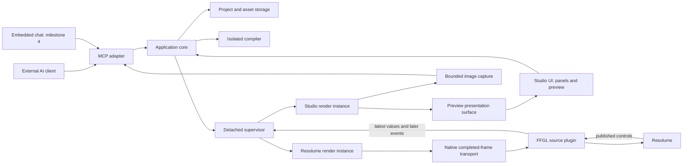
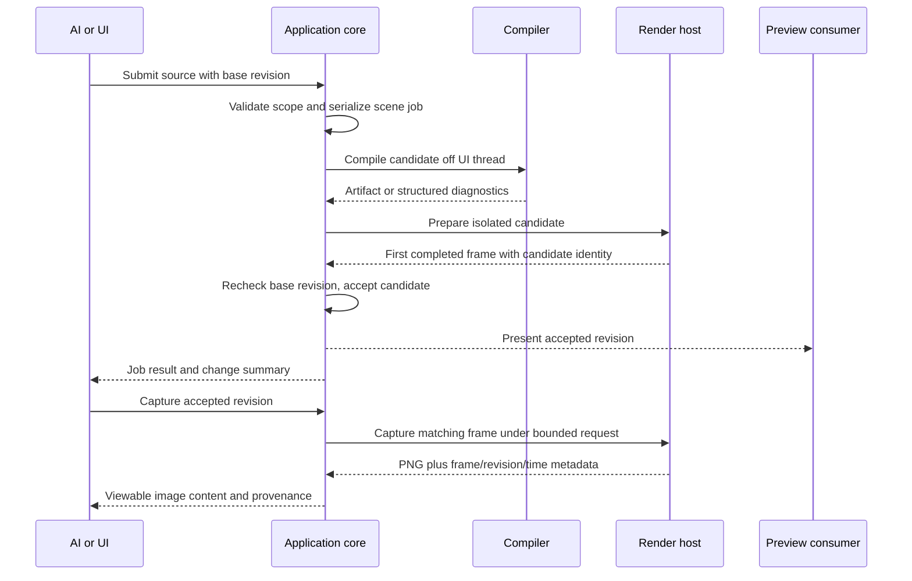

# Lux architecture

Status: reviewed planning target, ready for implementation. Read [decisions](decisions.md) for authority and [requirements](requirements.md) for outcomes. No runtime implementation or GPU capability has been proved by this document.

## System boundaries

Solid arrows express ownership or communication, not an assertion that a GPU sharing primitive already exists. Runtime and bridge designs define which proposed path passes actual frames. UI pixels never travel through React state; captures may use bounded CPU readback, while continuous host transport must remain on GPU.

The same versioned visual implementation and runtime execute in studio and host instances. Instances have separate parameters, clocks and simulation state. Studio edits do not silently change the host's pinned visual or an exported release. The 0.1 developer activation operation explicitly chooses a candidate artifact for its single host instance; 0.2 generalizes identity and saved host composition behavior.

## Ownership and persistence

| Owner | Owns | Does not own |
| --- | --- | --- |
| Application core | Scene revisions, accepted changes, jobs, validation and application operations | Panel geometry, GPU frame storage |
| Project storage | Source, graph, assets, look definitions and exact dependencies (durable in milestone 1 onward) | Live host state or transient captures by default |
| Supervisor | Process lifetime, heartbeats, runtime instance registry, crash recovery and current authoritative control snapshots | Rendering work inside host callback |
| Render host | One instance's evaluation, GPU resources, animation clock, frame provenance and measurements | Durable project state or privileged generated-code access |
| FFGL adapter | Native host parameter mapping and most recent completed compatible frame | AI compilation, blocking renderer startup, studio layout |
| Studio | Selection, graph viewport, panel layout, inspectors and command presentation | Clock advancement or scene disposal when a tab hides |
| Resolume | Show composition, mixing, mapping, native automation and published performance values | Mutable authoring source |

## Revision and presentation lifecycle

Any compile/prepare failure retains the last working result. Successful first-frame validation is a smoke test; a later hang triggers watchdog recovery and offers restart or restoration. Stable scene/revision/instance identifiers prevent late captures or worker replies from being attributed to a new revision. The core contracts define the precise race behavior and error codes.

## Concurrency and recovery

Only one scene-changing job executes at a time initially. Optimistic revision checks occur on admission and activation. UI commands and AI commands call the same core service. Capture jobs are bounded and do not stall the host callback. Parameter snapshots coalesce continuous updates; discrete events later require ordered bounded queues, never a boolean sampled per frame.

The detached supervisor remains alive while host consumers exist after the studio closes. Shutdown policy, crash generations and native handles must be explicit. Generated visual code executes in an unprivileged render context without Node or filesystem/network privileges; compiler and renderer are restartable. Separate processes do not isolate GPU/driver failure. Full security hardening and installed lifecycle extend the tracer; no document promises safe arbitrary native code execution.

## Interface homes and reading paths

- [Project model](design/project-model.md): identity, source authority, storage and releases.
- [AI authoring](design/ai-authoring.md): application operation schemas, jobs, errors and captures.
- [Runtime](design/runtime.md): visual execution, frame provenance and render-host lifecycle.
- [Resolume bridge](design/resolume-bridge.md): GPU ownership/synchronization, FFGL and measurements.
- [Studio](design/studio.md): dock layouts and UI diagrams, preview/settings/input behavior.
- [Environment](implementation/environment.md): observed machine and required version pinning.
- [Tracer contract map](design/tracer-contracts.md): shared type ownership, adapter mappings, fixed host schema and explicit activation.

The tracer plan is the execution order. If subsystem details disagree, the coordinator must reconcile the contract before delegating dependent tasks; implementers must not invent local variants of shared IDs, frame descriptors or operation names.
