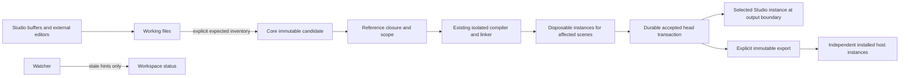
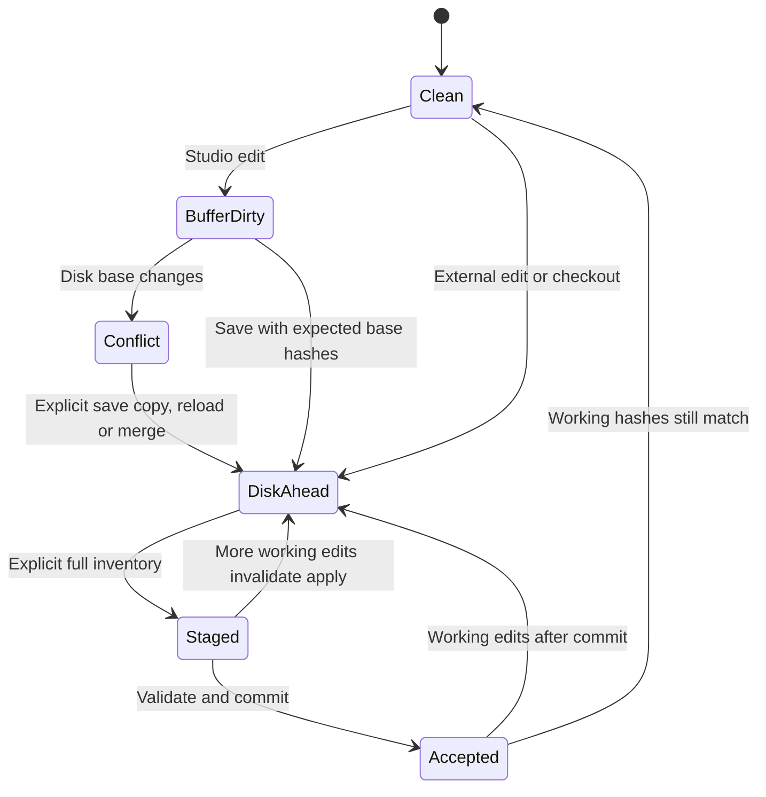

# Filesystem projects and accepted revisions

Status: proposed implementation architecture, 12 September 2026. This implements the approved direction in [project model](project-model.md#filesystem-first-authoring-clarification--12-september-2026) and [source workspace](source-workspace.md#normal-coding-environments--approved-direction-12-september). It describes future behavior, not evidence that the tracer has completed its active property/asset work. The companion [implementation plan](../implementation/filesystem-projects-plan.md) owns execution order and acceptance gates.

## Decision and current baseline

A Lux project is a directory of ordinary TypeScript source, readable metadata, original asset files, and exact dependency pins. Users and agents can edit it using their normal editor, shell and Git tools. Studio is another editor of those working files. MCP discovers project locations and identities, applies an explicit batch, reports diagnostics, controls playback and returns actual captures; it is not the required transport for source edits.

The working directory and the accepted runtime snapshot have different authority. Working files may be invalid, incomplete or newer than the running visual. Core accepts immutable snapshots through an explicit transaction. Runtime and export consume only accepted objects. Core never regenerates an older accepted snapshot over working files on apply, startup, recovery or checkout. This supersedes the earlier projection/regeneration procedure in project-model.md for directory projects.

Current code provides embedded SourceBundle editing in `apps/studio/src/source/workspace.ts`, scene import/validation in `packages/core/src/scene-document.ts`, and path-token/hash conflict detection for a single `.lux-scene` in `packages/core/src/scene-file.ts`. The compiler already validates a bounded virtual source bundle and resolves only submitted relative modules plus supported SDK/Three imports. Directory project storage, project CLI commands and library services do not exist at this baseline. The active tracer property/asset integration must finish first; its final saved-control schema becomes the migration input rather than freezing an intermediate branch's shape here.

## Ownership and identities

| State | Authority and lifetime | May change without apply? |
| --- | --- | --- |
| Working files | Ordinary files owned jointly by external editors and Studio through conflict-aware saves | Yes; neither successful save nor watcher event accepts content |
| Unsaved buffers | Studio workspace, keyed by project session, entity ID and full relative path | Yes; preserved across tabs/scenes; dirty buffers block overlapping disk apply |
| Candidate | Core-owned immutable complete content inventory and resolved scene closures | No; edits require a new candidate |
| Accepted project | Immutable manifest and object closure selected by one durable local head | Only one checked project transaction changes it |
| Running instance | Supervisor/runtime: accepted scene revision, generation, clock, live controls | Yes, for playback/controls; source changes require accepted revision |
| Installed release | Independent immutable closure in installed release storage | Never retargeted by authoring edits or project removal |
| Workspace state | Machine-local registration, root identity, selected scene, panel layout, buffer recovery | Yes; excluded from content and Git |

`projectId`, `sceneId`, `componentId` and `assetId` are opaque UUIDs and survive path/name changes. A definition contains code; a scene refers to a definition and owns its output settings and saved control intent. Two scenes using one definition share implementation, never simulation or saved values. First delivery has one code entry definition per scene; it does not invent nodes or graph topology. Helper modules are files, not components or scenes.

| Token | Meaning; never substitute another token |
| --- | --- |
| `projectSessionId` | Ephemeral core-issued capability bound to an opened physical root and service session |
| `workspaceGeneration` | Monotonic session counter for observed managed-file changes, identity changes and reconciliation; an early conflict signal, not a complete file proof |
| `inventoryHash` | SHA-256 of sorted canonical `(relativePath, rawByteHash)` entries for all declared working content |
| `candidateId` / `contentHash` | Staged immutable candidate identity / canonical candidate content, including dependency pins |
| `projectRevisionId` | New UUID for accepted history/concurrency, including content-equivalent restore; null before first acceptance |
| `sceneRevisionId` | Accepted identity of one scene's resolved closure, settings and saved controls; unchanged scenes retain it |
| `sourceHash` | Compiler's exact SourceBundle identity, using the existing compiler's canonical algorithm |
| `bufferVersion` | Monotonic unsaved document version; `expectedBufferVersions` protects read buffers even if their text later returns to identical bytes |
| `controlIntentSequence` | Saved-control editing concurrency, separate from runtime applied-control sequence and source identity |

Raw file hashes preserve UTF-8 bytes, line endings and asset bytes. JSON semantic normalization may produce equivalent execution, but must not erase the working diff. Scene closure identity includes its definition, transitive declared references, asset bindings, toolchain pins, settings and saved-control schema/provenance. Project revisions record both the raw inventory and resolved scene identities. Runtime capture continues reporting actual scene revision, frame, generation, effective controls and applied control sequence.

## Files and schema

The folder suffix is optional; `project.json` identifies the format. Friendly folder names can change without changing entity identity. Initial generated folders use IDs for stable paths. Every authoritative content file is declared by project, component, asset or dependency manifests; unrelated README files and editor configuration can coexist without entering runtime content.

```text
MySet/
  project.json
  tsconfig.json                         # usable ordinary-editor configuration
  scenes/<sceneId>/scene.json
  components/<componentId>/component.json
  components/<componentId>/src/main.ts
  components/<componentId>/src/noise.ts
  assets/manifest.json
  assets/files/<assetId>/spark.bmp       # original bytes, ordinary Git content
  dependencies.lock.json
  libraries/<contentHash>/package.json  # immutable vendored library manifest
  libraries/<contentHash>/src/*.ts
  vendor/toolchain/<contentHash>/       # self-contained pinned declaration pack
  .gitignore
  .lux/state/head.json                  # local accepted pointer; never Git-tracked
  .lux/revisions/<revisionId>.json
  .lux/objects/<sha256>
  .lux/transactions/<requestId>.json
  .lux/candidates/<candidateId>.json
  .lux/cache/                           # disposable compile/capture outputs
```

The following is the version-1 contract shape. `Hash`, branded IDs, `OutputSettings` and the final tracer saved-control DTO are imported from their owning shared contract modules; these examples do not introduce duplicate runtime types. Validation rejects unknown versions, duplicate keys/IDs, unknown fields, invalid UTF-8, nonfinite values and dangling references.

```ts
type ComponentRef =
  | { kind: 'local'; componentId: ComponentId }
  | { kind: 'package'; packageId: string; exportId: string };
type ProjectManifest = {
  format: 'lux-project'; schemaVersion: 1; projectId: ProjectId; name: string;
  sceneIds: SceneId[]; componentIds: ComponentId[];
};
type SceneFile = {
  schemaVersion: 1; sceneId: SceneId; name: string;
  implementation: ComponentRef; settings: OutputSettings;
  savedControls: SavedControlIntent; // final tracer schema/provenance DTO
};
type ComponentFile = {
  schemaVersion: 1; componentId: ComponentId; name: string; kind: 'code';
  entry: string; files: string[]; // relative to this component directory
  references: ComponentRef[];    // explicit transitive closure edges
  assets: Record<string, AssetId>; // compiler logical asset path -> stable ID
};
type AssetManifest = {
  schemaVersion: 1;
  assets: Record<AssetId, {
    path: string; mediaType: string; sha256: Hash; byteLength: number;
    interpretation: { colorSpace: string; alpha: string };
    provenance?: { source?: string; prompt?: string; model?: string;
      seed?: string; referenceAssetIds?: AssetId[]; attribution?: string };
  }>;
};
type DependencyLock = {
  schemaVersion: 1;
  toolchain: { sdkVersion: string; typescriptVersion: string; threeVersion: string;
    threeTypesVersion: string; declarationPackHash: Hash; runtimeBuildHash: Hash };
  packages: Record<string, { version: string; manifestHash: Hash; contentHash: Hash }>;
};
type AcceptedProject = {
  schemaVersion: 1; projectId: ProjectId; revisionId: ProjectRevisionId;
  parent: ProjectRevisionId | null; inventoryHash: Hash;
  files: Record<string, Hash>; sceneHeads: Record<SceneId, SceneRevisionId>;
  resolvedScenes: Record<SceneId, Hash>; requestId: string; createdAt: string;
};
```

For example, Scene A and Scene B both set `implementation` to `{ "kind": "local", "componentId": "<particles-id>" }`, while keeping different `savedControls`. The component declares `entry: "src/main.ts"`, `files: ["src/main.ts", "src/noise.ts"]`, and `assets: { "assets/spark.bmp": "<spark-asset-id>" }`. `main.ts` imports `./noise.ts`. Replacing spark bytes updates its manifest hash in the same explicit batch; leaving the old hash fails staging rather than silently trusting a filename.

Component manifests declare every source file, including an unused helper that should travel with editable source. Adding a file requires adding its manifest entry. Discovery reports unregistered source files under managed component folders; they are not silently compiled. Deleted entries or missing manifests are errors. Stage 1 rejects component-reference cycles and ambiguous ownership rather than guessing intended module boundaries. Later schema versions add graph definitions, node placement and Looks without changing file/buffer/accepted-state ownership.

## Shared definitions, libraries and reference resolution

A local definition edit computes a reverse dependency closure: every referring local definition, scene and asset binding is identified from the candidate and accepted snapshots. Changes to references can affect both old and new users. Scope is an explicit set of affected scene, component and asset IDs; core checks the actual resolved diff against that scope. A selected scene or file never implicitly authorizes all users of a shared definition. Discovery returns the usage list so Studio can show “Used by N scenes” before apply.

“Make unique” copies a local definition with a new ID, rewrites its internal relative paths where required, and repoints the selected scene in one staged project candidate. At the graph milestone the same operation can repoint one node. Copying a scene creates a new scene ID; its implementation remains shared unless uniqueness is explicitly chosen. Templates copy independent entities with remapped IDs and references. Duplicating a whole directory or making a Git worktree preserves logical project IDs but creates an independent physical workspace session.

A library is a catalog; a package is an immutable content bundle. Package manifests declare a namespaced `packageId`, exact version, export IDs, source files, asset entries, dependency pins and compatible SDK range. The lock chooses one exact version/hash per package ID in stage 1. The package hash covers canonical manifest plus every declared original file hash; unknown, missing or changed vendored files fail verification. Hashes prove integrity relative to a chosen pin, not publisher trust. Library search and network publication are separate later operations; importing an already available validated package is sufficient initially.

Pinning copies complete verified bytes into `libraries/<contentHash>` before the candidate can reference the package. No mutable symlinks into a personal cache and no “latest” resolution are permitted. Offline apply, Git checkout and archive reopen require those bytes and exact toolchain support locally. Missing pins return `DEPENDENCY_UNAVAILABLE`, with package/version/hash; an update is a new candidate, never a startup repair. Editing an immutable package in an external editor returns `PACKAGE_MODIFIED`; keep the edit on disk, then explicitly restore it or create a local override. Lux never repairs it by overwriting the edit automatically.

First delivery preserves the existing import grammar: SDK and supported Three bare imports, plus relative `.ts` imports within the complete admitted virtual bundle. Components may relatively import files belonging to declared local references or pinned package dependencies; package files may import their own files and declared package dependencies. Core flattens the verified closure using canonical project-relative module names and passes source bytes to the existing compiler. It rejects imports outside the declared closure before compiler admission. It does not add arbitrary npm imports, evaluate package scripts or ask the compiler to read working paths.

Root-relative placement preserves ordinary TypeScript navigation: for instance, a local file can import a declared package helper through a relative path into `libraries/<hash>/src/noise.ts`. Pin updates and “make unique” produce an explicit import/reference diff when relative paths change. `ComponentRef.exportId` selects the package's declared entry; helper reuse still uses explicit files and reference ownership. Export flattens that same closure and preserves a path map for diagnostics. If source/asset logical names collide after resolution, reject with both owners rather than prefixing names invisibly and changing source semantics.

## Ordinary editor types and validation

Project creation copies a complete, versioned declaration pack from the installed Lux distribution to `vendor/toolchain/<hash>`. It contains self-contained `@lux/visual-sdk` declarations, the exact supported Three declaration tree and its transitive declaration dependencies, TypeScript standard libraries, package metadata and licenses. SDK declarations must not point into `../../runtime-contracts` or the Lux source checkout. The distribution also provides the matching trusted compiler/CLI; a project never supplies executable compiler binaries. Packaging verifies that all declaration references resolve inside the pack and that SDK declarations describe the actual compiler/runtime pair.

```json
{
  "compilerOptions": {
    "strict": true, "noEmit": true, "target": "ES2022", "module": "ESNext",
    "moduleResolution": "Bundler", "allowImportingTsExtensions": true, "types": [],
    "paths": {
      "@lux/visual-sdk": ["./vendor/toolchain/<hash>/sdk/index.d.ts"],
      "three/webgpu": ["./vendor/toolchain/<hash>/three/build/three.webgpu.d.ts"],
      "three/tsl": ["./vendor/toolchain/<hash>/three/build/three.tsl.d.ts"]
    }
  },
  "include": ["components/**/*.ts", "libraries/**/*.ts"]
}
```

The generated configuration and declaration pack work from a fresh clone with no Lux repository or ancestor `node_modules`. Standard editor TypeScript servers can provide diagnostics, completion and navigation. The installed CLI provides the exact pinned validation version; an editor using a different TypeScript version may show different diagnostics. Its version is visible in discovery. Do not run or auto-select project-supplied editor plugins. A language service that needs Node-related types to explain declaration internals does not grant those APIs to authored code.

`lux project check --project <directory>` parses and snapshots the declared batch, resolves its closure and invokes the trusted compiler without acceptance or activation. `lux project apply --project <directory> --scene <id>` stages the complete declared batch and submits an apply job through the local authenticated core endpoint. A successful shared-definition apply may affect additional explicitly scoped scenes. `--scope all` is an explicit project-wide scope, not the default expansion of a single scene. If no service is running, check still works; apply returns a service connection error with startup guidance, not a hidden second project writer.

These are proposed installed CLI commands, not current npm scripts. `lux project inspect --json` exposes the discover DTO for shell agents; `lux project stage --manifest <file>` accepts an explicit expected inventory, while apply can accept its returned candidate ID. The convenience apply command computes and displays a candidate/diff and uses the same stage/apply calls; it does not bypass concurrency gates.

The trusted compiler ignores project `tsconfig.json`, environment `NODE_PATH`, arbitrary package exports, plugins and install hooks. It creates its own configuration and uses its installed verified toolchain. Project config is editable tooling intent; if it drifts from Lux's supported config, check reports `EDITOR_CONFIG_MISMATCH` with a suggested diff, preserving the file. TypeScript documents that `paths` describes a resolver mapping and does not rewrite emitted imports; the actual sandbox resolver remains authoritative. [TypeScript paths reference](https://www.typescriptlang.org/tsconfig/paths.html).

## Explicit batch and application API

An expected inventory is the author's declaration of a complete batch, not an inferred quiet period. It enumerates raw hashes for every manifest-declared content file, including dependency manifests and original assets. The CLI computes it from the caller's saved working files; an agent may construct it directly from known intended bytes. Explicit stage confirms “these exact versions form my candidate.” No system can infer whether a semantically valid half-edit was intentional; apply requires this deliberate boundary and never treats watcher silence as that intent.

Core traverses declarations from the supplied `project.json`, checks the expected inventory exactly matches that declaration closure, safely reads every member, verifies byte hashes and snapshots those exact bytes into immutable storage. Additions/deletions of declared content change the manifests and inventory. Unregistered files are reported separately. A file change, incomplete write, dirty overlapping buffer or expected membership mismatch fails staging. Once staged, compilation never rereads the working directory.

```ts
type Scope = { sceneIds: SceneId[]; componentIds: ComponentId[]; assetIds: AssetId[] };
type BufferExpectation = Record<string, number>; // document key -> version
type ProjectPrecondition = {
  projectSessionId: string; expectedHead: ProjectRevisionId | null;
  expectedWorkspaceGeneration: number; expectedBufferVersions: BufferExpectation;
};
discover({ projectSessionId }): Promise<{
  projectId: ProjectId; projectSessionId: string; rootPath: string;
  head: ProjectRevisionId | null; workspaceGeneration: number;
  inventoryHash: Hash; files: Record<string, Hash>; buffers: BufferStatus[];
  scenes: SceneLocation[]; components: ComponentLocation[]; impact: ReferenceIndex;
  toolchain: DependencyLock['toolchain']; selectedSceneId: SceneId | null;
}>;
stage(input: ProjectPrecondition & {
  requestId: string; expectedFiles: Record<string, Hash>; scope: Scope;
}): Promise<{
  candidateId: string; contentHash: Hash; inventoryHash: Hash;
  diff: ContentDiff; affectedSceneIds: SceneId[]; expiresAt: string;
}>;
apply(input: ProjectPrecondition & {
  requestId: string; candidateId: string;
}): Promise<{ jobId: string }>;
// Terminal job result always distinguishes acceptance from presentation:
type ApplyResult = {
  committed: boolean; projectRevisionId: ProjectRevisionId | null;
  sceneHeads: Record<SceneId, SceneRevisionId>;
  presentation: 'presented' | 'not-selected' | 'pending' | 'failed';
  previousWorkingRevisionId?: SceneRevisionId; diagnostics: Diagnostic[];
};
```

Stage and apply use different request IDs; retrying an ID with different payload returns `REQUEST_ID_REUSED`. Candidate metadata retains scope, buffer expectations, original session and head, exact inventory, toolchain hashes and expiry. Apply cannot expand that scope or substitute a candidate from another session. Full inventory is rechecked at admission and immediately before commit; buffers, saved-control intent sequence and selected-instance binding are also checked. Rechecking the complete project deliberately serializes unrelated saved-content edits in the initial small-project implementation.

The core reports structured paths/entity IDs for `WORKSPACE_CHANGED`, `BUFFER_CONFLICT`, `REVISION_CONFLICT`, `SCOPE_VIOLATION`, `PROJECT_ID_CHANGED`, `PACKAGE_MODIFIED`, `DEPENDENCY_UNAVAILABLE`, `PROJECT_BUSY`, `QUOTA_EXCEEDED` and compile/runtime errors. Conflict keeps candidate evidence and working files; the caller rereads and deliberately stages again. CLI text diagnostics and MCP structured diagnostics carry candidate ID, original path, line/column and content hash so stale errors never underline unrelated new text.

Agents without direct filesystem access can use a bounded working-file batch API with expected old hashes and buffer versions. That API writes drafts, returns the actual resulting inventory and then uses stage/apply; it cannot mutate the accepted head itself. Multi-file draft writes have a recoverable write journal and may visibly be incomplete if interrupted. They do not promise cross-file filesystem atomicity. A successful draft write is not a successful apply, and partial-write recovery never overwrites a newer external version.

## Transaction, presentation and concurrency



Only one core process owns the project writer lease, keyed by canonical physical root identity. Other Studio windows connect to it; another independent service reports `PROJECT_BUSY` or opens read-only. The lease is OS-backed and released on process death; a stale PID text file is not a lock. External editors and Git remain free to write outside the short protected read/commit sections. Core also holds a project-wide optimistic commit gate, with one executing and one queued apply initially.

```mermaid
sequenceDiagram
    participant E as Editor or CLI
    participant C as Core
    participant B as Compiler
    participant R as Supervisor/runtime
    participant D as Durable store
    E->>C: stage(expected full file hashes, head, scope, buffer versions)
    C->>C: Safe capture; persist immutable candidate
    C-->>E: candidate ID, exact diff, affected scenes
    E->>C: apply(candidate ID, preconditions)
    C->>B: Compile all affected resolved scene closures
    B-->>C: Exact artifacts and saved-control compatibility reports
    C->>R: Smoke each changed scene in bounded disposable instance
    R-->>C: Matching completed frames; selected prepared instance lease
    C->>C: Acquire gate; recheck disk inventory, buffers, head and lease
    C->>D: Flush objects/revision and prepared request journal
    C->>D: Replace head pointer: logical commit
    C->>R: Promote committed selected revision at output boundary
    R-->>C: Matching completed frame or explicit presentation failure
    C-->>E: Durable revision + presentation status + diagnostic result
```

All affected scenes compile and smoke before any project head moves, including inactive scenes referencing shared code/assets. Smoke instances use each scene's own saved controls, seed and settings; run them serially to bound GPU/memory use and dispose inactive instances afterward. A changed unused component still receives source/type validation; an entry definition receives a default-settings smoke fixture before first use. Existing valid closures may reuse certificates only when exact input/toolchain hashes match; the selected prepared instance needs a live matching generation lease at commit. One failing scene rejects the whole candidate.

Immediately before commit, acquire safe read leases on the entire declared content set, verify exact hashes and declaration membership, and hold the leases across the head replacement. Freeze overlapping Studio buffer/save/control-intent mutations during this short section. Acquisition failure is a retryable workspace conflict, not permission to accept a stale view. New unregistered files cannot change declared membership while the declaring manifests are leased. Files can change after leases release; the accepted revision still describes the exact committed candidate and status immediately shows newer working changes.

New objects and a complete accepted revision manifest are written to exclusive temporary files on the same supported local volume, flushed, hash-verified and published under immutable names. Persist a prepared journal with old/new heads, request digest, candidate closure and selected runtime intent. Atomically replace `.lux/state/head.json`; this is the sole logical content commit. Flush and mark the request committed. The storage adapter must prove its Windows replacement/reopen behavior under fault injection; ordinary multi-file rename is not an atomic transaction.

Durable content and GPU presentation cannot commit atomically across processes. Before head replacement, any failure retains old acceptance and output. After replacement, the new revision is accepted even if the process dies before promotion. Runtime must never label old output as the new revision. Reopen verifies accepted objects and retries presentation of that revision; while unavailable, retain a valid previous frame with a visible previous-revision status. Return `committed: true` plus `presentation: pending|failed` after a post-commit timeout/failure. Never report an uncommitted failure or silently rewrite the head backward. A user-requested restore creates a compensating accepted revision.

Selected-scene changes during apply do not retarget a prepared instance. The job records the selection/binding at admission; if selection changes, acceptance can finish but returns `not-selected`, and normal selection admission prepares the currently selected scene separately. Host-owned instances remain bound to installed releases. Runtime-only controls retain their owner-authoritative sequence; saved-control changes/migrations belong to the staged scene metadata and are validated against its code schema. An open saved-control gesture blocks overlapping apply until completed or cancelled; the job cannot consume an incidental slider value.

Cancellation before the commit section disposes workers/leases and leaves the candidate/drafts available. During commit, cancellation becomes pending and the journal/result decides the terminal outcome. MCP disconnect does not cancel the job. Retries recover the recorded result; after request retention expires, clients inspect head/history rather than blindly assuming retry is safe.

## Buffer, Git and workspace reconciliation



Every buffer keeps base disk hash, current text, version and owning entity. External changes to a clean buffer reload safely and invalidate stale diagnostics; a changed disk hash under a dirty buffer preserves both versions and shows conflict. No automatic last-writer-wins or invisible text merge. Initial apply rejects any dirty buffer in the candidate read set, including metadata/control drafts. Save writes only after verifying its expected disk base; save failure keeps the dirty buffer. Revert is an explicit discard action; closing a tab does not discard.

Use a recoverable working-write protocol for Studio save: record expected old bytes/hash and proposed new bytes, then replace each file through the safe filesystem adapter. If external edits intervene, stop and report the actually written subset; acceptance has not changed. On restart, finish only entries whose current bytes still match the journal's old or already-written hashes. A third value is a conflict retained as recovery material, never overwritten. Prefer single-file saves for ordinary typing; metadata-plus-file operations remain explicit batches.

Track source, metadata, original assets, dependency lock, vendored packages, declaration pack and editor configuration in Git. Ignore `.lux/`, captures, generated artifacts, local logs and machine settings. Git commits/checkpoints are deliberate user/agent actions and are independent of accepted revisions and buffer undo. Do not initialize Git, stage unrelated files or create commits merely because apply succeeded.

Watchers invalidate inventories and report likely external changes, but perform full safe scans on stage/apply, reopen and explicit refresh. Node documents watcher platform limitations and lack of protection against filesystem substitution; it is a hint source, not the transaction boundary. [Node filesystem documentation](https://nodejs.org/api/fs.html#caveats).

A checkout may update hundreds of files without an atomic directory snapshot. While it runs, expected inventory acquisition fails or remains explicitly unaccepted; after the user/agent finishes checkout, stage the declared target batch. Detect Git HEAD/index changes as useful status hints without treating a Git commit as an accepted Lux head. Even a byte-identical checkout can change file identity and invalidate open safe handles; rescan rather than trusting watcher counts. Do not run Git hooks or repository-configured external commands during Lux inspection.

Git worktrees may share repository metadata while their working directories differ. Register sessions by canonical root/volume/file identity, not Git common-dir or `projectId`; do not follow `.git` as a project content path. Two worktrees of the same project have independent accepted heads, locks and buffers. A fresh clone lacks `.lux` history: open as `head: null`, validate/apply its working content to create the first local accepted revision; never manufacture accepted state from a Git hash. [Git worktree documentation](https://git-scm.com/docs/git-worktree).

If project.json changes to another project ID, invalidate the session immediately and preserve dirty buffers in the old project's recovery workspace; require explicit reopen to bind a new session. Moving the root requires re-registration; missing files or a renamed root cannot be interpreted as consent to write elsewhere. Duplicate logical IDs inside one project fail validation; duplication across independent clone roots is normal. A copied `.lux` directory is verified and rebound to the physical root before any writes; stale transaction/session capabilities never transfer.

## Safe files, assets and portable interchange

All API paths are canonical relative slash-separated paths under a previously authorized project root. Reject absolute/UNC/device paths, drive prefixes, `..` path segments, backslashes, NULs, alternate data streams, trailing dots/spaces, Windows reserved names, case-fold collisions and names exceeding the existing 240-character virtual module limit. TypeScript source keeps the existing ASCII component/path grammar. Asset and metadata validators have similarly closed grammars. An import containing `../` is allowed only when the trusted virtual resolver normalizes it to another admitted module; an API path itself never contains traversal.

Resolve the root from an explicit open/create operation, then verify each traversed directory and leaf by native handles. Reject symlinks, junctions, other reparse points, nonregular files and hardlinked content (`numberOfLinks > 1`), including immutable objects and destination directories. Validate file identity, final handle path and volume against the registered root; hold ancestor handles against rename/replacement while operating. A string-prefix check, `realpath` followed by an ordinary open, or Node `lstat` alone cannot prevent substitution between checks.

The Windows adapter uses `CreateFileW` with reparse-point inspection and bounded read handles whose sharing mode excludes write/delete for stage/precommit capture; directory handles keep traversal anchored. It verifies file information by handle and uses exclusive temporary creation for writes. Unsupported filesystem semantics return `UNSUPPORTED_FILESYSTEM`, not a weaker silent fallback. Microsoft documents sharing conflicts, reparse-point flags and handle-based file information; these are building blocks that still require Lux's path/race tests. [CreateFileW](https://learn.microsoft.com/en-us/windows/win32/api/fileapi/nf-fileapi-createfilew), [GetFileInformationByHandle](https://learn.microsoft.com/en-us/windows/win32/api/fileapi/nf-fileapi-getfileinformationbyhandle).

Initial supported roots are writable local NTFS directories with verified replacement and locking behavior. Cloud placeholders, network shares, reparse-backed folders and cross-volume object stores are rejected with copy-to-local guidance. No elevated filesystem access is needed. A same-user process with permission to tamper directly with core memory or `.lux` is outside generated-code isolation; nevertheless disk data is revalidated and never trusted as executable authority. Generated source never receives project paths, handles, Node integration, network access or privileged bridges.

An asset ID identifies an editable asset record; accepted revisions resolve it to immutable original bytes, interpretation and provenance. Renaming the working file changes no ID. Replacing pixels changes its byte hash while retaining the ID only when the user intends replacement. Deduplication shares immutable bytes without merging logical asset IDs. Save prompts, model/seed and attribution as optional metadata, but always retain actual original pixels; no provider URL substitutes for bytes. Credentials and provider authorization are outside project files, and library/export operations do not send assets to providers.

Stage 1 inherits the tracer's admitted image formats, byte limits and decoder; it does not claim PNG/JPEG support merely because the directory can contain such files. The current asset policy admits bounded BMP source assets. A closure maps stable asset IDs to existing logical `assets/*.bmp` names when constructing SourceBundle v2. Color/alpha interpretation must match the decoder and runtime contract. Source/asset changes share one candidate so old pixels cannot accidentally accompany a new mapping. Releases copy original bytes and exact derived metadata; authoring caches are not release dependencies.

Import `.lux-scene` through the final tracer validator into a newly created project directory or an explicit new scene transaction. Preserve every source file, entry, source version, supported asset byte sequence, output setting, seed and saved-control provenance. Allocate new entity IDs once and return the mapping; repeated import requests deduplicate by request ID. Do not modify the original scene. Invalid legacy source can be retained as an unaccepted working draft with diagnostics; unsupported newer format versions fail without partial migration.

Initial single-entry scenes can export portable `.lux-scene` by flattening their exact accepted closure into the current supported interchange schema, including actual asset bytes and saved controls. Working-draft export is separately labeled and never masquerades as an accepted release. Fail if the closure exceeds interchange limits or uses later graph/Look features that the target format cannot represent. A full project archive includes editable files, pins and vendored dependencies; it excludes machine state and can optionally include verified history. Reject unresolved Git LFS pointer files, missing blobs and unresolved package pins during completeness checks.

## Recovery, bounds and implementation boundary

Startup verifies the durable head and every referenced object before allowing apply. If the head equals a prepared journal's new revision, record that request as committed and recover presentation. If it equals the old head, the preparation was uncommitted and is abandoned without touching working files. Corrupt or missing heads enter recovery mode with the last verified revision and diagnostics; never guess by newest filename. Recovery offers explicit accepted-head restoration or opening current disk as a new unaccepted draft, preserving both evidence sets.

Disk full before head replacement leaves acceptance unchanged. Failure after replacement returns/reconstructs the committed revision even if the trailing journal write failed; the revision itself contains request identity. Buffer recovery is machine-local, stores base hashes and proposed text, and only restores into buffers. After a crash, comparing those hashes with current disk distinguishes a recoverable unsaved draft from a new external version. Closing a project with dirty buffers offers save, discard or cancel; a failed save does not close it.

| Initial bound | Contract |
| --- | --- |
| Working project | At most 8 scenes, 32 local definitions, 256 authored `.ts` files and 8 MiB total authored UTF-8; metadata total 1 MiB |
| Scene compiler closure | Existing 32 files / 1 MiB source; 128 KiB diagnostics; 30-second compile; 5-second smoke; existing linker/output/request caps |
| Assets | At most 64 project asset records / 16 MiB original bytes; each scene closure retains current 4-image / 1 MiB original / 2 MiB decoded RGBA caps, 512-pixel dimension and per-image decoder bound |
| Dependencies | At most 16 package pins / 32 MiB vendored package bytes; declaration pack separately capped at 256 MiB / 4096 files and never counted as authored source |
| Work | One running and one queued apply per project; smoke scenes serially; 5-minute total job limit; one staged inventory request at a time |
| Storage | Accepted objects/history quota 1 GiB per project, candidates/cache 256 MiB; preflight worst-case writes before starting |
| Retention | Accepted history retained until explicit compaction; unleased candidates expire after 24 hours; durable request records retained at least 24 hours and referenced accepted request identities remain in revisions |

These are proposed engineering bounds, not measured performance. All transitive local/package source and assets count against per-scene limits; splitting files across packages cannot evade admission. Validate full declared package integrity once per stage, then compile only each scene's declared resolved closure. Enforce nested JSON depth and record/path counts before allocation and stream/hash bytes under limits. The check/apply result identifies the exceeded dimension and actual count. If retained roots consume the quota, reject new work without deleting them; offer explicit compaction/export choices later.

GC roots include accepted and previous-working revisions, recovery journals, active candidate/worker leases, pending runtime promotion, checkpoints and retained evidence. Installed release storage owns independent roots and cannot be collected through project GC. Failed builds and unused temporary files are collectible only after their leases/retention expire. Service-wide capture retention and result limits remain those in [AI authoring](ai-authoring.md); adding filesystem access does not enlarge image-result quotas.

| Edge case | Required outcome |
| --- | --- |
| Entry and helper edited separately | No watcher activation; explicit complete inventory snapshots both or fails hashes |
| File changes during compilation | Compile frozen candidate; precommit full inventory mismatch rejects acceptance |
| Dirty Studio buffer plus external change | Preserve buffer and disk; block overlapping apply/save until explicit reconciliation |
| Shared definition breaks an inactive scene | Entire project candidate rejected; prior selected output/head retained |
| New source with stale asset manifest hash | Stage rejects asset mismatch; no mixed source/pixels |
| Package bytes changed under same pin | Block with `PACKAGE_MODIFIED`; preserve edits for override/recovery |
| Git checkout changes project ID | Invalidate session; retain old dirty buffers; explicit reopen |
| Identical project in two worktrees | Separate root sessions, locks, buffers and accepted histories |
| Reparse/hardlink substitution or open writer | Reject unsafe path or sharing conflict before accepted state changes |
| Crash before/after head swap | Recover respectively old/new acceptance; never regenerate working files |
| New head durable but renderer promotion fails | Report committed revision with failed/pending presentation and correctly labeled old output |
| Missing SDK pin/offline package or LFS pointer | Fail completeness with exact missing identity; never fetch/substitute latest |
| Saved-control gesture overlaps source apply | Block or finish gesture explicitly; never capture incidental live values |
| Save/import stopped midway | Preserve actual written subset and journal; no acceptance; conditional recovery only |
| Quota exceeded with only retained roots | Reject new work; preserve accepted content and installed releases |

First delivery includes directory create/open, stable manifests, ordinary file editing and pinned offline types, a bounded local package import/pin path, shared code definitions across single-entry scenes, safe explicit stage/apply, dirty-buffer and Git reconciliation, durable acceptance/recovery, migration/interchange and MCP/CLI discovery/check/apply. It deliberately does not require a graph editor, general library registry, network publication, automatic apply, broad npm support, remote collaborative editing, full history UI, new image formats or IDE replacement. Later milestones can add these without changing the working-file/accepted-snapshot boundary.

Proposed implementation ownership is `packages/core/src/project-{schema,session,inventory,store,service}.ts` for data/admission; a native-backed `project-filesystem` adapter for Windows handles, safe writes and leases; `project-resolver.ts` and `library-service.ts` for closure/pins; and `apps/studio/src/source/` for buffer reconciliation. Reuse current compiler/linker, asset admission, saved-control compatibility, runtime preparation/promotion and capture contracts. CLI and MCP are thin authenticated adapters to the same core methods. The final tracer service ownership must be reconciled before implementation rather than creating a second competing runtime authority.

Acceptance requires a fresh offline clone resolving SDK/Three types, an entry-plus-helper edit with meaningful Git diff, explicit shared-scene apply and correctly tagged capture, invalid/incomplete batch retention, dirty-buffer/Git races, package override behavior, original-byte scene migration, and process-crash/disk-full/path-substitution fault injection. CPU tests establish data and transaction invariants; actual Windows filesystem, packaged editor/CLI and renderer promotion checks establish integration. Independent architecture and implementation-plan reviews must inspect every ownership and failure boundary before runtime work begins.
