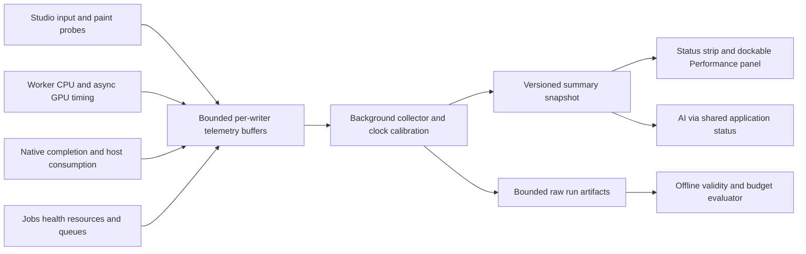

# Profiling and performance monitoring

Status: implementation design, not measured capability. This document owns **how Lux instruments, presents, diagnoses and validates performance**. [Tracer acceptance](../implementation/tracer-acceptance.md) owns the reference workload, numerical pass/fail budgets and sign-off; do not maintain another threshold table here. Covers T03/T06/T07/T09, B02, C03, R03 and U04/U07. [Runtime](runtime.md) and [bridge](resolume-bridge.md) own execution/resource lifetime, not a competing metrics definition.

## Questions the system must answer

Is the UI responsive while the visual runs? Is slow work in JavaScript, GPU rendering, the compositor, native transfer or host consumption? Are frames fresh, late, repeated or skipped? Did a control reach the image? Are memory/resources/queues bounded across edits and failures? How much did the profiler itself change the result?

Report these separately. Target FPS, rendered FPS, host-consumed fresh FPS and UI cadence are different quantities. A fast CPU submission does not prove fast GPU execution. Component names describe creative structure; optimized shared GPU passes must not be charged independently to every component that uses them.

## Collection architecture



Instrumentation cannot own runtime scheduling, hold texture leases beyond their required use, or keep a host instance alive. Closing the Performance panel only removes a summary subscriber. Stopping a profiler session does not stop the visual. Watchdog and native correctness counters remain active even when profiling is disabled.

## Modes, budgets and backpressure

| Mode | Collection | Purpose and limit |
| --- | --- | --- |
| Minimal baseline | Required health/watchdog, frame/control identities and lifetime correctness counters; no optional profiling UI or spans. | Comparison baseline for measuring routine overhead; never disable safety to obtain a faster result. |
| Routine monitoring | CPU spans/counters, resource/queue gauges, completed-frame metadata, sampled GPU queries (initially one frame in 30). Summaries at 2 Hz. | Default. UI/AI consume snapshots, not per-frame events. Sampling policy and missing/aged values are visible. |
| Diagnostic profile | Selected process/span/pass categories plus bounded Chromium/native trace where needed. | Explicit start/stop, default 10 seconds, maximum 60 seconds; one session per service. Detailed traces never silently run indefinitely. |
| Acceptance benchmark | Required full frame/control records and timing samples under a locked manifest/workload; no diagnostic overlays or unrelated heavy tracing. | Entire prescribed measurement window. No sampling that can hide tails; if full coverage is unavailable, the affected metric is unavailable or inconclusive. |

Use preallocated single-writer buffers: initially 4096 fixed-size records per producer thread, with an aggregate 8 MiB in-memory telemetry cap. Intern metric/instance identifiers outside hot callbacks. Record durations/counters with fixed numeric fields; defer string formatting, JSON encoding, sorting, file I/O and IPC batching to the collector. The FFGL callback must never wait on telemetry locks, disk, collector, GPU query completion or UI subscribers. Overflow increments a separately retained atomic lost-record counter and drops telemetry, not rendering work.

Drain off the render path at most every 250 ms; emit compact UI summaries at 2 Hz. If a writer is faster than the collector, retain cumulative counter totals and mark the affected time span incomplete. Never display an apparently healthy p99 computed only from records that fit. A benchmark that loses required frame/control/span records fails evidence validity even when the picture is smooth. Diagnostic traces can end early with an explicit truncation reason.

Bound retained live summaries to 120 seconds and telemetry output to 256 MiB per benchmark run / 64 MiB per diagnostic session initially. Stream to the run directory; if a cap or disk failure is reached, finalize an incomplete manifest and stop recording without blocking playback. Keep explicit user-retained evidence until deletion; unretained diagnostic sessions expire after 24 hours under a 512 MiB cache cap. Capture-image retention remains the separate AI contract, not this budget. These are initial engineering limits, validated by overload tests and changeable only with a recorded decision.

## Metric catalog and exact endpoints

| Metric / owner | Instrumentation boundary | Interpretation |
| --- | --- | --- |
| `visual.cpu.update_ms` / runtime worker | Monotonic duration around runtime update including generated JS. | Wall duration on execution thread, including interruption; not whole-process CPU utilization. |
| `visual.cpu.submit_ms` / runtime worker | CPU work encoding/submitting render commands, excluding previously measured update. | Aggregate update + submit **per frame**, then compute quantiles. Never sum p95 values. |
| `visual.gpu.frame_ms` / renderer | GPU timestamp intervals for declared passes/commands; per-frame coverage manifest. | GPU work duration, distinct from submit-to-complete wait. Missing passes make total unavailable. |
| `bridge.gpu.copy_ms` / native producer/receiver | GPU-side timing around owned copy/conversion stages using supported native queries. | Transport cost, separate from visual GPU work; report unsupported stages. |
| `compositor.*` / render-host trace | Trace-supported composition/present stages correlated with the actual frame marker. | Deep diagnosis; no invented frame identity from paint timestamps. |
| `host.callback_ms` / FFGL | QPC immediately before/after callback work, with fixed probes. | Host CPU occupancy; allocation/initialization reported separately, never mixed into steady state invisibly. |
| `frame.produced`, `host.opportunity`, `host.fresh`, `host.repeat`, `producer.skipped` | Completed producer and actual host-consumption identities. | Cumulative counts and per-second rates; distinguish missing callbacks from repeated frames. |
| `connection.delay_ms` | Completed producer frame to host source consumption of that exact frame. | Includes waiting/transport, stops before physical screen/projector display. |
| `control.response_ms` | Actual plugin parameter receipt/version to exact matching consumed frame. | Reconcile sent/received/superseded/rendered/consumed/unmatched sets; later versions do not prove earlier visibility. |
| `ui.response_ms` / studio | Input/command admission to first confirmed presentation acknowledging it. | React commit/requestAnimationFrame alone is not proof of paint; benchmark uses correlated Chromium trace/presentation evidence. Routine event-to-next-rAF is labeled a proxy. |
| `ui.cadence_hz` / studio | rAF callback intervals plus window visible/hidden state. | UI scheduling proxy, never visual or host delivery FPS. |
| `job.queue_ms`, `job.compile_ms`, `job.smoke_ms`, `capture.readback_ms`, `capture.encode_ms` / core/workers | Explicit job phase timestamps, correlated by job/candidate/revision. | Explain long AI edits and diagnostic overhead without folding them into steady-state render costs. |
| `watchdog.stop_ms`, `recovery.first_frame_ms` / supervisor and host | Injection to confirmed execution stop; restart request to compatible frame/current controls consumed. | Uses independently observed completion, not notification time. |
| Resources and queues / owner registry | Allocate/release and enqueue/dequeue/drop counters, periodic owned-byte estimate. | Texture slots, frame/capture leases, JS jobs, GPU query slots, native handles, processes and device/input subscriptions. Actual counts versus estimated bytes labeled. |

Memory gauges distinguish JS heap, process resident/private memory when available, and estimated Lux-owned GPU allocations. Neither summed texture byte estimates nor WMI AdapterRAM establishes total driver VRAM use. Allocator caches and shared resources must not be double-counted as new allocations on every instance. Keep immutable allocation IDs and owner/runtime generation; report shared physical allocation once and logical references separately.

## GPU timing without changing the rendering dependency chain

Probe the selected adapter/device for `timestamp-query` support and record whether it was requested/enabled. Use supported pass timestamp writes, resolve to query buffers and asynchronously read completed query data. Maintain a small reusable pool separate from image-transfer slots (initially eight query/readback slots per instrumented runtime); never map an in-use buffer or wait each frame for its result. No free query slot means a reported missing timing sample, not a stalled render. Flush pending results at run end under a five-second deadline; timed-out samples invalidate coverage.

Read timestamp words as uint64/BigInt, subtract before converting to milliseconds, and record API units, timer resolution and quantization. Reject negative/unwritten/device-lost/disjoint samples; don't count a zero query result as zero work without validity evidence. GPU clock timestamps are used for durations within their own domain, not subtracted from CPU/QPC timestamps. Pass timing excludes any uninstrumented work outside the pass; keep the coverage list alongside every aggregate.

Use the pinned Three.js public timing hooks if they cover the needed work. Otherwise choose a documented, version-pinned instrumentation adapter during TR-02/03; do not depend silently on unstable renderer internals. Where no trustworthy full-coverage timing exists, show unavailable and use a bounded external GPU trace for investigation. No CPU wall-clock surrogate may pass a GPU-duration gate. Shared passes list their contributing components but their cost is counted once. Serial non-overlapping pass durations can be summed within a frame; overlapping queues/stages cannot be added into a fictitious end-to-end duration. The WebGPU pass timestamp fields are documented by [GPUWeb](https://gpuweb.github.io/types/interfaces/GPURenderPassTimestampWrites.html); capability, resolution and selected renderer coverage remain implementation checks.

## Clocks, provenance and result schema

Native processes on the same test machine use QPC plus recorded frequency. Worker/UI clocks retain their own origin; calibrate them instead of assuming `performance.now()` values share an origin. Use repeated request/reply clock samples, bracket remote timestamps by local send/receive time, retain the tightest valid intervals, and repeat at start/end and every 30 seconds. Record offset/drift fit and uncertainty. Calibrations separated by restart get new IDs; wall time only labels reports. QPC is independent of external UTC synchronization, as described by [Microsoft](https://learn.microsoft.com/en-us/windows/win32/sysinfo/acquiring-high-resolution-time-stamps).

Cross-process latency results include lower/upper bounds from clock uncertainty. For threshold checks, evaluate the conservative upper bound; if uncertainty straddles the threshold, report inconclusive rather than claiming a pass. If calibration fails or changes non-monotonically, invalidate that interval. Never subtract GPU timestamps from QPC. A reset changes animation clock epoch without resetting the measurement clock.

Proposed shared definitions belong to `packages/runtime-contracts/src/telemetry.ts`, reusing the existing instance/revision/frame types:

```ts
type MetricSummary = {
  metric: string; unit: "ms" | "Hz" | "count" | "bytes";
  availability: "available" | "unsupported" | "pending" | "invalid";
  reason?: string; sampleCount: number; expectedCount: number;
  missingCount: number; samplingPolicy: string;
  p50?: number; p95?: number; p99?: number; max?: number; value?: number;
  validity: "complete" | "sampled" | "incomplete";
  gate: "pass" | "fail" | "unavailable" | "inconclusive" | "not_evaluated";
};
type TelemetryRecord = {
  schemaVersion: 1; runId: string; writerId: string; sequence: string;
  instanceId?: string; generation?: number; outputGeneration?: number;
  revisionId?: string; frameId?: string; clockEpoch?: number;
  controlSequence?: number; jobId?: string; passId?: string;
  clockDomain: string; calibrationId?: string; timestampTicks: string;
  metric: string; value: number; unit: string;
};
```

This is the serialized record shape; hot-path records use interned IDs/fixed fields. `sequence` detects collector loss/reordering. Never merge instances, generations, revisions, clock domains, workload settings or profiling modes into one unexplained distribution. Dashboard summaries use nearest-rank quantiles over their recorded window and show age/count/coverage; sampled routine p99 is marked an estimate with no acceptance verdict. Offline benchmark evaluator uses complete raw populations and the same documented quantile definition. Missing metrics have no numerical zero substitute.

## Studio and AI access

Tracer shows a small status strip: actual visual delivery, UI cadence/response proxy, CPU/GPU availability, host connection, and dropped/incomplete telemetry. `lux.status` returns the same versioned summary through core; the UI does not calculate an independent verdict. A slow or disconnected client cannot backpressure producers. Snapshot reads are bounded and identify window start/end, instance/revision, profiling mode and measurement age.

Milestone 4 adds a dockable **Performance** panel through the existing panel registry: Overview, CPU/GPU breakdown, frame/control timeline, Resources/Queues and profile controls. It supports the same tab/popout/layout rules as other panels. Use clear unsupported, stale, recording and incomplete states. Filtering a component cannot fabricate per-node GPU costs; shared passes remain shared. Opening the panel enables no expensive trace implicitly.

TR-02's GPU spike owns a local bounded recorder/controller using this evidence schema and buffer/loss rules; it requires neither the later collector nor core service. TR-03 migrates that recording path into the supervisor collector, and TR-04 adds the trusted core profiling/status facade. Subsequent benchmark runners call that shared facade rather than inventing another recorder. Milestone 3 can expose `lux.profile.start/stop/result` through the same job/cancellation interface if needed for AI-directed diagnostics; no new default tracer tool family is required. A single service session coordinates separate Electron process groups and native traces and reports partial starts/stops. Electron `contentTracing` is main-process controlled, uses start/stop recording and discovers available categories; it does not provide Lux's UI or automatically capture an unrelated native Resolume process. Record trace categories and process coverage. See [Electron contentTracing](https://www.electronjs.org/docs/latest/api/content-tracing). Use an installed native profiler/ETW or GPU tool only for selected deeper questions, with exact tool/settings in evidence; ordinary users need no cloud monitoring service.

## Validation: prove the measurements before trusting the budgets

| Test | Procedure | Required result |
| --- | --- | --- |
| Quantile and units | Known synthetic durations with explicit nearest-rank answers; ns/ticks/ms conversions; huge uint64 values subtracted before conversion. | Exact expected statistics, no precision loss or sum-of-quantiles error. |
| Clock validity | Inject known offsets, drift, asymmetric delay, reset and failed calibration; compare bounded derived latency. | Known truth inside reported bounds; no pass when upper bound/uncertainty fails the criterion. |
| Frame accounting | Feed correct 60 Hz and fresh-every-time 30 Hz traces across the independent full window, plus repeats/skips/gaps/restart. | 30 Hz fails cadence even at 100% fresh; counts/elapsed coverage and generation boundaries reconcile. |
| Control accounting | Use the acceptance 600-version stream; remove slow/unmatched responses and add out-of-order/newer versions. | Missing exact responses fail validity/count reconciliation; removing them cannot improve the verdict. |
| Timing capability | Disable GPU timestamp support; inject unwritten/disjoint/stale-generation query results and delayed result readback. | Unsupported/invalid/pending is visible; no false zero or hidden dropped-tail samples. |
| Telemetry overload | Block collector/IPC/disk, fill buffers, remove UI subscriber, disconnect AI, exhaust query slots. | Playback/callback stays nonblocking, counts remain bounded, drops/incomplete runs visible, resources reclaimed. |
| Attribution | Compare a known CPU-bound update and a known extra GPU pass; then one pass shared by two nodes. | CPU and GPU categories respond independently; shared work counted once; unmeasured stages not attributed by guess. |
| UI endpoint | Compare routine rAF proxy with traced acknowledgement paint/presentation under CPU load and background/minimized windows. | Proxy explicitly labeled; acceptance uses confirmed endpoint; hidden-window cadence not reported as visual performance. |
| Cross-tool check | Correlate a short representative run with Chromium/native GPU trace, actual frame markers and host callback records. | Explain missing stages and differences; selected tool/version coverage documented before trusting instrumentation. |
| Lifecycle/leaks | Repeat candidate edits, captures, profile starts/stops, popout moves, renderer restarts and failed runs; wait for bounded retirements. | Owned resource counts return to declared baseline, queues drain, no leaked timing buffers/leases/listeners. |

Validate routine overhead with five alternating baseline/routine pairs, identical source/settings/seed and run windows, warmup each mode, no background diagnostic recording. Compare median **work duration** (CPU update/submit and trustworthy GPU work separately), not vsync-capped frame interval, which can hide added work. Publish every pair, relative change and a run-level 95% bootstrap interval; if the upper bound is not below the existing 2% budget, report fail/inconclusive. Near timer resolution, do not invent a stable percentage; improve measurement or record an explicit unresolved gate. Mandatory safety probes stay identical in both modes; full benchmark/diagnostic overhead is separately labeled. No subtracting profiler cost to manufacture passing hardware results.

Milestone 5 soak: after declared warmup, run the prescribed 60-minute workload and lifecycle cycle with counts sampled each second. Compare equal workload phases after lease retirement, not rising cumulative allocation counters. Lux-owned live object counts must return to the declared phase baseline; bounded caches must plateau. Report process/GPU byte estimates and trend with noise bounds, but do not turn noisy OS residency into a definitive leak diagnosis. A continuing unexplained growth trend, increasing queue high-water marks without bounded recovery, or an incomplete telemetry run blocks the soak claim. Keep raw samples and limits for the implementation reviewer.

## Implementation ownership and evidence

| Task / milestone | Proposed files and delivered proof |
| --- | --- |
| TR-01 | Manifest schema in `packages/runtime-contracts/src/telemetry.ts`; preflight records clock/query/trace capability and source/tool versions. Minimal schema only, runtime identity imports added in TR-03. |
| TR-02 | `native/texture-bridge/src/telemetry.cc`, `native/ffgl-source/src/Telemetry.cpp`, `tools/gpu-spike/recorder.mjs`; native clock/frame/control counters, bounded writer and spike-local recorder/controller. No dependency on later core service; verify nonblocking collection and actual GPU/frame provenance before broader work. |
| TR-03 | `packages/runtime/src/metrics.ts`, `apps/render-service/src/telemetry-collector.ts`, shared schema completion; CPU/GPU query pools, ownership gauges, calibration and lifecycle tests. |
| TR-04/05 | `packages/core/src/profiling-service.ts`, `apps/studio/src/performance-status.tsx`; shared status snapshots, trusted recording control and UI probe/age/availability. Keep full panel out of tracer. |
| TR-07 | `scripts/acceptance-report.mjs`, `tests/performance/{accounting,clocks,quantiles,overhead}.test.ts`; all negative fixtures above plus measured overhead and actual-host evidence. Integrate tests with `pnpm test:unit` and actual runs with `pnpm test:acceptance`. |
| 2/3/4/5 | Shared-pass attribution; AI-bounded profile jobs; dockable panel; full resource soak respectively. No extra infrastructure service or continuous upload required. |

Extend the existing run directory with `telemetry.jsonl`, `calibration.json`, `resources.jsonl`, `instrumentation.json` and bounded `traces/` when used. `performance.json` includes coverage/availability, counts, quantile method, uncertainty, exclusions, mode, overhead pairs and each gate's result/reason. The manifest hashes raw files and associates each with process/adapter/source/settings. A dropped-record, truncated-file or write-error flag remains visible in the final report; ending recording cannot turn incomplete evidence green.

Implementation completion requires: negative calculator fixtures pass; unavailable timing/overflow/clock faults cannot yield success; UI/AI snapshots agree; profiler start/stop cannot alter instance lifetime; real-host reference, overhead and applicable recovery gates pass with raw artifacts. All these checks are **planned**, not run by this documentation task. Source API references checked 12 September 2026 UTC; pin actual versions/capabilities during implementation.
