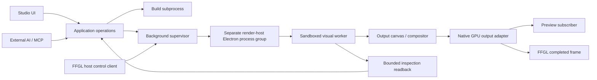
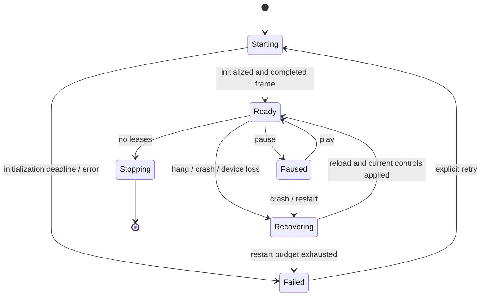

# Visual runtime and supervision

Status: proposed implementation design; no rendering or performance claim has been tested by this documentation task. Covers T01–T09, B01–B04, U04/U07; reserves boundaries for T10/T11, A01/A02, G01–G03, C01–C03 and R01–R03. Source acceptance criteria remain in [the original plan](../../plans/ai-visual-workshop-design.md), especially Appendix B.

## Runtime boundary

Use one versioned runtime package in studio authoring and background Resolume playback. A runtime instance owns a scene revision, clock, seed, controls, simulation state and output. A preview surface is a subscriber, not its owner. Moving a panel, hiding a tab, maximizing or opening a preview window does not create another simulation or change output resolution.

Recommend Windows/Electron/Three.js/TSL/WebGPU initially, subject to the GPU experiment in [Resolume bridge](resolume-bridge.md). The proposed path renders the final output into the canvas of a dedicated offscreen render-host page, then obtains Electron's composed shared texture. It does **not** export an arbitrary Three.js `GPUTexture` through a standard WebGPU API. WebGPU's texture interface exposes views and destruction, not a native texture-handle export [S1].

The render-host page contains only the output canvas: no controls, diagnostic overlay or UI scaling. One worker owns an OffscreenCanvas transferred from this page; verify that this combination actually reaches shared-texture output in the selected Electron build. If worker presentation fails, a dedicated sandboxed render page may execute the visual as an explicitly recorded topology change; it still cannot share the studio UI process.



Electron's process separation and sandbox are available mechanisms, not guarantees of fault isolation [S2]. Validate actual PIDs/process groups. Studio, supervisor and generated-code execution must not accidentally share a renderer process. Separate OS processes still share GPU/driver failure risk.

## Proposed modules and interfaces

These are file targets for implementation, not existing files. Dependencies point inward: hosts and adapters depend on runtime contracts; runtime never imports Electron, FFGL, MCP, React or project storage.

| Proposed path | Responsibility / boundary |
| --- | --- |
| `packages/runtime-contracts/src/index.ts` | Canonical branded IDs and RuntimeKey/OutputSettings/control/frame DTOs, errors and protocol validation; core imports/re-exports these. |
| `packages/visual-sdk/src/index.ts` | Small generated-code API and discoverable example; no desktop capabilities. |
| `packages/runtime/src/instance.ts` | Load/init, update/render, reset/dispose and resource ownership. |
| `packages/runtime/src/clock.ts` | Monotonic clock, play/pause/reset, bounded fixed steps. |
| `packages/runtime/src/capture.ts` | Full-output still readback and provenance; later inspection providers. |
| `packages/runtime/src/metrics.ts` | Bounded counters, CPU timings, optional asynchronous GPU timing. |
| `apps/render-host/src/main.ts` | Offscreen output page, native adapter, instance connection; trusted code only. |
| `apps/render-host/src/visual-worker.ts` | Unprivileged scene execution using pinned runtime and SDK. |
| `apps/render-service/src/supervisor.ts` | Independent lifecycle, leases, health, process recovery and host snapshot replay. |
| `apps/build-worker/src/main.ts` | Compile/typecheck allowed imports, source maps and actionable diagnostics. |
| `tests/runtime/` | Clock, activation, invalid candidate, hang, device loss and capture contracts. |
| `tests/e2e/tracer/` | Actual AI loop, process survival and hardware measurement scenarios. |

```ts
// Proposed contracts; wire format is separately schema-validated.
type RuntimeKey = { instanceId: string; generation: number };
type SceneIdentity = { sceneId: string; revisionId: string; bundleHash: string };
type OutputSettings = { width: number; height: number; fps: number; seed: number };
interface VisualDefinition {
  sdkVersion: string;
  controls: readonly ControlDefinition[];
  create(context: VisualContext): Promise<VisualInstance>;
}
interface VisualInstance {
  update(frame: FrameContext): void;
  render(target: OutputTarget): void | Promise<void>;
  reset(seed: number): void | Promise<void>;
  dispose(): void | Promise<void>;
}
interface RuntimeSession {
  load(candidate: ValidatedBundle, settings: OutputSettings): Promise<ReadyFrame>;
  setControls(snapshot: ControlSnapshot): void;
  transport(action: "play" | "pause" | "reset"): Promise<RuntimeStatus>;
  capture(request: StillCaptureRequest): Promise<StillCaptureResult>;
  dispose(): Promise<void>;
}
```

`VisualContext` contains the controlled renderer/resource factory, resolved read-only assets, seeded random stream and error sink. `FrameContext` contains `tick`, `timeSeconds`, `deltaSeconds`, resolved controls and an ordered event list (empty in 0.1). `OutputTarget` is runtime-owned, with explicit dimensions/color/alpha metadata. The SDK never receives native texture handles or arbitrary file/network APIs. Allow only pinned SDK/Three.js imports; runtime-generated shaders remain untrusted GPU work.

`ControlDefinition` has stable ID, type, label, default, range and change cost (`live`, `reallocate`, `reset`, `recompile`). 0.1 implements one finite continuous number; reject out-of-range values and NaN/Infinity at the application boundary. `ControlSnapshot` contains authority, monotonic `controlSequence` and values keyed by stable ID. The runtime echoes the applied sequence into frame metadata; only the host may write published controls in its performance instance, while studio controls remain local to the authoring instance.

Every message includes protocol version, runtime key, request ID and bounded payload length. Reject unknown required versions, stale generations, unknown controls and a mismatched bundle/runtime hash before activation. `RuntimeError` includes code, phase, instance, revision, source location when known, retryability and concise remediation; no raw stack is required for normal UI display. Preserve diagnostic details separately.

## Load and replacement transaction

1. Application core creates one serial scene-changing job with its base revision, scope and immutable candidate bundle. Compilation runs in a subprocess, with no arbitrary dependency installation or lifecycle scripts.
2. Build validates types/imports/manifest/assets within a 30-second deadline and returns a hash plus source-mapped errors. Runtime initialization and a first-frame smoke test happen in a candidate render process, outside UI execution.
3. The existing instance remains selected until the candidate produces a completed frame within a five-second smoke/activation deadline. Candidate work is bounded and marked separately in performance traces; do not claim steady-state budgets during concurrent validation.
4. At a frame boundary, core commits the accepted revision and the supervisor atomically switches the output subscription. Recheck base revision before committing. Preserve compatible control values by ID; explicitly report reset/incompatible controls.
5. The UI automatically shows the successful revision and one request-level summary. Milestone 1 adds durable Undo; tracer retains prior source for explicit restoration and must not show a nonfunctional Undo button. A failed build, timeout or first frame leaves the selected revision unchanged. Dispose the candidate; keep the previous validated bundle for restoration.
6. Dispose old GPU resources only after outstanding frame/capture leases complete. On later runtime failure, report the failed revision and restart or restore the prior bundle; a first frame is not perpetual validation.

The core owns durable project transactions and revision history (Milestone 1). The supervisor retains enough immutable bundle/control state for 0.1 restart, but is not a second project database. A performance release is pinned separately and cannot follow authoring replacements implicitly.

## Clock, scheduling and bounds

Use a monotonic clock; wall time is metadata only. `play` resumes from paused animation time; `pause` stops simulation advancement and may reuse the completed frame. `reset` restores the seed and time zero, retaining current controls. `restart` is a supervisor operation that replaces the process/generation and resets state, retaining the current authority's controls. These commands return applied state and are idempotent by request ID.

While paused, changing controls invalidates presentation and produces one fresh frame at frozen animation time without advancing simulation. Reset reinitializes at time zero, increments clock epoch and produces a fresh frame while retaining paused state. A capture with a control-sequence barrier can complete without pressing Play. Rendering failures return bounded errors; never relabel old pixels with new controls/epoch. Test new frame IDs with fixed animation time after a paused control change, and zero-time pixels with a new epoch after reset.

0.1's reference shader uses runtime time and has an immediately visible continuous parameter. Default output is 1920×1080 at 60 fps; preview fit never changes it. Settings changes are explicit transactions. Unsupported dimensions fail with a reason rather than silently changing quality.

Establish a fixed-step option now for 0.3: proposed 1/60-second steps, at most four catch-up steps per live tick, then record dropped simulation time and continue; never hide overload. Controlled capture later executes all required intermediate steps with a bounded job deadline. Do not promise identical results across GPUs.

Milestone 4 adds explicit `step` to the playback contract. It requires paused state and advances the authoring instance by one declared step (default 1/60 second), executes every needed internal simulation step, produces a completed frame and remains paused. Keep revision/generation/clock epoch unchanged; advance tick/time only. Snapshot live continuous inputs at admission and consume current-epoch queued events once, or replay the recorded step interval; include input provenance. Unsupported step/playing state returns an explicit error rather than silently pausing or affecting a host instance. This is distinct from rendering changed controls at frozen time, and is not required in 0.1.

Bound one active build and one pending replacement per scene; reject or explicitly supersede pending work. Bound two GPU submissions in flight and three native output slots initially. Bound captures to one active plus one queued request per instance (later global queued cap four). Continuous control updates coalesce by ID and sequence; event queues introduced in 0.3 never coalesce triggers. Publish queue depths and drop/reject counters.

## Ownership and lifetime

The render service runs independently from the studio, launched by the studio or the plugin's non-render control worker. Use a per-user rendezvous endpoint and an atomic single-service startup lock. Start render-host process groups with a separate profile/session from the studio. Do not attach playback lifetime to a studio-owned kill-on-close job or `window-all-closed` handler.

Clients hold leases keyed by instance and client ID. A host-owned instance survives loss of every studio lease; one studio preview lease only subscribes to its output. In 0.1, explicit developer host activation pins the validated bundle into a separate host runtime instance. Studio and host share immutable bundle/runtime code, never mutable simulation or control state. Studio edits cannot change the pinned host visual until the next explicit activation. The host controls only its own instance; studio authority stays with the authoring instance. Release playback later uses the same separation. There is no implicit global singleton visual.

Proposed lease renewal is every second with five seconds of expiry tolerance. On clean instance removal, release immediately. After the final lease expires, stop its renderer; when no instances remain, the service exits after a 30-second idle grace. Host reconnection carries the instance generation and full current control snapshot. Do not launch duplicate instances when simultaneous clients reconnect.

The supervisor is the sole canonical runtime-ID allocator; pluginClientId maps idempotently to it using [tracer attachment contracts](tracer-contracts.md). Binding and live-runtime leases retain the immutable restart closure even after unrelated scene revisions are collected. Runtime generation identifies process replacement; native outputGeneration separately identifies ring replacement without invalidating control commands.

Process/native handle ownership is listed in [the bridge design](resolume-bridge.md). Resource release after client disappearance must be bounded without freeing memory still in use by a live GPU operation. Terminating a process is the final reclamation path after device failure; do not spin indefinitely waiting for a dead device fence.



## Watchdog and containment

Worker heartbeat every 250 ms contains last completed tick and command progress. A heartbeat must originate on the execution loop: a helper thread cannot report healthy while generated JavaScript spins. The supervisor uses its own monotonic clock. Proposed detection at 1.25 seconds plus forced termination deadline at 1.75 seconds leaves headroom for the required two-second stop gate; measure actual kill completion under an infinite loop. A failed deadline fails the gate.

Distinguish paused/alive, CPU loop stall, no GPU progress, device loss, native bridge failure and IPC loss. GPU progress requires completion evidence, not just submitted frame counts. Paused instances still heartbeat. An explicit runtime error does not wait for a heartbeat timeout.

Terminate the isolated render-host group and invalidate its generation; never terminate Resolume. Automatically restart once from the validated bundle with current host controls and seed. A second fault within 30 seconds enters `Failed` until explicit retry, preventing a rapid restart storm. Recovery resets simulation unless a future component provides a versioned checkpoint. Discard prior-generation callbacks and events. Required explicit restart recovery is a completed reference frame within five seconds.

Sandbox generated code with Node integration disabled, context isolation and Electron sandbox enabled. Block navigation, windows, external network and direct desktop IPC; expose only bounded typed runtime messages. Compilation and runtime process isolation reduce damage but cannot make arbitrary GPU shaders preemptible or protect every process from a driver reset [S2]. Test and report those limits rather than declaring complete containment.

## Inspection versus transport

Inspection captures deliberately read pixels to CPU and encode an image; normal preview/FFGL transport never does this. In 0.1 support repeated full-output stills only. Proposed limits: maximum 1920×1080 and 8 MiB encoded PNG, one image/request, one active plus one queued, five-second deadline; refuse excess work with a retryable busy result. Cancellation releases staging buffers and references.

Capture a specific completed runtime output and pair its metadata atomically. Return retrievable image bytes/MCP image content, not only a local path. Include instance/generation, revision and bundle/runtime hashes, string `frameId`, `actualTimeSeconds`, `clockEpoch`, `controlSequence`/values, seed, render dimensions, capture dimensions and color/alpha conversion. Adapter mapping: native frame `animationTimeSeconds` becomes capture `actualTimeSeconds`; native `appliedControlSequence` becomes `controlSequence`; `clockDomain` is distinct from logical reset `clockEpoch`. If the selected revision changes before capture pins its frame, resolve against the requested revision or report a conflict.

Captured PNGs use a documented display conversion from linear premultiplied runtime output to display-referred image encoding; alpha unpremultiplication must avoid dividing zero. Full-output capture excludes studio chrome. Later capture adapters add component/diagnostic outputs, crops and controlled jobs without changing the live performance instance.

## Measurement and acceptance evidence

Store the test manifest, raw bounded timing samples/counters, summary and source hashes under `evidence/tracer-0.1/<run-id>/`. Measure host reference budgets with the studio preview inactive/closed; measure UI responsiveness in a separately declared concurrent studio workload. Record both workloads and never merge their samples. Hardware/runtime selection is recorded in [environment](../implementation/environment.md). No result may be inferred from static documents or successful compilation.

| Measurement | 0.1 procedure and gate |
| --- | --- |
| Reference | Deterministic animated shader, frame marker, alpha/color pattern, visible control; fixed seed/quality; 30 s warmup then 5 min at 1920×1080/60 Hz. |
| CPU | Time update and submission separately from asynchronous completion; combined p95 ≤4 ms. Report build/capture overhead separately. |
| GPU | Timestamp-query instrumentation where supported; p95 scene frame work ≤12 ms. Report transfer/compositor work separately; external GPU trace fills attribution gaps. Unavailable measurement is not a pass. |
| Delivery | Host opportunities and completed distinct frame IDs: ≥99% fresh, repeats/skips separate, no unexplained gap >100 ms. See bridge for compositor provenance. |
| UI | Timestamp representative slider, transport and job-status input to next visible acknowledgement during rendering; p95 ≤50 ms, p99 ≤100 ms. UI frame cadence separately from visual FPS. |
| Recovery | Inject syntax error, init exception, CPU infinite loop, explicit restart and renderer termination. Bad candidate retains working revision; stop loop ≤2 s; restored completed frame/current host controls ≤5 s. |
| Instrumentation | Identical workload with routine metrics enabled/disabled, multiple alternating runs; median frame cost overhead <2%. |

Use asynchronous query readback several frames later; never wait inside every frame for GPU timing. Track owned resources, estimated bytes, in-flight frames and queues, labeling estimates. Full 60-minute no-growth soak and broader shader/simulation/particles/3D/effect workloads remain Milestone 5; 0.3 adds its fixed-step simulation and event gates. Shared pass costs must not be invented per visible component.

## Extension boundaries and decisions

0.2 adds independent host instance persistence and lifecycle tests without replacing `RuntimeKey`. 0.3 adds ordered timestamped events and replayable inputs. Milestone 2 adds a declared typed graph scheduler under `VisualInstance`: evaluate shared dependencies once, explicit previous-step feedback, linear premultiplied image boundaries and explicit numeric fields. Arbitrary JavaScript is not reverse-engineered into graph nodes.

Milestone 3 adds isolated controlled capture sessions. Milestone 4 adds audio/MIDI providers outside generated code and persisted creative mappings. Milestone 5 freezes runtime/assets/control schema into installed releases. Runtime compilation stays outside the host even in an installed package.

Before coding the spike, pin exact Electron/Chromium/Three.js and native SDK builds and verify toolchain availability. The current machine has both NVIDIA and Intel adapters; require matched adapter identity in Electron/native bridge/Resolume. Pinning an API version does not prove its GPU path. The initial architecture decision is to attempt Electron shared textures first; broaden the SDK only after the bridge gate, or record a fallback redesign.

## Sources checked 2026-09-12 UTC

- [S1 WebGPU specification source: GPUTexture interface](https://raw.githubusercontent.com/gpuweb/gpuweb/main/spec/index.bs): public texture interface and worker exposure; no native handle export.
- [S2 Electron process model](https://www.electronjs.org/docs/latest/tutorial/process-model) and [sandbox](https://www.electronjs.org/docs/latest/tutorial/sandbox): process roles and privileged API isolation.
- [S3 Electron offscreen rendering](https://www.electronjs.org/docs/latest/tutorial/offscreen-rendering): shared GPU output differs from CPU bitmap mode; actual WebGPU worker behavior remains a test.
- [S4 Three.js WebGPURenderer](https://threejs.org/docs/pages/WebGPURenderer.html): candidate renderer and explicit WebGL fallback option. Pin versions at the experiment; this design does not assert a supported release matrix.
