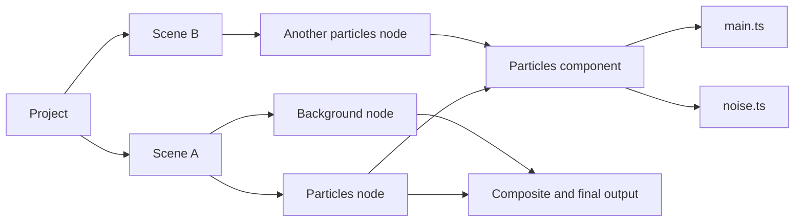
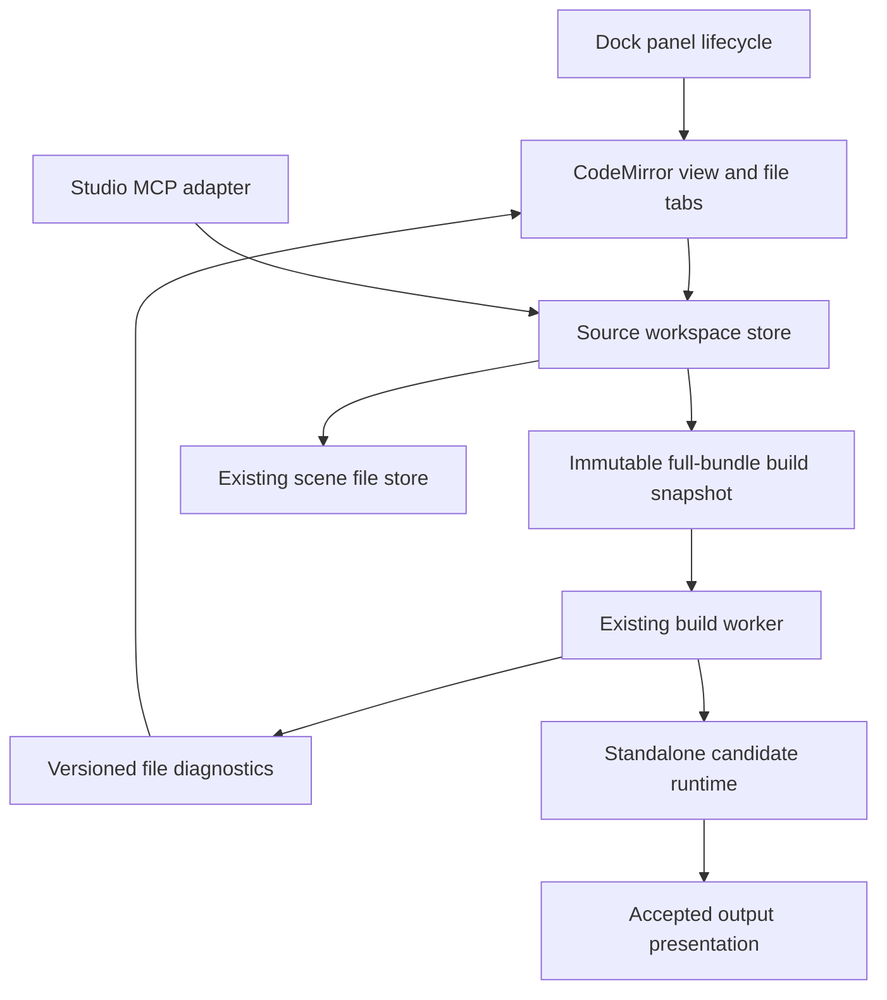

# Source workspace and multi-file authoring

Status: implementation direction prepared under delegated design authority, 2026-09-12. Documentation only; editor dependencies and application behavior are unchanged. This elaborates [Studio](studio.md), [project model](project-model.md), and the [QA follow-up](source-editor-follow-up.md). Existing historical plans remain unchanged.

## Product model

A Project contains Scenes. A Scene produces one final image by composing Nodes. Each Node is an instance of a Component definition, with independent controls/state. A definition can be code with multiple files or a graph. A helper file is not a visual layer or graph node. One selected Scene runs by default; changing file tabs never changes the selected Scene or rendered output.

The Library lists Scenes, Components, Assets and Templates. Graph selection drives the Inspector. The Inspector exposes **Edit source** for code components and **Open graph** for graph components. Edit source opens the definition's entry file in a Source panel. An explicit **Inspect output** action changes the preview inspection target; ordinary selection never replaces the final composition.



## Workspace navigation

Source is a selectable dock panel alongside Graph and Preview. The initial editor upgrade lives in the current collapsible Visual source region; it does not require Dockview or the graph implementation. Later dock integration relocates the same panel adapter.

Ultrawide default: keep Preview largest, Graph visible and Source in a tab group below Graph. Source can instead replace Graph in that group or be dragged elsewhere. Library and Inspector remain independent. Laptop default: Preview, Graph and Source share the central tab group; switching tabs preserves each view and does not stop rendering.

```text
ULTRAWIDE — illustrative widths, freely resizable
┌─────────────┬──────────────────────────┬────────────────────────────────┬─────────────┐
│ Library     │ Graph                    │ Preview: FINAL                 │ Inspector   │
│ Scenes      │ Particles ── Glow ── Over│                                │ Particles A │
│ Components  │ Background ──────────┘  │       dominant preview         │ Controls    │
│ Assets      ├──────────────────────────┤                                │ Edit source │
│             │ Source: Particles       │                                │ Used by 2   │
│             │ Files │ main.ts noise.ts│                                │ nodes       │
│             │       │ TypeScript      │                                │             │
└─────────────┴──────────────────────────┴────────────────────────────────┴─────────────┘
LAPTOP
┌─────────────┬──────────────────────────────────────────┬─────────────┐
│ Library     │ [Preview] [Graph] [Source]                │ Inspector   │
│ collapsible │ Source breadcrumb / file tabs / editor  │ collapsible │
└─────────────┴──────────────────────────────────────────┴─────────────┘
```

Source panel header identifies Scene / Component / file, with the originating Node as context when present. Opening another Node using the same definition focuses the existing buffer. Files tree lists the selected definition's complete bundle with an Entry badge. Tabs show filenames and an unsaved dot; duplicate basenames display a parent folder. The tree is collapsible, keyboard navigable and independent of the Library.

Clicking a file opens a persistent tab; no temporary-tab replacement behavior initially. Closing a tab hides the view, preserving its unsaved buffer in the workspace. Reopening restores cursor, selection, scroll and undo history. Closing the Source panel has the same non-destructive meaning. **Revert file** explicitly discards that buffer after confirmation. No silent eviction of dirty buffers.

First release supports editing existing .ts files and creating a new .ts file using a validated relative path. File rename, deletion and entry reassignment are disabled initially: reliable import rewriting and entry migration deserve a separate change. AI whole-bundle updates may change topology, subject to bundle validation and explicit diff summary. Paths and filenames follow existing compiler admission rules, not arbitrary filesystem paths.

## Draft, saved and running states

These are separate: **draft** is editable text, **saved** is the last persisted document, **running** is the last activated revision. Saving invalid source is allowed as a draft and does not imply successful activation. Build captures the whole bundle, not the selected tab. Compilation runs outside the UI; editing is locked during the first-stage build transaction to match current behavior. Failed builds keep draft text and the previous working preview.

Manual **Build & preview** remains for this incremental release. Automatic validation/activation described by the broader product design is a separate milestone, not introduced with syntax coloring. CodeMirror undo is local text history; project Undo is a distinct future accepted-revision operation.

Within a future open Project, switching Scenes retains in-memory dirty drafts by stable Scene/definition identity without a discard dialog. Selecting a different Scene is an explicit runtime switch; if the target cannot run, retain the previous output with an unmistakable 'Showing previous scene' label. This depends on the project/scene runtime contract and is not part of the standalone editor task. Closing/replacing a document or Project with any dirty buffers offers Save / Discard / Cancel. Save failure keeps it open. Crash recovery is not implied by in-memory retention.

## Shared definition scope

Node controls change only that Node. Source edits change a definition. Show a persistent **Used by N nodes in M scenes** summary and a list of affected identities before building shared code. Do not infer scope from selection alone.

- **Edit shared definition** applies to every reference in this Project.
- **Make unique for this node** copies the definition and repoints only the selected Node before editing, as one project transaction.
- Library versions are immutable. Editing creates a project-local override, with an explicit choice of affected references; publishing or updating the personal library is separate.

If usage changes between reading the scope and committing the edit, reject as stale and refresh the impact list. AI uses the same scope/revision validation. Shared code never silently migrates installed releases. These operations require the future project model; the standalone bundle has one owner and shows no fabricated usage counts.

## Technical ownership



Create `apps/studio/src/source/workspace.ts` as a framework-independent store. Its snapshot owns the full SourceBundle, monotonically increasing draft version, dirty comparison against saved content, selected file and open files. Use immutable snapshots for React subscription and deep copies at API boundaries. Keep CodeMirror EditorState/view state in an adapter cache keyed by document identity plus relative file path; runtime status updates must not recreate editor state. No file identity based on basename alone.

Expose a single editing/build admission path to human and AI callers. Existing `expectedDraftVersion` remains the standalone concurrency token. A synchronous busy lock is acquired before awaiting compile; stale versions and concurrent submissions fail without changing buffers. Snapshot success replaces the complete bundle once, increments the version once and records the accepted source identity. Failure releases the lock and preserves pre-request drafts. AI success with changed files invalidates old editor states for those files; unaffected files retain histories. Keep the replaced draft available as one workspace undo snapshot. Deleted-file diagnostics/tabs become explicitly stale or close without losing the undo snapshot.

The store must not duplicate a second mutable entry-file `code` string. Build, save and MCP read derive from its same full bundle. Existing `currentSource()` and mutable draft ref in `authoring.tsx` are replaced during integration. File dialogs remain in trusted main/preload APIs; editor code has no filesystem or runtime authority.

Preserve compiler diagnostics as structured file/line/column/message data rather than flattening them in `standalone-client.ts`. Attach the submitted draft version. Clicking a current diagnostic opens that file and places the cursor using compiler coordinate conventions; clamp out-of-range values. If the draft changed, label diagnostics stale and do not underline unrelated current text. Missing files remain readable in Problems with a stale-target explanation. Syntax coloring itself is not semantic validation.

## Editor choice

Recommendation: **CodeMirror 6**, directly wrapped in a small React adapter. Its modular state/view architecture fits a panel, and its JavaScript language package supports TypeScript parsing/highlighting. MIT licensing meets the open-source requirement. Use MUI for tabs, menus, tree and toolbar; map editor colors to the Studio theme. [System guide](https://codemirror.net/docs/guide/), [language package](https://github.com/codemirror/lang-javascript), [license statement](https://codemirror.net/).

| Option | Benefit | Cost and decision |
| --- | --- | --- |
| CodeMirror 6 | Modular editor; sufficient for highlighting, history, search and file-specific state | Compiler diagnostics need our adapter; full TypeScript language-service completion is not part of this stage. Recommended. |
| Monaco | URI-based file models and language-service workers support a richer IDE direction | Worker integration needs validation with Lux's file-based page and CSP. Prefer if integrated semantic IDE features become a near-term requirement. |
| Keep MUI multiline field | No new integration | Does not satisfy requested syntax coloring or scalable file editing; retain only as a fallback on editor initialization failure. |

Monaco's official documentation describes models and workers and warns about file-origin worker loading; this is an integration risk, not a claim that Electron cannot support Monaco. [README](https://github.com/microsoft/monaco-editor/blob/main/README.md), [ESM integration](https://github.com/microsoft/monaco-editor/blob/main/docs/integrate-esm.md).

CodeMirror's GitHub language repository is archived because it moved to [the upstream repository](https://code.haverbeke.berlin/codemirror/lang-javascript); do not interpret that as project abandonment. Pin actual package versions and verify licenses together during implementation, not from this proposal. No dependencies installed for this design.

Bundle all editor assets locally. Preserve the existing script/network CSP. Wire the current per-launch style nonce to editor-generated styles using the selected package's supported API, verified against its pinned types. Do not enable unsafe-eval or remote scripts to make the editor work. Language-service workers are not needed for initial syntax highlighting.

## Acceptance and stage boundaries

Initial delivery: colored TypeScript, line numbers, local undo/redo and search; existing-file tabs/tree; new-file validation; whole-bundle save/build; versioned diagnostics; no preview remount from typing or switching tabs. Keyboard focus can leave the editor without a trap; Ctrl+S saves the whole document; IME composition is not submitted halfway through composition.

CPU validation covers store identity/history boundaries, race handling, save payloads, diagnostics navigation and React interactions. Native font rendering, IME, screen-reader behavior, packaged CSP, docking and typing latency require a later bounded UI check. Performance measurements belong to [performance monitoring](performance-monitoring.md); record typing latency and editor memory with maximum admitted source size, rather than inventing FPS evidence from jsdom.

Full multi-Scene navigation, graph/component scope actions and Dockview integration follow their existing project and graph milestones. The [implementation plan](../implementation/source-workspace-plan.md) separates the directly executable editor work from those dependent integrations. The [CPU audit](../reviews/source-workspace-cpu-audit.md) records current evidence and missing coverage.
