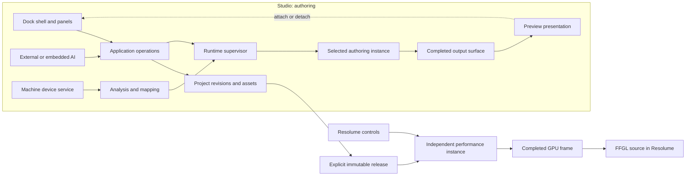
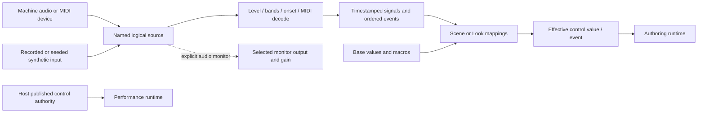

# Studio, preview, and inputs

Status: accepted behavior comes from [requirements](../requirements.md), especially U01–U09. Architecture, library choice, file targets, and detailed contracts below are proposals for implementation and testing. This document implements the direction of [original design](../../plans/ai-visual-workshop-design.md) §§4–8 and [domain proposal](../../plans/domain-and-workflow-proposal.md) §§1–4, 7, 10. It does not claim a working editor or validated GPU/window integration.

## Ownership and boundaries

One selected Scene runs by default. The Library uses thumbnails, metadata, and explicit audition rather than animated tiles. A Look recalls control values, seed, and creative modulation; it is not a second scene graph. Resolume retains show arrangement, mixing, routing, mapping, and transitions (B01, B03, S04).



Dock panels own view state, never simulation lifetime. The supervisor owns instance identity, clock, seed, current revision, control values, and recovery. Moving a preview attaches a presentation consumer to that existing instance. It must not create a new simulation, restart time, or dispose the producer. The host instance is independent: closing Studio cannot stop it (T05, U04).

UI and AI use the same validated operations and revision checks (B02, A01–A02, S01). Compilation and generated execution stay off the UI path. Show candidate job state, concise change summary, one Undo, and any reset required; successful validation activates automatically. Build failure keeps the working result; later runtime failure offers restart or restore. The dock shell must remain operable during either failure.

## Panel layout and behavior

Every region accepts chosen panels through tabs, splits, resizing, and dragging. Defaults are starting arrangements, not fixed slots. View > Add Panel, named layouts, Save Layout, and Reset Layout remain discoverable. Close/reopen restores panel state where the target still exists. Provide menu commands for moving panels as well as pointer dragging.

Ultrawide default: Preview gets the largest area; Graph remains visible. Library and Inspector are independent narrow columns. Bottom panels can collapse without shrinking the central work area permanently (U01–U03).

```text
+------------------------------------------------------------------------------------+
| Project / Scene / Look     Play Pause Reset Restart     Undo   Layout   Preferences |
+------------+-----------------------+----------------------------------+--------------+
| Library    | Graph                 | Preview: FINAL                   | Inspector    |
| Search     |                       | Fit  Zoom  Render scale          | Target  Lock |
| Scenes     | [Particles]--[Glow]   |                                  |              |
| Components |                \      |         DOMINANT IMAGE           | Controls     |
| Assets     | [Background]--[Over]  |                                  | Bindings     |
| Templates  |                       |                                  | Capabilities |
|            |                       | Maximize  Pop out  Fullscreen    | Diagnostics  |
+------------+-----------------------+----------------------------------+--------------+
| Inputs [Source | Analysis | Mapping]  | Chat | Jobs / Diagnostics                    |
+------------------------------------------------------------------------------------+
| Audio: device / activity / monitoring OFF   MIDI: state   Visual fps   UI fps   Link |
+------------------------------------------------------------------------------------+
```

Laptop default: Preview and Graph share one central tab group. Selecting Graph does not stop rendering; returning to Graph restores its pan, zoom, and selection. Narrow side panels remain independently collapsible and resizable. Bottom panels start collapsed or short (U02, U06).

```text
+---------------------------------------------------------------------+
| Scene / Look    Play Pause Reset Restart    Undo    Layout            |
+----------+---------------------------------------------+------------+
| Library  | [Preview] [Graph]                           | Inspector  |
| Search   | FINAL   Fit  Zoom  Render scale              | Target Lock|
| Scenes   |                                             |            |
| Assets   |              LARGE PREVIEW                  | Controls   |
|          |                                             | Bindings   |
|          |                Maximize / Pop out / Fullscreen|            |
+----------+---------------------------------------------+------------+
| Inputs | Chat | Jobs / Diagnostics                                  |
+---------------------------------------------------------------------+
| Audio: state / meter / MON OFF   MIDI: state    Visual fps / UI fps   |
+---------------------------------------------------------------------+
```

Selection follows stable node IDs. Inspector follows selection unless locked; its target label always identifies the locked node. Deleting that node produces a missing-target state with Unlock, not an unrelated replacement. Multiple inspectors may be opened with independent locks. Available actions come from declared component capabilities (G01–G02, U03).

Selecting a node changes Inspector, never final output. **Inspect output** explicitly chooses a node port or diagnostic view and labels the preview `Inspecting: Node / Port`; **Return to Final** is always available. This presentation choice does not rewire the graph or alter the host output. Inspection can require additional bounded work and reports that cost. A rectangle is capture scope, not inferred object identity; AI edit scope is separately visible (C01–C03, U06).

Chat attaches explicit node selection and captures, including revision/time. Jobs show build/runtime errors and cancellation. Library distinguishes built-in, project-local, and pinned personal items; editing a reused definition creates a project-local override, while publishing/updating is explicit (P01–P02, S01).

## Preview and settings semantics

| Control | Meaning and owner | Consequence |
| --- | --- | --- |
| Fit | Presentation fits the full image inside the pane with aspect preserved. | Letterbox as needed; no runtime resolution change. |
| Zoom | Presentation magnification/pan, including 100% pixel inspection. | May crop the visible area; full-output capture remains full output. |
| Render scale | Explicit authoring render-quality override relative to scene output dimensions. | Show effective render dimensions and cost; never silently lower for speed. |
| Output dimensions/aspect | Scene output settings, validated and saved with the Scene. | Allocates output targets through runtime resize; independent of dock size. |
| Target FPS | Scene/runtime pacing target, separate from measured delivery. | Report actual performance; missed target is not hidden. |
| Frame-step (milestone 4) | Advance one declared runtime step while paused through the shared playback operation. | Preserve pause state/revision/instance, render the next frame, show advanced tick/time; never advance the host instance. |
| Seed | Saved Scene/Look creative state. | Reset/reinitialize when required by component contract. |
| Simulation resolution | Advanced component control for field/grid/particle workload. | Independent from image dimensions; show reset and memory implications. |
| Capture dimensions | Requested inspection output size/aspect policy. | Downsampling is not a render override; provenance records both. |
| Preferences | Machine display, UI scale, devices, monitor output, layout. | Excluded from project content and release. |

Render scale defaults to 1.0 in the tracer with a fixed recorded output size. Changing pane size, DPI, maximize, or fullscreen changes presentation only. Host output resize is a separate host/runtime operation. A capture records the effective output/render settings and any explicitly requested override (T07, U07, C03).

Milestone 4 frame-step uses the runtime's declared timestep (default 1/60 second), including all necessary internal fixed simulation steps. It is enabled only when paused. UI and AI call the same generation-aware step operation. For live inputs, freeze continuous values at command admission and consume only explicitly queued current-epoch events once; for replay inputs, sample the recorded interval being advanced. Record input mode/snapshot. Repeated steps advance exactly the declared intervals and remain paused, without touching host time or source revision (S05).

Workspace maximize temporarily hides other panels and returns to their prior arrangement. Popout moves the presentation to another window; closing that window docks it back. Monitor fullscreen uses the native window operation, with Escape and a visible return action. Save pre-fullscreen bounds separately. These actions preserve instance ID, simulation tick, revision, controls, and input subscriptions; a transient presentation interruption must not reset the scene (U04).

Persist versioned personal layouts and window bounds under machine application data, outside project/Git/release. Save display identifiers plus bounds in logical pixels, then validate against current work areas on restore and display changes. Clamp inaccessible windows onto an available display with reachable title controls; offer Bring All Windows Back and Reset Layout. Invalid layout data falls back to a default without touching scene content. A project may save graph node positions, while machine-specific dock arrangement and transient graph viewport remain separate (U05, P02).

## Docking library decision and integration gate

Provisional choice: **Dockview core with its React binding**, isolated behind a small Lux panel registry and layout adapter. It directly covers the requested arrangement; no custom docking engine is planned. Pin the tested package versions and licenses after the spike.

| Candidate | Current official evidence | Decision implication |
| --- | --- | --- |
| Dockview | Core and React packages are MIT; drag/split/tab layout, maximize, floating/popout groups, and layout save/restore are free. Optional Enterprise is commercial; examples include snapping, layout history, and advanced keyboard docking. [License matrix](https://dockview.dev/docs/overview/licence/), [package licenses](https://github.com/dockview/dockview/blob/master/LICENCE.md). | Meets accepted core needs without Enterprise. Do not assume every demo feature is MIT. |
| FlexLayout | React docking library with JSON model, tabsets, and popouts; [MIT license](https://raw.githubusercontent.com/caplin/FlexLayout/master/LICENSE). Popouts use React portals and require correct destination document/window handling. [Official README](https://github.com/caplin/FlexLayout/blob/master/README.md). | Credible fallback if Dockview's Electron window contract fails; it also needs a surface lifecycle test. |

Checked 2026-09-12 UTC. These are documented capabilities, not Lux test results. [Dockview popout documentation](https://dockview.dev/docs/core/groups/popoutGroups/) requires a same-origin HTTP(S) popout page, documents asynchronous open failure and return-to-grid behavior, and says popout groups cannot use group maximize. Native window fullscreen therefore needs a Lux/Electron adapter; an app/custom protocol must not be assumed compatible.

Before committing the full shell, test these gates on the selected packaged Electron version:

1. Establish a permitted same-origin window strategy with restrictive navigation, preload/API boundaries, and CSP. Test packaged launch without a dev server. If a local HTTP origin is needed, record authentication/binding and lifetime ownership; do not loosen URL guards blindly.
2. Move the real preview surface across documents/windows, split/tab/maximize, fullscreen, close, and return. Assert one producer instance and advancing simulation; detect duplicate clocks, subscriptions, stale handles, or renderer resets.
3. Validate actual GPU presentation attachment across Electron renderer contexts. A DOM portal preserving React state does not prove WebGPU/context/resource portability. If direct reparenting fails, reattach a presentation surface consuming the same completed output; do not duplicate simulation.
4. Verify owner-document event handlers, menus, shortcuts, resize observers, focus, and DPI changes. Test monitor removal and reopening saved layouts; blocked/failed popouts leave a usable main panel.
5. Hide/minimize the main window and switch tabs while host output runs. Measure background throttling, frame delivery, and resource counts; UI visibility cannot own host scheduling.
6. Close/reopen the preview repeatedly, then terminate Studio during host playback. Release consumers and windows exactly once; keep the host-owned renderer alive. Record results and selected versions before library adoption.

Failure changes the layout/presentation adapter or library choice, not U04 or T05. Keep the minimal tracer usable while resolving this integration.

## Inputs: source, analysis, mapping



Inputs is dockable, with three visibly separated areas (S02–S03, U08–U09):

- **Source:** Off, live audio device, MIDI device, recorded fixture, or synthetic fixture; logical source name; connection/permission state; channels; sample rate where available; activity meter; Start/Stop/Retry. Machine Preferences binds a logical name such as `music` to a physical device.
- **Analysis:** inspect actual level, spectrum/bands, onset threshold/refractory interval, gain, floor, attack/release, and smoothing. Show raw and processed values together. Label units and algorithms, and distinguish signal gain from monitor volume. Tempo, phase, LFOs, and curves enter as explicit signal sources in Milestone 4.
- **Mapping:** source signal/event, target stable control ID, input/output range, curve, invert, smoothing, mode, enabled state, and resulting value. Show base, macro contribution, modulation contribution, clamp, and effective result. MIDI Learn arms one chosen row and stops after a match/cancel; it never silently remaps other rows.

Proposed evaluation: base/Look value -> macro transformation -> ordered internal modulation -> declared clamp. Each binding records replace/add/multiply semantics and stable order. Published host-controlled values bypass competing studio bindings during performance unless an explicitly supported internal modulation contract says otherwise. Display authority beside each target. Changing a base value while modulation is active must not make its effect mysterious.

A continuous MIDI CC updates a value; note/trigger events retain timestamps, sequence IDs, and multiplicity. Do not convert repeated triggers into a polled boolean. Use bounded queues and a declared lateness/overflow policy with visible drop counts. On reconnect, flush obsolete events and reset held-note state; do not replay old bursts (T11, S03).

Machine preferences hold device identities, permissions, channel routing, and monitoring output/level. Scene/Look data holds logical source references, analysis settings that define the creative response, mappings, and macros. Missing devices leave mappings intact but visibly unresolved. No automatic substitution with a different microphone or controller. Recorded assets and synthetic fixture definitions can travel with the project; OS device IDs and grants cannot (U09).

Audio lifecycle: Off -> Requesting permission -> Starting -> Running, with explicit Suspended, Disconnected, Denied, and Error states. Start/Resume is user-visible when required by the platform. Use a generation token so a late permission/start response cannot resurrect a stopped or superseded source. Switching sources stops old tracks, detaches monitoring, disconnects nodes, removes listeners/timers, and zeros stale analysis before publishing the new source. Reacquire only the selected device and show negotiated settings; Retry handles denied, busy, or missing-device conditions.

Music analysis should request disabled echo cancellation, noise suppression, and automatic gain when supported; show actual negotiated settings and validate against a known signal on the target system. Do not rely on voice-oriented defaults or assume all devices honor requests. Define actual RMS from time-domain samples (window and channel policy explicit); a mean normalized frequency-bin magnitude is a spectrum-level estimate, not RMS.

Monitoring is a separate, explicit OFF-by-default audio output path with destination and gain. A small persistent indicator reports capture state and whether monitoring is audible even when Inputs is hidden. Opening Inputs, enabling analysis, recalling a Look, or recovering a source must not turn monitoring on implicitly. Surface output/playback errors rather than claiming success. Verify loopback/feedback behavior; monitoring is not required for analysis. Studio device services outlive panel moves but stop on Studio shutdown unless separately owned by a supported performance input service.

MIDI lifecycle similarly distinguishes permission, no device, connected, disconnected, and error. Subscribe once per active logical source; hotplug updates status without duplicating listeners. Rebinding or disposal removes callbacks, clears stale controls/events according to the binding policy, and preserves saved mappings for reconnection. MIDI monitoring is a bounded recent-event list with device/channel/message/value/time and drop counts; it is independent of audible audio monitoring.

## Loom evidence and limits

The source plan records Loom baseline `bbc6e81d8f6609486f12aa0a303a23a30d46760d`. GitHub API returned 404 for that ref during this review. The following observations are from separately pinned current commit `9fb02b37c167810196b1408313e9059e7cae1dc0`, not a claim to have reproduced the baseline:

- [audio.ts](https://github.com/ZackMFleischman/loom/blob/9fb02b37c167810196b1408313e9059e7cae1dc0/packages/runtime/src/inputbus/audio.ts) provides off/mic/test modes, explicit device selection, disabled voice processing requests, band/onset analysis, stop/track cleanup, and a separate monitor element. Its `rms` is the arithmetic mean of byte frequency bins divided by 255. Its synthetic hats use `Math.random()`, so the test source is not sufficient evidence of seeded deterministic replay. Browser-behavior comments are hypotheses to retest, not portable guarantees.
- [Header.tsx](https://github.com/ZackMFleischman/loom/blob/9fb02b37c167810196b1408313e9059e7cae1dc0/packages/engine-app/src/ui/console/Header.tsx) demonstrates compact source/monitor/MIDI status and independent UI/output FPS. Lux adopts those visibility ideas, not Loom's set/deck workflow or automatic restoration of audible monitoring.
- [inputs.ts](https://github.com/ZackMFleischman/loom/blob/9fb02b37c167810196b1408313e9059e7cae1dc0/content/inputs.ts) separates named kick/hats/bass/energy/CC channels from consumers. Lux retains logical source naming but explicitly separates machine bindings and Scene/Look creative tuning instead of inheriting global-only channel ownership.

## Host transfer and staged delivery

The 0.3 test uses native Resolume audio modulation and MIDI mapping of published controls. It proves continuous modulation and repeated ordered triggers through the host bridge; it does not imply raw audio buffers, spectra, or MIDI devices are exposed by FFGL. Studio device capture is not silently transferred to a release (T11, S03).

Export lists each mapping as supported internal mapping, host setup required, or unsupported, with target controls and the missing input contract. Published controls remain host-authoritative; avoid double-applying the same audio response. Rich audio analysis in performance needs its own supported and tested input service/contract. Offline release playback requires neither Studio nor its devices. Initial delivery is a source plugin; incoming-image effects and broader device sources are later work (R01–R02, U09).

| Stage | Proposed files / contract | Evidence required |
| --- | --- | --- |
| 0.1 | `apps/studio/src/{main.ts,renderer.tsx,preview.tsx,service-client.ts}`; one preview, named continuous control, transport/restart/status, fixed output dimensions. | AI create/capture/revise loop; invalid candidate retains output; independent UI/visual timings; closing Studio leaves host alive (T01–T09). |
| 0.1 lifecycle smoke | `tests/e2e/tracer/studio.spec.ts`; temporary real-surface attach/detach/window harness before full shell. | Same instance/tick/controls through presentation moves and failures (U04). Full Dockview packaged-origin, layout and monitor recovery gates remain milestone 4; this smoke test does not certify the library. |
| 1 | `apps/studio/src/jobs/JobsPanel.tsx`, `history/ChangeSummary.tsx`; shared operation client, serial jobs, Undo/status. | Automatic success, conflict/error/cancel, durable recovery without Keep ceremony (A01–A02). |
| 2/3 | `apps/studio/src/graph/GraphPanel.tsx`, `inspector/InspectorPanel.tsx`, `preview/InspectionTarget.ts`; typed target IDs and explicit inspection. | Branch selection/lock, deleted target, final unchanged, capture scope independent from edit scope (G01–G03, C01–C03, U03/U06). |
| 4 | `apps/studio/src/layout/DockShell.tsx`, `PanelRegistry.ts`, `LayoutStore.ts`, `apps/studio/electron/WindowCoordinator.ts`; full shell and personal layout schema. | Ultrawide/laptop, arbitrary panels, restore/reset, monitor removal, DPI/fullscreen/return, no scene reset (U01–U07). |
| 4 | `apps/studio/src/inputs/InputsPanel.tsx`, `packages/inputs/src/{sources,analysis,mapping,lifecycle}.ts`, `apps/studio/src/preferences/DeviceBindings.ts`; timestamped source contract and portable bindings. | Known-signal analysis, MIDI repetition, denial/hotplug/late-start recovery, monitoring explicit, no listener leaks; seeded/recorded replay (S02–S04, U08–U09). |
| 4/5 | `apps/studio/src/chat/ChatPanel.tsx`, `library/LibraryPanel.tsx`, `release/InputCompatibilityReport.tsx`. | Equivalent AI operations, assets/looks/library workflows, export mapping report and host authority (S01, M01–M02, P01–P02, R01–R02). |

Paths are proposed targets to reconcile with the implementation plan, not existing modules. Full docking, chat, device setup, graph editing, and library workflows must not expand the 0.1 tracer. The early lifecycle smoke test exists to expose integration risk while that tracer remains small.
