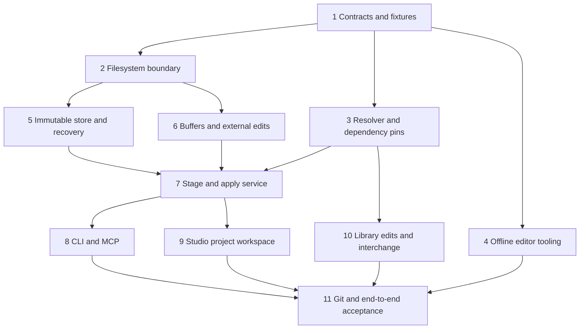

# Filesystem-first projects implementation plan

> For agentic workers: use `superpowers:subagent-driven-development` or `superpowers:executing-plans` to implement each slice with its tests and review gate. Checkboxes describe future work; this document does not claim implementation.

**Goal:** let people and coding agents edit ordinary project files with useful TypeScript tooling and Git, then apply a coherent change into Lux without losing drafts or disrupting the last working visual.

**Architecture:** editable working files are distinct from validated immutable snapshots and running instances. One project service owns staging, conflict checks, durable acceptance and activation; Studio, a local CLI and MCP use that service. Component/scene identity and exact package pins determine scope, while sandboxed compilation still receives a bounded source bundle rather than arbitrary disk access.

**Tech stack:** existing TypeScript, Node, Electron, React/MUI/CodeMirror, Zod, contained TypeScript/esbuild compiler and native Windows capability helpers where path/locking guarantees require them. Git awareness is required in the first project release; Git remains external version control, not the transaction engine. Avoid a new language server, package manager or Git database implementation.

**Spec:** [Filesystem project architecture](../design/filesystem-projects.md). Its schemas and transaction semantics are authoritative for this plan. [Review record](../reviews/filesystem-projects-review.md) must have no unresolved blocking findings before implementation begins.

**Planning status:** all three independent reviews and correction rechecks passed; see the review record. Implementation has not begun.

## Scope and baseline

This is the first project-workflow checkpoint after the tracer. It does not reopen tracer completion or imply project storage already exists. The first deliverable supports multiple scenes, each referencing a single code component, project-local shared definitions and exact vendored dependencies; graph composition and library publishing UI remain later work. Preserve a standalone `.lux-scene` interchange path.

At planning time, active integration is `codex/tracer-0.1`, with isolated parameter and codec work ahead of it. Before coding, identify the final integrated commits and refresh this inventory:

| Existing path | Current responsibility | Integration rule |
| --- | --- | --- |
| `packages/core/src/scene-document.ts`, `scene-file.ts` | Portable bundled scene schemas and conflict-checked disk save | Keep compatibility; add directory project services beside these, not by reinterpreting old scene versions. Integrate the pending v3 control provenance work first. |
| `apps/studio/src/source/workspace.ts`, `authoring-session.ts` | Whole-source draft, saved/running distinction, editor selection and save/build coordination | Add a project-backed adapter; preserve the standalone adapter and per-file CodeMirror history. |
| `apps/studio/src/source/CodeEditor.tsx`, `SourcePanel.tsx` | Text editing and file/asset views | Project file paths identify buffers; UI layout is not document ownership. |
| `apps/studio/src/main.ts`, `preload.ts`, `agent-bridge.ts` | Privileged I/O, trusted IPC and local agent bridge | Move new filesystem operations behind focused project handlers; do not put filesystem authority in the renderer. |
| `apps/studio/src/standalone-client.ts`, `controls/` | Candidate activation, generic properties and runtime snapshots in the parameter integration branch | Adapt the candidate lifecycle for prepare/activate/abort; do not implement a second rendering path. |
| `apps/build-worker/src/source-policy.mjs`, `compile.mjs`, `link-runtime.mjs`, `artifact-identity.mjs` | Bounded source admission, contained compiler, linker and sealed artifacts | Resolver emits a normal accepted SourceBundle; disk paths and project tsconfig cannot expand imports. Preserve SDK 0.1/0.2 and asset versions. |
| `packages/assets/src/`, pending admission worker | Original-byte and codec validation | Reuse off-UI admission; do not decode unchanged assets during typing or watcher events. |
| `scripts/studio-mcp.mjs`, `packages/visual-sdk/src/discovery.mjs` | Source/control operations and checkout SDK discovery | Add negotiated project capability and locations without breaking standalone tools. |
| `packages/export/src/`, `scripts/studio-export.mjs` | Immutable exported closure | Export accepted scene closure only; never enumerate mutable project files at host startup. |

## Global constraints

- Read the architecture's exact schema, path and quota constants; implement them once in `packages/core/src/project/contracts.ts` and derive schemas/types from it.
- A path, display name, Git branch, file timestamp or content hash is not an entity ID or permission token.
- No watcher event, timeout, debounce or quiet interval authorizes activation or proves a batch is coherent.
- Failed validation preserves working files, dirty buffers and the previous accepted/runtime snapshot. No automatic restore of working files from history.
- Revalidate complete managed membership, bytes, selected scope, accepted head and buffer versions at the specified boundaries. A stat-only comparison is insufficient.
- Runtime code remains unprivileged; no Node, arbitrary imports, project filesystem or network access is added by editor tooling.
- All package and SDK resolution is exact, local and verified. Do not install or run project scripts as a side effect of opening a project.
- One accepted transaction may affect several scenes. Validate every affected entry closure before acceptance; only the explicitly selected scene owns the persistent preview.
- `.lux-scene` migration preserves originals. Installed releases remain pinned and independent of project/Git changes.
- Keep graphics tests serial and test-owned. CPU/injected-failure tests precede live Studio tests; no Resolume interaction is required for the project protocol itself.

## Shared interface and ownership map

The architecture defines the wire schemas for `discover`, `stage`, `apply`, job status and conflicts. Define these interfaces before parallel consumers start; agents may not add local variants. `ProjectSessionId` identifies an authorized local checkout binding, and all operations carry the expected accepted head/workspace and applicable buffer versions. `StageRequest` includes the exact complete expected managed file inventory and explicit scope. Staging returns an immutable candidate; applying references that candidate rather than rereading unspecified live input.

| Proposed unit | Responsibility / public surface |
| --- | --- |
| `packages/core/src/project/contracts.ts` | Manifest/reference/snapshot schemas; `ProjectSessionId`, `ProjectDiscovery`, `StageRequest`, `StagedCandidate`, `ApplyRequest`, result/error types and policy constants. |
| `packages/core/src/project/paths.ts` | Pure canonical relative-path and collision validation. |
| `packages/core/src/project/filesystem.ts` | Capability-bound handles, bounded inventory/reads, external-write-safe saves and secure native adapter boundary. |
| `packages/core/src/project/resolver.ts` | `resolveProject(snapshot, sceneId)` -> bounded resolved source, asset and origin maps; `affectedScenes(base, next)` -> complete transitive impact set. |
| `packages/core/src/project/store.ts` | Immutable object/revision storage, retained roots, crash recovery and atomic head publication. |
| `packages/core/src/project/service.ts` | `open`, `discover`, `stage`, `apply`, `status`, `close`; session lease, queue, idempotency, scope and final rechecks. |
| `packages/core/src/project/buffers.ts` | Base/disk/buffer comparison, guarded saves and conflict records; no JSX or rendering ownership. |
| `packages/core/src/project/library.ts` | Verified exact vendored pins, local overrides and explicit dependency updates; no online catalog service. |
| `packages/core/src/project/interchange.ts` | Import/export portable scenes without silently dropping metadata, helper files, images or controls. |
| `packages/core/src/project/git.ts` | Bounded read-only repository/branch/worktree/conflict discovery; external checkout/reset detection and status without executing repository hooks or configured commands. |
| `packages/core/src/project/tooling.ts` | Pinned offline editor/type kit generation and validation, including origin-aware diagnostics. |
| `apps/studio/src/project/` | Project-session IPC client, directory workspace adapter, selection/conflict UI and project/scene command presentation. |
| `scripts/lux-project.mjs` | CLI adapter to the same project service; discovery, validation, stage/apply/status. No direct writes to accepted-head storage. |
| `scripts/test-project-cpu.mjs`, `scripts/test-studio-project.mjs` | Explicit runner inventory and isolated real-app acceptance. |

Any concrete signature adjustment requires changing the architecture and all consumers in the same reviewed slice. Private helpers may differ; public meanings must not.

## Dependency order and parallel work

Use separate worktrees for independent slices. Freeze contracts after slice 1. Filesystem and resolver/tooling work can run in parallel, then store and buffer work after the I/O boundary. Integration owns `main.ts`, `authoring.tsx`, MCP registration, runtime prepare/activate adaptation and runner inventories; assign one writer for those files. Each slice supplies its exact commit, evidence, remaining gaps and compatibility impact. Independent review does not replace integration tests.

## Slice 1: schema, state model and executable fixtures

**Files:** create `packages/core/src/project/contracts.ts`, `tests/project/contracts.test.ts`, `tests/project/fixtures.ts`; update shared identity exports only where necessary.

**Deliverable:** strict schemas matching the architecture and fixtures for two scenes sharing one component, a unique component, nested helpers, one pinned library dependency, assets and named controls.

- [ ] Write negative fixtures: duplicate IDs, stale references, unsupported versions, duplicate/case-colliding paths, extra fields, bad pins, missing dependency closure malformed schema hashes/control caches, legacy-v1 versus empty-assets-v2 distinction, and mixed-SDK imports. Valid prior-source control provenance is not itself an error.
- [ ] Implement bounded raw duplicate-key-aware JSON parsing before object/schema validation; include literal duplicate-key, deep nesting, oversized string and invalid UTF-8 fixtures. Implement and export the exact manifest/session/candidate contracts, quotas and deterministic hash-body format. Use explicit versioned identity bodies rather than arbitrary JSON property order.
- [ ] Test that display renames preserve IDs, reference changes alter the relevant content identity, and invalid metadata cannot invoke submitted code.
- [ ] Run `node --test tests/project/contracts.test.ts`; review schema examples against the architecture and commit.

## Slice 2: safe filesystem capabilities and complete inventory

**Files:** create `packages/core/src/project/paths.ts`, `filesystem.ts`, `tests/project/filesystem.test.ts`, `tests/project/native-filesystem.test.ts`; add a focused native helper/runner under `native/project-files/` if required by the Windows boundary.

**Deliverable:** open a selected directory as a session capability, enumerate exactly managed files with byte hashes, and save only against a checked base without following outside links or overwriting an external writer.

- [ ] Write real temporary-directory tests for spaces/Unicode project roots, nested relative paths, empty/deleted files, case collisions, reserved/device/alternate-stream paths and all quota boundaries.
- [ ] Exercise junction/reparse/symlink/hardlink/ancestor substitution and file replacement between inspection and I/O. Test the native handle-owned original-to-backup and exclusive no-clobber new-target save protocol: an intervening external creation must survive and leave both original/proposed recovery bytes. Test handle lifetime and replacement behavior, not only lexical path validators.
- [ ] Implement bounded reads and complete membership fingerprints through the architecture's supported local-filesystem contract. If native guarantees cannot be provided, report unsupported mode rather than silently weaken the promise.
- [ ] Implement watcher hints plus explicit full refresh; inject dropped, duplicate and reordered events. Assert refresh catches changes with identical mtime/size.
- [ ] Test sharing violations, unreadable files, disk full and external writes during save. Preserve both conflicting versions; failed saves cannot mark a dirty buffer saved.
- [ ] Run focused CPU/native filesystem tests with temporary roots and commit. No graphics.

## Slice 3: reference resolver and exact package closure

**Files:** create `packages/core/src/project/resolver.ts`, `library.ts`, `tests/project/resolver.test.ts`, `tests/project/library-pins.test.ts`; add minimal fixture bundles in `tests/fixtures/project/`.

**Deliverable:** convert supported scene/component/reference metadata into the existing compiler's bounded source and asset envelope with a reversible diagnostic origin map.

- [ ] Test two scenes sharing a component, two definitions sharing a helper, and distinct scenes using supported SDK 0.1/0.2 variants; reject incompatible mixed-SDK references inside one closure; distinguish definition ownership from scene/node values.
- [ ] Implement exact UUID/pin lookup, dependency-cycle rejection, transitive affected-scene calculation and deterministic virtual module paths. No prefix matching or global-library fallback.
- [ ] Reject unknown IDs, direct cross-project filesystem imports, path escapes, missing vendored bytes, mutable edits to pinned package content and unsupported graph manifests.
- [ ] Cover scenes directly referencing package exports with explicit SDK/source-envelope/entry metadata (legacy v1 and empty-assets v2), duplicate filenames in different components/packages, relative import resolution, asset aliases, renamed component folders, removal of used assets and pin updates affecting several scenes.
- [ ] Compile a resolved fixture through the real existing compiler and verify diagnostics map to the original project file. Apply existing 32-file/1 MiB source and asset limits to the resulting closure, not separately to each library to evade quotas.
- [ ] Verify an unused invalid managed manifest is reported by project validation as specified; selected-scene filtering cannot hide broken shared references. Commit after independent review.

## Slice 4: offline coding-environment kit

**Files:** create `packages/core/src/project/tooling.ts`, `scripts/prepare-project-tooling.mjs`, `tests/project/tooling.test.mjs`; update SDK packaging/type generation and appropriate build inventories.

**Deliverable:** a project opens in an ordinary coding environment with usable pinned SDK/Three types, completion and source navigation, independent of the Lux development checkout.

- [ ] Package the exact supported SDK declarations and required type closure from the installed Lux distribution. Record provenance/version hashes and license inventory.
- [ ] Generate per-definition tsconfigs selecting the declared SDK variant and a root solution index, with relative project-local paths; the check command validates each entry with its matching trusted SDK. Do not rely on absolute development paths, global node_modules, symlinked compiler state or a reachable registry.
- [ ] Test clean-room offline typechecking of an entry/helper and declared numeric parameters with the pinned compiler; wrong keys/imports must produce useful diagnostics.
- [ ] Deliberately edit project tsconfig, package.json and type declarations. Editor configuration may affect editor suggestions, but trusted build must ignore/reject semantic overrides and never run lifecycle scripts or arbitrary TS plugins.
- [ ] Test mixed-SDK project editor/CLI diagnostics and SDK upgrade/downgrade mismatch reporting and repair as an explicit operation that preserves edited content; opening a project cannot silently install packages or overwrite a customization.
- [ ] Run the tooling tests with the Lux checkout hidden from resolution. Commit the distribution/type closure and evidence together.

## Slice 5: immutable snapshots, durable head and recovery

**Files:** create `packages/core/src/project/store.ts`, `tests/project/store.test.ts`, `recovery.test.ts`; extend the existing file replacement adapter instead of duplicating undocumented save logic.

**Deliverable:** immutable staged/accepted content with one durable head publication, bounded retained objects and crash recovery that never regenerates old source over external edits.

- [ ] Implement write-once object validation, candidate leases, revision identities, session-independent accepted state and atomic head replacement using the architecture's journal ordering.
- [ ] Inject failure before/after every durable write, flush, rename and head publication. On reopen, recover exactly the verified old or new accepted head, never a mixed revision.
- [ ] Prove recovery does not edit current working files, including external changes made while Studio was closed. Offer recovery copies when needed.
- [ ] Test missing/corrupt objects, transaction records, stale lock holders and interrupted cleanup. Never steal a live writer lock based on elapsed time.
- [ ] Test quota/retention rules protecting running, accepted, staged, undo/checkpoint and export roots; cached data loss must not imply accepted source loss.
- [ ] Run focused failure-injection tests and a real subprocess-kill/reopen test before committing. Document what crash durability is proven on the selected filesystem.

## Slice 6: Studio buffers and external change reconciliation

**Files:** create `packages/core/src/project/buffers.ts`, `git.ts`, `apps/studio/src/project/workspace.ts`, `tests/project/buffers.test.ts`, `tests/project/git-awareness.test.mjs`, `tests/studio/project-workspace.test.ts`; adapt existing SourceWorkspace/CodeMirror cache narrowly.

**Deliverable:** every file has a known base, optional dirty buffer and observed disk version; file tabs remain views rather than owners. Git repository/branch/worktree and conflict status is available from the first project release.

- [ ] Implement the architecture's isolated Git observation-directory adapter (captured index/metadata and core-owned allowlisted config, never live repository config) with Git >=2.39.0 plus capability probes, bounded execution/output and sanitized environment. Optional content status requires a safely captured local semantic/object closure; otherwise report unavailable. Test normal branch, detached HEAD, unborn branch, nested project root, no repository, worktree .git indirection, merge/rebase/unmerged files, missing Git and changed index/HEAD. Static and racing hook/filter/fsmonitor/external-diff/include/worktree-config sentinel commands must not execute, including changes between capture and invocation. Test the independent unmerged-index fingerprint/lease gate, unchanged content with changed index stages, filters disabling optional status, missing Git in a repository, and verified non-repository mode. Unknown mandatory conflict state blocks apply while draft saving remains possible.
- [ ] Test clean-buffer external edit reload, dirty-buffer external edit conflict, same-byte convergent edits, delete/rename with dirty buffers, external Git checkout and project-switch cleanup.
- [ ] Implement conflict records with both versions preserved and explicit keep/reload/merge outcomes. Merge resolution itself must recheck the current disk base.
- [ ] Preserve editor cursor/undo for unchanged files and stable identities; never copy dirty buffers into another checkout merely because project IDs match.
- [ ] Implement guarded Save and Save All, independent of runtime activation. In a directory project Ctrl+S saves the active file, then stages/applies the affected scene only when required buffers are saved and conflict-free. Other dirty required files offer Save all and apply; do not mix disk and unsaved inputs. Unrelated already-saved draft changes require reviewing the whole pending diff and explicit wider scope; preserve the preview and do not silently include them. Saving invalid source still succeeds as a draft even if build fails. Keep standalone tracer shortcut semantics unchanged until an explicit migration.
- [ ] Exercise edits arriving during compile and during activation: no successful result may falsely mark newer buffers/disk content applied or saved.
- [ ] Run unit and RTL workspace tests; commit without changing dock layouts.

## Slice 7: stage/apply service and runtime transaction

**Files:** create `packages/core/src/project/service.ts`, `tests/project/service.test.ts`, `activation.test.ts`; adapt `apps/studio/src/standalone-client.ts` through an explicit candidate port and keep the standalone compatibility adapter.

**Deliverable:** discover -> edit -> stage -> apply -> capture works with exact provenance and one shared operation boundary.

- [ ] Write stale head, changed membership, buffer conflict, scope mismatch, expired candidate, wrong session/root and request-ID reuse tests first.
- [ ] Implement immutable staging from the exact expected inventory. Stage does not execute source, rewrite files or activate the preview.
- [ ] Apply validates every affected scene closure, prepares temporary candidates serially, verifies first-frame/schema/assets, rechecks all admission guards, and follows the documented durable-commit/activation ordering.
- [ ] Define cancellation at every phase, including the commit boundary; a timed-out client obtains the actual result by request ID rather than assuming failure or retrying a mutation under a new ID.
- [ ] Test external writes and Git index changes before staging, during compile, after the final read and after head publication. Include project metadata, unused package-pin changes and explicit project-vs-entity scope. Never claim arbitrary external writers share an atomic multi-file lock; immutable staged bytes and explicit stale-working-tree status preserve the stated contract.
- [ ] Test no selected scene, selected scene unaffected, scene switch during apply, shared component impacting several scenes, missing dependencies and failed inactive-scene validation.
- [ ] Test current numeric parameter intents during apply/reset/restart, schema migration reporting and first-frame values. Path relocation and source-only edits preserve valid cached-origin metadata, derive new accepted source/schema/value provenance without rewriting disk, and export the derived accepted record; explicit Save scene controls persists a new guarded cache. Installed host instances remain independent.
- [ ] Run service tests with injected compiler/runtime ports, then real compiler fixtures; commit with the precise partial-success/recovery semantics in evidence.

## Slice 8: CLI and MCP adapters

**Files:** create `scripts/lux-project.mjs`, `apps/studio/src/project/ipc.ts`, `tests/project/cli.test.mjs`, `tests/studio/project-mcp.test.ts`; modify MCP, main/preload and endpoint capability discovery in one ownership lane.

**Deliverable:** an agent knows the selected project, scene, editable locations, SDK and expected versions and can apply its filesystem edits without uploading all source text.

- [ ] Add the architecture's listOpenProjects/openProject/discover/stage/apply/jobStatus/requestStatus schemas, Git DTO, session binding and request IDs. Test first connection without a known session, lost response without jobId, new session after service restart, and unknown/expired receipt uncertainty without automatic retry. Report standalone vs project mode truthfully; old Studio endpoints do not inherit newer adapter capabilities.
- [ ] CLI stages a deliberate snapshot, exposes scope/affected scenes and waits or polls the same job API; it never edits the accepted store directly or finds a project by guessed cwd.
- [ ] Validate same-host file paths and capability scope; remote agents use existing bounded submission or a future explicit transfer capability, not fabricated local access.
- [ ] Verify authentication, wrong-origin/sender denial, token redaction, duplicate requests, reconnect, process restart and stale candidate rejection.
- [ ] Test that read-only discover/status/capture remains usable during compile and that ordinary Git commands need no MCP proxy.
- [ ] Update the repo-shipped visual-creation skill with the filesystem workflow and standalone fallback; validate/reinstall/check it when the feature actually ships, not during design. Commit with adapter tests.

## Slice 9: Studio project/scene commands and conflict UX

**Files:** create `apps/studio/src/project/ProjectCommands.tsx`, `ProjectConflicts.tsx`, `ProjectStatus.tsx`; modify authoring, SourcePanel and existing menu/status surfaces; add `tests/studio/project-ui.test.tsx`.

**Deliverable:** open/create a project, select scenes, edit source and reconcile disk changes with compact truthful status.

- [ ] Show distinct project and scene names, source ownership and affected-scene context, plus compact Git branch/worktree/conflict status. A helper file is never shown as a new scene or node.
- [ ] Keep Library, Source and Inspector as ordinary dockable panes; no new fixed sidebar or always-visible help banner.
- [ ] Show dirty, saved-on-disk, staged, applying and running-revision mismatch in stable compact UI. Failures/conflicts open details on demand without preview reflow.
- [ ] Expose explicit save draft, apply changes, shared-definition edit and make-local/unique actions only when their underlying operations exist.
- [ ] Validate keyboard use, narrow layouts, two source panes viewing one buffer, closed-tab recovery, scene changes and project close with unsaved content.
- [ ] Run RTL followed by one serial real Studio workflow; commit after inspecting screenshots and actual captures.

## Slice 10: library edits, portable import/export and Git behavior

**Files:** extend `library.ts`, create `interchange.ts`, `tests/project/interchange.test.ts`, `git-worktrees.test.mjs`; adapt export input acquisition only at accepted snapshot boundaries.

**Deliverable:** useful project reuse without hidden mutable dependencies, plus a lossless path from existing scenes.

- [ ] Import v1/v2 (including empty-assets v2) and integrated v3 `.lux-scene` fixtures into a new project location and a compatible mixed-SDK project; allocate new identities, retain entry/helper/asset bytes, per-definition SDK/source-envelope versions and cached control provenance; derive relocated accepted provenance only after validation; preserve the original file.
- [ ] Test local shared definition edits, unique copies with internal reference remapping, pinned package overrides and explicit pin upgrades/downgrades. Reject direct edits to immutable vendor content with a clear local-copy action.
- [ ] Validate a project from Git checkout with no private cache, duplicate project IDs in independent worktrees, an unresolved Git merge and concurrent external branch switch. Runtime session IDs and locks are checkout-scoped.
- [ ] Verify Git ignore rules exclude generated caches, credentials, endpoint files and machine preferences while retaining everything needed for offline source reconstruction and declared dependency resolution.
- [ ] Export an accepted scene through existing release assembly; mutate working files and library catalog afterward and prove exported closure unchanged. No registry fetch at installed startup.
- [ ] Test portable re-export of supported single-component scenes. Unsupported future project/graph features must be rejected explicitly rather than silently flattened or dropped.
- [ ] Run real temporary Git repositories/worktrees and source roundtrip tests; no network/publishing needed. Commit with migration evidence.

## Slice 11: independent review and release gate

**Files:** `scripts/test-project-cpu.mjs`, `scripts/test-studio-project.mjs`, `docs/reviews/filesystem-projects-acceptance.md`; update progress/roadmap and installed skill.

- [ ] Ensure every new `.test.ts`, `.test.mjs`, RTL bundle and native filesystem test is included by an actual documented runner; tests passing only when manually named do not close the gate.
- [ ] Run all project CPU suites, affected Studio/editor/scene/compiler/export regressions, repo and Studio typechecks. Re-run only affected checks after corrections.
- [ ] Run clean-room offline coding workflow: import scene, edit entry/helper with ordinary filesystem tools, typecheck, Git diff/commit, discover/stage/apply, capture, change named values, save, close and reopen.
- [ ] Run injected crash/conflict cases and serial real Studio QA for shared components and dirty-buffer/external-editor collisions. Verify previous preview remains usable.
- [ ] Request independent reviews focused on data integrity/concurrency, everyday agent/UI/Git workflows, and implementation/security/dependency closure. Resolve blockers and rerun targeted evidence.
- [ ] Record completed criteria, exact commits, actual platform/tool versions, artifact paths, remaining limitations and whether any manual QA is still required. Mark the milestone complete only when all required acceptance gates pass.

## Test matrix to carry into implementation

| Family | Required evidence |
| --- | --- |
| Filesystem | New/delete/rename/replace, case/Unicode roots, ancestry races, reparse/hardlinks, unreadable/disk-full, same-size/time modifications, watcher loss. |
| Identity/references | Duplicate UUID, dangling scene/component/asset reference, shared/unique copy, transitive package cycles, pin/hash mismatch, two clones/worktrees. |
| Concurrent editing | Clean reload, dirty conflict, same-byte convergence, save during external edit, stage while buffer changes, checkout while compile runs, stale result after project switch. |
| Transactions | Immutable staged batch, final membership recheck, all-affected validation, exact request replay, cancellation, crash before/after head publication, failed runtime activation. |
| Controls/assets | Source-owned schemas, saved values before first frame, removed/range-changed parameter, latest intent, decoded asset cache identity, missing/translucent image, source-only and image-only change. |
| Tooling/Git | Offline type completion/checking, incorrect SDK pin, tsconfig/plugin tampering, no scripts on open, readable per-file diff, commit/checkout/reopen, ignored local data. |
| Compatibility | Legacy scene import, old standalone MCP path, parameter/asset scene versions, no change to installed Resolume releases, bounded export closure. |

## Definition of ready for implementation

The architecture and this plan agree on field names, limits, persistence/activation ordering, compiler resolution and keyboard behavior. The review report records each finding and its disposition; no blocking question is delegated to an implementer as an undocumented guess. Architecture sign-off means planning is complete, not that any filesystem project feature has shipped.
