# Milestone implementation roadmap

## Current direction: four parallel workstreams

User direction, 13 September 2026 UTC: prepare these four workstreams to run
concurrently in isolated Git worktrees, with regular integration back to main.
**All four workstreams are now authorized.** The subsequent user direction in
Codex task `01a09967-d0ac-75d2-bea3-ccda2980ed32` authorizes Conductor onboarding,
overall orchestration, and advancing workstreams 3 and 4 alongside the existing
filesystem/component work. The user delegates routine decisions while asleep.
The user's later direction makes the root task the sole coordinator for all four
workstreams, including shared interfaces, integrations and graphics.
See [Conductor onboarding](../conductor-onboarding.md) and the
[orchestration checkpoint](../conductor-orchestration.md).
This records scope and coordination, not completed
implementation plans. It supersedes earlier priority ordering where it conflicts;
technical dependencies and the existing acceptance requirements still apply.

| Workstream | Scope | Dependencies and coordination |
| --- | --- | --- |
| 1. Filesystem projects and Git | Ordinary TypeScript project files, offline editor tooling, scenes/shared code, conflict-aware apply and Git workflows. | Use the reviewed [project architecture](../design/filesystem-projects.md) and [implementation plan](filesystem-projects-plan.md). Establish project identity, persistence and operation contracts before dependent consumers integrate. |
| 2. Components, graph and library | Reusable creative components, typed graph composition, per-instance controls, effect stacks, grouping and library discovery/reuse. | Prepare a focused plan from the component expectations below. Coordinate scene/component identity, dependency pins and persistence with workstream 1; build on existing declared controls. Independent component/runtime work can progress before project integration. |
| 3. Creative controls and inputs | Audio/MIDI reactivity, modulation, named looks and macros for experimentation without repeated source edits. | Prepare a focused plan spanning the relevant 0.3/4 requirements. Agree parameter targets, control authority, event/clock semantics and saved mappings with workstreams 1 and 2, and coordinate runtime changes with workstream 4. Host modulation and Studio input providers remain distinct contracts. |
| 4. Reliability | Frame delivery, recovery and diagnostics, GPU/resource accounting, performance validation, actual-host coverage and isolated installed distribution. | Continue the [post-tracer reliability work](tracer-preview-closeout.md), including preserved experiment review. Keep these activities in one coordinated workstream; incomplete numerical gates remain explicit and do not block unrelated creative development. |

### Preparation and integration rules

**Delivery correction, 13 September 2026:** usable features are the checkpoints.
The user identified too much internal work without a working feature. Follow
the delivery rules in `../../AGENTS.md` and the next demonstrations in
[the orchestration checkpoint](../conductor-orchestration.md). Each new internal
task must explain why that demonstration needs it now. An old plan's next slice
is not an automatic dispatch order. Reuse completed work, connect one concrete
case, and defer extensions that do not help that case. Keep the existing safety
and independent review requirements. Report actual feature use, not ticket totals.

- Prepare separate scoped plans and testable delivery slices for the four
  workstreams. Refresh the existing filesystem plan against integrated main;
  its baseline notes predate tracer closeout. Resolve shared interfaces and
  first deliverables before implementation starts.
- At execution time, use a separate worktree and `codex/` branch for each
  workstream. Coordinate ownership of shared Studio entry points, project and
  parameter contracts, runtime interfaces, MCP registration and test runners;
  avoid competing implementations of the same contract.
- Merge small, coherent, reviewed and tested slices back to main regularly,
  rather than waiting for a whole workstream to finish. Serialize integrations,
  validate affected combined behavior, then bring the other worktrees forward
  to the integrated main before their next dependent slice. Regular merges are
  authorized for the active execution phase, with the same review and validation
  requirements applied to the newly authorized workstreams 3 and 4.
- Run CPU development/tests and reviews in parallel. Serialize graphics,
  Studio and Resolume test sessions so evidence and runtime ownership remain
  attributable. Preserve existing experiment artifacts.
- Synchronize and reinstall the shipped visual-creation skill with relevant
  SDK, asset or MCP changes, as required by repository maintenance instructions.
- Broader Studio iteration/inspection is not a fifth active workstream.
  Include UI needed to use the selected features in their owning workstream;
  retain unrelated inspection, embedded chat and general polish for later.

## Earlier roadmap context

**Creative feedback addendum, 12 September 2026:** promote visual-declared live parameters to the next authoring capability alongside assets, before broader polish. A visual's code declares its parameters; `intensity` is just one possible visual-specific property, never a required global parameter. Derive Inspector controls and generic MCP parameter validation/application from that declaration, with persistence/export compatibility. The noisy sphere brief needs independent displacement, frequency, sharpness, animation and material controls. Track delivery and validation in [current priorities](current-priorities.md). The repo-shipped visual-creation skill must be updated and reinstalled whenever relevant SDK, asset or MCP features change; see the repository maintenance instructions.

This is the full-product coverage map. Only [tracer 0.1](tracer-0.1.md) is decomposed into execution tasks now. Later milestones require a focused implementation plan against the contracts below before coding; this avoids freezing speculative file-level details before GPU feasibility is established. Source acceptance procedures remain linked from [requirements](../requirements.md).

**Active priority: creative workflow feedback (12 September 2026).** The user wants to create and iterate on actual visuals now. [Current implementation order](current-priorities.md#active-order-creative-workflow-feedback-first) therefore puts an internal creative-use checkpoint ahead of remaining infrastructure and release acceptance. Use the working Studio/MCP authoring path, finish only bounded usability work already underway, then prioritize capabilities from real creative friction. Image assets, graph/multiple-view expansion, telemetry and broader export hardening are not blanket prerequisites for that checkpoint. The milestone map below still defines eventual product coverage and release obligations; it is not a gate preventing early user iteration.

The user specifically requested **asset implementation continue in parallel as important authoring capability**. Keep the approved required-assets pipeline active alongside the creative-use/UI work, while preserving the existing code-only path. The earlier general infrastructure deferral does not defer this explicitly prioritized track.

**Near-term creative-workflow polish: inspector density (user feedback, 12 September).** Visual properties take precedence in the Inspector. Performance, Runtime and Host output are independently collapsible and collapsed by default; expansion uses compact aligned rows, restrained spacing and concise labels instead of tall diagnostic blocks. Keep full identifiers available through accessible disclosure/copy actions without dominating the default layout. Background status updates must not reopen sections, steal focus or resize expanded content unnecessarily. This is a bounded follow-up to the compact shell pass, in parallel with assets, rather than deferred to the broad milestone 4 redesign. Validate narrow panes, keyboard expansion, readable values and preservation of property editing; errors remain discoverable without automatically expanding routine telemetry.

**First usable asset workflow:** assets appear alongside source files in compact pane content with thumbnail, filename, dimensions and size. Selection shows an image preview; import, replace and remove update the complete scene. Deliver this browser with initial Studio asset rendering, ahead of full offline-export acceptance. The first supported codec remains the bounded BMP subset; PNG/JPEG require their own codec step.

**User codec requirement update:** PNG with transparency and JPG/JPEG are minimum first-use requirements. Their codec step and verified alpha compositing now precede calling the asset workflow usable; the opaque BMP slice alone does not satisfy this checkpoint. Validate transparent/partial-alpha pixels, filtered edges over light/dark backgrounds, capture representation and later exported playback. See the appended requirement update in required-assets.md; this supersedes deferring these formats beyond first use.

**Scope revised 12 September 2026:** tracer means **create in Lux → export/install
a reusable source → use it in Resolume without Lux Studio running**, including
cold start, independent sources and composition reopen. The authoritative
[export scope](tracer-export-scope.md) moves these minimum outcomes forward from
0.2/5. Existing standalone authoring and GPU transport demonstrations are inputs
to tracer, not proof that installed export is complete.

## Dependency sequence

**Completed implementation checkpoint (12 September 2026):**
[Saved-visual GPU transport](transport-status.md) is implemented on
`codex/resolume-transport` at `a5eee83`: compiled scenes, live host Intensity,
persistent single-source playback, freeze/reconnect and clean shutdown have
been verified in Resolume. Reuse it for TR-02/03/06 rather than scheduling the
transport implementation again. Full GPU acceptance and the tracer export,
installation, independent-instance and cold-reopen outcomes remain open; the
checkpoint records exact evidence, code location and remaining gates.

```mermaid
flowchart LR
    Preflight[0.1 preflight] --> GPU[0.1 GPU and host feasibility]
    GPU --> Loop[0.1 AI create-capture-revise plus host]
    Loop --> Export[0.1 export and install reusable sources]
    Export --> Independent[0.1 Studio-free cold start and independent sources]
    Independent --> ProjectFiles[1a filesystem-first project authoring]
    ProjectFiles --> Life[0.2 host compatibility, lifecycle and source thumbnails]
    Life --> Reactive[0.3 audio MIDI and simulation]
    Reactive --> Safe[1 durable safe edits]
    Safe --> Graph[2 graph and inspector]
    Graph --> Inspect[3 richer inspection]
    Inspect --> Creative[4 full studio and inputs]
    Creative --> Release[5 release hardening and distribution]
    Release --> Effects[6 reusable Resolume effect exports]
```

Features accumulate without removing prior tests. Small docking/presentation experiments belong early to validate lifetime boundaries, but a full graph, library or embedded assistant is not needed to pass 0.1.

The real docking shell now has a near-term usability follow-up (user feedback, 12 September 2026): add a **+ pane picker on every tab group** so choosing a pane places its view in that group, and keep a global recovery action when all groups are closed. Current panes are singletons; the first change must explicitly move/reopen the existing view where necessary, with labels that describe this. Multiple independent pane views remain a concrete part of milestone 4, with earlier support where the underlying view state is ready: unique view IDs, per-view selection/inspector lock, shared workspace/runtime ownership, no duplicate renderers or conflicting editor state, and persisted placement. Do not present moving a singleton as creating a new instance.

Run a focused design/UI/UX audit now alongside the remaining tracer work and use its results for the next shell polish checkpoint. Compact is the default: simplify the top Build/Open area and source-file actions, replace space-heavy playback buttons with recognizable icon controls, reduce redundant buttons and excessive spacing, and preserve a large preview. Icons need accessible names, tooltips, keyboard focus and adequate hit targets; errors and essential build/draft state must remain clear. Validate laptop and ultrawide layouts, close/reopen through the local picker, empty-layout recovery, saved layouts and stable preview/transport behavior. Broader visual consistency and full multi-view workflows continue in milestone 4; these bounded usability fixes need not wait for it.

[Performance monitoring](../design/performance-monitoring.md) owns instrumentation and measurement validation across stages: native baseline in TR-02, bounded runtime/collector in TR-03, shared status in TR-04/05, acceptance evaluator in TR-07, shared-pass attribution in 2, bounded AI diagnostics in 3, full dockable Performance panel in 4, and resource soak in 5. T03/T06/T07/T09 and R03 require those checks as well as the milestone outcome tests.

## Deliverables and verification by milestone

| Stage | Deliverables and contract extensions | Acceptance evidence |
| --- | --- | --- |
| 0.1 | Usable create/export/install/play loop: minimal visual API and AI capture/revise; immutable source packages, required assets and pinned installed runtime; basic install helper, one named control, automatic background startup, independent sources, composition persistence, recovery and existing measurements. | Export two distinct visuals; close Studio; run both in Resolume. Separately test duplicate copies. Cold reopen restores release IDs/controls with all Lux processes initially stopped, no network, checkout or manual producer. Preserve actual frame/control and Appendix B gates. See tracer export scope. |
| 0.2 | Broader host lifecycle, resize and compatibility coverage; resource/capacity handling and compatible/incompatible upgrade cases beyond tracer's fixed schema. Early export usability: recognizable per-release Resolume source thumbnails in clip and property areas, following the installed-source functional QA checkpoint. | Resize/deactivate one while another runs; extend reconnect/device-failure cases and measured concurrency. Verify thumbnails before activation and after composition reopen, including two distinct exports; inspecting thumbnails must not launch a rendering producer. Retain tracer's independent-source and cold-reopen tests; no unlimited capacity claim. |
| 0.3 | Explicit fixed-step simulation/overload policy, one event control, native audio modulation/MIDI knob/repeated notes, ordered event transport with generations. | Seeded particle fixture, 20 events/sec for 10 seconds, exact delivered-event count/order, host MIDI-delivery observation, latency/restore gates, stale events discarded. |
| 1a (first after tracer) | Filesystem-based projects with real TypeScript files, pinned SDK/editor types, explicit batch apply and MCP project/path discovery; Git-aware status/reconciliation and normal Git editing (see [architecture](../design/filesystem-projects.md) and [plan](filesystem-projects-plan.md)); import existing tracer scenes. | Agent edits entry/helper on disk, obtains useful types and per-file Git diffs, then applies/captures successfully. Incomplete edits and dirty Studio conflicts retain data and working preview; Git checkout/reopen reconciles correctly. |
| 1 | Atomic project transactions, accepted revision journal, undo/redo/checkpoints, source/assets/runtime pins, autosave, durable conflict handling, project archive foundation. | Restart/reopen without AI/dev server; crash between multi-file writes cannot create a half-project; invalid/hanging edit retains working data; conflicting clients cannot overwrite; one AI request is one undo action. |
| 2 | Declared graph registry and typed ports, branch/shared dependency scheduling, groups, meaningful 3D systems, inspector, effect stack/amount/bypass, control publishing, initial compact library. Component reuse is the default authoring path; shared declarations drive node controls, AI discovery and runtime behavior. See the component authoring expectations below. | Corrected Particles→Glow→Composite with Background→Composite then ColorGrade; bypass restores particles without doubling; saved graph round trip; type errors rejected; shared work counted once; manual graph and inspector edits survive the next AI edit. Also verify library reuse, live controls, independent node values and explicit legacy decomposition as described below. |
| 3 | Output/diagnostic target selection, region/aspect controls, live and controlled sequences, repeatable input playback, measurements and separate inspection/edit scopes. | Three frames at relative 0/500/1000 ms with actual provenance; region validation; frame limits; real intermediate simulation steps; host instance untouched; component scope rejects unrelated edits; supported diagnostics explain rendered behavior. |
| 4 | Complete dockable studio and layout presets; embedded chat; named looks/macros; studio audio/MIDI, meters/mapping; generated assets; complete preview quality/time/settings controls. | Ultrawide/laptop restore, node inspector lock, graph/preview selection independence, popout return/fullscreen/monitor removal, signal-to-control visibility, external/embedded operation parity, create/import/revise transparent sprite, two looks without dual continuous renders. |
| 5 | Harden the export path already delivered in tracer: polished installer/distribution and renderer management, explicit update/migration, complete later asset/look/control/input coverage and sustained benchmarks. | Repeat offline installed lifecycle across the full feature set; host audio/MIDI and generated sprite offline; five workload categories; 60-minute resource soak; diagnostic overhead; orientation/color/alpha and final budgets. |
| 6 | Export reusable FFGL effects: one incoming Resolume image, Lux processing and a returned GPU image. Add an input-image authoring/preview contract, effect packaging and published controls; reuse installed runtime management without Studio. | Apply one exported distortion to both a video clip and a live source. Verify input/output frame association, measured added latency, GPU-only steady-state transfer, orientation/color/alpha, bypass, resize, independent effect copies, saved composition cold reopen, and responsive failure/recovery. |

## Component authoring and runtime control (milestone 2)

**Direction clarified 12 September 2026:** reusable Components become the normal
unit of authoring when the graph and initial library arrive. Three.js/TSL may
implement a Component internally. A Node is a placed instance of that definition,
with its own stable identity, control values and runtime state. The graph and
inspectors expose this declared structure; drawing nodes around opaque scene code
does not itself create reusable parts or live controls.

This elaborates [project model](../design/project-model.md),
[AI authoring](../design/ai-authoring.md), [runtime](../design/runtime.md) and
[Studio](../design/studio.md). The focused milestone-2 plan must carry these
expectations into their contracts and implementation. Milestone boundaries stay
unchanged: tracer retains its minimal visual API and fixed control schema; full
docking, input mapping and library presentation remain in milestone 4.

- **Meaningful creative units.** Start with a handful of understandable building
  blocks such as particle systems, deformation, materials, lighting rigs and
  effects. Graph Components can expose a compact interface with deeper internal
  nodes available when needed. Code Components expose their declared controls;
  their implementation is not automatically an editable internal graph. Avoid
  requiring a node for every Three.js operation. Node boundaries need not create
  separate GPU passes; shared 3D work still follows the scheduler contracts.
- **One declared interface.** Each Component declares typed inputs/outputs,
  capabilities, lifecycle and meaningful creative controls with stable IDs,
  types, defaults, ranges where applicable, units and descriptions. Use the same
  declarations for library/AI discovery, inspector controls, validation and
  eligibility for explicit host-control publishing. The serialized graph owns
  wiring and instance values; UI and AI use the same revision-checked operations.
- **Reuse before custom implementation.** AI authoring searches and inspects the
  library, configures/connects suitable existing Components, and composes them
  into reusable graph Components where useful. Write project-local custom code
  for capabilities the available Components do not reasonably cover, with the
  same declared interface. Support this order through searchable metadata,
  examples and graph-editing tools as well as authoring instructions. Preserve
  existing node identities and manual edits. Structural validation can enforce
  declared interfaces and valid references; it cannot reliably detect every
  semantic duplication hidden in arbitrary code.
- **Controls that affect the running visual.** Exposed controls must be consumed
  by the implementation. Declare whether a change applies live, rebuilds
  resources, recompiles or resets simulation, and surface that behavior in the
  inspector. Ordinary artistic adjustments should update the running instance
  without source replacement or unnecessary resets. For example, spike height,
  sharpness, rotation speed and material roughness should be considered for
  independent controls instead of remaining source constants behind one intensity
  macro. Expensive structural settings may have different update semantics.
- **Deliberate library growth.** Useful project-local Components or graph groups
  can be explicitly published after interface/lifecycle validation and a working
  example. Do not publish every generated experiment automatically. Library uses
  pin versions and content hashes; instances have independent values/state, and
  scoped customization follows the existing local-override rules. Publishing a
  new version does not silently update existing scenes or installed releases.
- **Gradual migration.** Existing tracer visuals remain usable as one custom
  Component with their declared external controls. Deliberately extract useful
  parts and expose additional parameters when revisiting a visual. Do not promise
  automatic arbitrary-code-to-graph conversion or require all old visuals to be
  decomposed before milestone 2 can ship.

In addition to the existing graph acceptance fixture, milestone 2 must demonstrate:

1. An AI-created visual reuses suitable library Components and adds a custom
   Component only for an identified missing capability. Record the library
   references and verify that the saved composition exposes those instances.
2. An inspector adjustment visibly changes a declared live parameter without
   source recompilation or simulation reset; a structural/reset parameter follows
   its separately declared behavior. A later scoped AI edit and save/reopen
   preserve the manual control values and unrelated graph wiring.
3. Two instances of the same Component retain independent values and simulation
   state where applicable. Publishing a newer library version leaves the scene's
   pinned version unchanged.
4. A legacy visual works as one custom node, followed by explicit extraction of
   one useful part into a reusable Component with working inspector controls.
   Verify the intended output is retained; wrapping alone is not decomposition.

## Complete requirement routing

Each ID has a design owner, a completion milestone, and an acceptance home. Requirements spanning stages are completed cumulatively rather than deferred wholesale.

| IDs | Authoritative design | Implementation / acceptance home |
| --- | --- | --- |
| T01, T02 | [AI authoring](../design/ai-authoring.md) | 0.1 tracer tasks and AI evidence |
| T03 | [Studio](../design/studio.md), [runtime](../design/runtime.md) | 0.1 preview/control and measurement tasks |
| T04, T05, T08 | [Bridge](../design/resolume-bridge.md) | 0.1 GPU/control/lifecycle tasks |
| T06 | [Runtime](../design/runtime.md), [AI authoring](../design/ai-authoring.md) | 0.1 failure tests; durable extension 1 |
| T07, T09 | [Bridge](../design/resolume-bridge.md), [environment](environment.md) | 0.1 preflight and measured acceptance |
| T10 | [Bridge](../design/resolume-bridge.md), [project model](../design/project-model.md) | 0.1 independent sources/copies and composition reopen; 0.2 wider lifecycle/compatibility |
| T11 | [Runtime](../design/runtime.md), [bridge](../design/resolume-bridge.md) | 0.3 simulation/event/host-input test |
| B01, B03 | [Architecture](../architecture.md) | All stages; 0.1 scope and actual playback review |
| B02 | [AI authoring](../design/ai-authoring.md), [runtime](../design/runtime.md) | All stages; 0.1 boundary tests, 4 parity tests |
| B04 | [Architecture](../architecture.md), [bridge](../design/resolume-bridge.md) | 0.1 feasibility gate; decision record before fallback |
| A01, A02 | [Project model](../design/project-model.md), [AI authoring](../design/ai-authoring.md) | 1 transaction/conflict/undo/reopen tests |
| G01, G02, G03 | [Project model](../design/project-model.md), [runtime](../design/runtime.md), [studio](../design/studio.md) | 2 graph/compositing test; DEC-09 resolves source example |
| C01, C02, C03 | [AI authoring](../design/ai-authoring.md), [runtime](../design/runtime.md) | 3 capture/diagnostic/scope/replay tests, including AI use of bounded particle position samples paired to image tick and before/after comparison under the same seed/input sequence |
| S01 | [AI authoring](../design/ai-authoring.md), [studio](../design/studio.md) | 4 external/embedded parity test |
| S02, S03 | [Studio](../design/studio.md), [bridge](../design/resolume-bridge.md) | 0.3 native host subset; 4 studio analysis/mapping; 5 export mapping test |
| S04 | [Project model](../design/project-model.md), [studio](../design/studio.md) | 4 look save/compare |
| S05 | [Runtime](../design/runtime.md), [studio](../design/studio.md), [AI authoring](../design/ai-authoring.md) | 4 repeated paused frame-step through UI and AI advances exact declared time/ticks with recorded input policy, retains pause/revision/instance and leaves host unchanged |
| M01, M02 | [Project model](../design/project-model.md), [AI authoring](../design/ai-authoring.md) | 4 asset workflow and failed replacement; 5 offline generated sprite |
| P01, P02 | [Project model](../design/project-model.md) | 0.1 basic editable save/open and immutable release closure; 1 durable storage/history; 2 graph/library pins; 5 complete archive/feature coverage |
| R01, R02, R03 | [Project model](../design/project-model.md), [bridge](../design/resolume-bridge.md), [runtime](../design/runtime.md) | 0.1 minimum installed offline release/lifecycle and tracer budgets; 0.2 upgrade/compatibility expansion; 5 complete release and sustained benchmark suite |
| E01 | [Bridge](../design/resolume-bridge.md), [runtime](../design/runtime.md), [project model](../design/project-model.md) | 6 incoming-image contract, GPU input/output feasibility and installed effect workflow |
| U01 | [Studio](../design/studio.md) | Early shell feasibility; full docking 4 |
| U02, U03 | [Studio](../design/studio.md) | 2 graph/inspector; complete library/layout defaults 4 |
| U04 | [Studio](../design/studio.md), [runtime](../design/runtime.md) | 0.1 presentation lifetime smoke; complete popout/fullscreen 4 |
| U05 | [Studio](../design/studio.md) | 4 machine layout/monitor recovery |
| U06 | [Studio](../design/studio.md), [AI authoring](../design/ai-authoring.md) | 2 selection independence; 3 intermediate capture |
| U07 | [Studio](../design/studio.md), [runtime](../design/runtime.md) | 0.1 fixed output vs pane size; full settings 4 |
| U08, U09 | [Studio](../design/studio.md), [bridge](../design/resolume-bridge.md) | 4 device/analysis/mapping; 5 export authority |

## Coverage fixtures, not mandatory base classes

Use the original domain proposal's Loom examples as inspiration and source inspection targets, not validated benchmarks: Pho Nebula for nested image branches; Rutt-Etra/Attractor Cloud for geometry/shared scene; Slime Veins/Smoke Signals for stateful fields; Geo Wars for shared simulation and events; Spring Rave for signals; Camera Ghost for external media lifecycle and recorded substitutes. Add fluid-driven particles, image-driven geometry, AI/manual graph alternation, and generated transparent sprites as staged coverage. Record any reused source commit and license. The previously cited local Loom commit may not be retrievable remotely; do not substitute an unrecorded current checkout.

## Decisions deliberately staged

- Early 0.2 export usability: user reported blank clip and property-area thumbnails despite successful installed playback and process-cold reopen (2026-09-12). Deliver a representative image for each immutable exported visual through the supported host thumbnail mechanism; investigate both reported surfaces rather than assuming one API covers both. The pinned FFGL SDK supports static thumbnail information, but the current Lux source/export code has no thumbnail integration. Confirm the actual host behavior before choosing implementation. Schedule after basic installed functional QA alongside host compatibility work, ahead of broad milestone 4/5 polish; it does not invalidate working playback or replace remaining tracer recovery/performance gates.

- 0.1 selects exact working platform/dependency tuple and proves native GPU transfer and client image display.
- 0.1 proves installed source identity, fixed control schema, independent copies and composition persistence; one global mutable tracer plugin cannot satisfy the export workflow. 0.2 expands registration/upgrade compatibility.
- 0.3 proves host-delivered audio/MIDI semantics and event capacity; no assumed raw spectrum contract.
- 1 specifies version migration, atomic recovery and Git checkpoint behavior in its focused plan.
- 3 finalizes capture limits and controlled-job restoration for supported component types.
- 4 selects embedded AI provider integration and complete input mapping UX; credentials remain outside projects.
- 5 approves final numerical release budgets against measured evidence and completes installer signing/distribution decisions.
- 6 adds effect exports after source export is established. First prove the new incoming-image GPU path and define input lifetime/frame matching, latency and failure behavior before broad effect authoring work. Source-output tests do not prove this path.

## Low-priority follow-up: AI activity visibility

User request (2026-09-12): show what external AI agents did or are currently doing through the Studio MCP adapter. Schedule with milestone 4 Studio workflow polish; this does not block standalone authoring, playback controls, or export work.

Start with an activity view in Jobs & diagnostics, or a separate **AI Activity** dockable panel if the volume warrants it. Placement remains a UX decision; a separate panel must support ordinary dragging, resizing, tabs, close/reopen and saved layouts.

Record a bounded session history of admitted MCP requests with timestamp, request ID, operation, target when known, actual pending/running/succeeded/failed state, and a concise result or error. Distinguish source reads and captures from code or control changes. Link builds to their revision and available diagnostics; summarize affected files without dumping complete source or image payloads. Correlate updates by request ID so retries do not create misleading duplicate completed actions. Identify the calling client only when known, otherwise label it as an external agent.

Show only activity observable by Lux: a request in progress is not evidence of an agent's internal reasoning or work between calls. Keep authentication tokens and secrets out of entries. Routine activity must not insert/remove banners or resize the preview. Durable history, rich diffs and filtering are optional later extensions, not requirements for the first bounded session log.

Acceptance: an external agent read → build → capture → failed build produces understandable entries, pending work updates in place, failure retains the working preview, and opening/closing the activity view does not alter runtime behavior. Validate request correlation, bounded retention and redaction with CPU tests before interactive QA.

## Current sequencing addendum

See [current implementation order](current-priorities.md) for the standalone-first pivot and QA follow-ups reconciled against TR-01–07. Shared MCP controls, lifecycle/recovery gaps and measured acceptance precede the planned editor expansion. Host integration remains a separate coordinated lane and a requirement for original full tracer completion; the AI activity log stays low priority.

## Feedback placement policy

User direction: integrate roadmap requests and product feedback into the appropriate existing milestone or active implementation task. Small bugs and low-cost fixes may be immediate; larger features follow their dependencies; optional polish belongs in a later polish step. Use scope, impact and dependencies to choose placement rather than treating every suggestion as the next task. Update the relevant existing entry and its acceptance checks instead of accumulating separate competing priority documents. Briefly tell the user where the feedback landed. The current-priorities addendum above records the earlier scope reconciliation; it is not a template for creating a new priority list with each request.
## Later effect workflow

Create a distortion in Lux using a test image or video as its input. Export and
install it as a Resolume **effect**, then apply it to a clip, layer or composition
and adjust its published controls. The same effect can process a video, camera
feed or Lux source; it does not generate those inputs itself. Installed playback
runs without Lux Studio, AI, a development checkout or network access.

The initial scope is one image input per effect. Multiple inputs and audio
effects are not included. A focused milestone-6 design must define safe input
ownership, nonblocking output/failure behavior and measured latency targets, then
validate them in the actual host. Tracer remains source export only; processing
inside a Lux source and applying existing Resolume effects to it remain useful
before effect export exists. DEC-14 records this addition, not implementation.

Later work does not promise cloud rendering, marketplace, accounts, collaboration, seamless loops for arbitrary simulations or identical pixels across GPUs.

### Compact status-bar follow-up (C19)

Consolidate the compact footer and routine Jobs/Diagnostics summaries into one status bar: current build activity, problem counts and useful runtime/connection health, with click/keyboard access to detail panes. Keep Jobs and Diagnostics available as normal dockable panes without consuming default workspace space for idle or duplicated information. Preserve a stable, concise height and make failures discoverable without preview reflow. This belongs with the Inspector density pass, after the required code-defined properties and image workflow; persistent editor shortcut hints are removed immediately.

## Current tracer capability reconciliation — 13 September 2026 UTC

The [SDK 0.2 scope addendum](tracer-export-scope.md#current-sdk-02-requirement-addendum--13-september-2026-utc)
supersedes this roadmap's historical "one named control" tracer entry and any
reading that defers visual-declared live numeric controls to milestone 2.
Those controls and the required PNG/JPEG authoring workflow are integrated;
they are not missing prerequisites to implement again. Later graph publishing,
broader asset/input coverage and release hardening retain their existing scope.

Use the linked [Studio validation](../../evidence/tracer-0.1/parameters-images-studio/validation.md)
and [installed alpha/reopen evidence](../../evidence/tracer-0.1/parameters-images-studio/installed-alpha.md)
with their stated limits. Remaining tracer acceptance is distinct from these
delivered capabilities. The filesystem-first milestone-1a placement after
tracer and the existing later-feature order are unchanged.

## User-approved preview closeout — 12 September 2026

The user accepted the tracer as a usable preview release and moved remaining
show-readiness validation and performance work after tracer. This supersedes
earlier ordering and completion requirements in this document; it does not
claim the unmeasured gates passed or change their numerical targets.
See [the closeout decision, remaining lanes and preserved experiment handoff](tracer-preview-closeout.md).
Filesystem/Git and creative feature work may proceed in parallel with runtime
hardening when resumed. Graphics tests remain serialized. Merge the verified
tracer branch to main, push, then stop; do not automatically start later work.
