# Milestone implementation roadmap

This is the full-product coverage map. Only [tracer 0.1](tracer-0.1.md) is decomposed into execution tasks now. Later milestones require a focused implementation plan against the contracts below before coding; this avoids freezing speculative file-level details before GPU feasibility is established. Source acceptance procedures remain linked from [requirements](../requirements.md).

## Dependency sequence

```mermaid
flowchart LR
    Preflight[0.1 preflight] --> GPU[0.1 GPU and host feasibility]
    GPU --> Loop[0.1 AI create-capture-revise plus host]
    Loop --> Life[0.2 identity and host lifecycle]
    Life --> Reactive[0.3 audio MIDI and simulation]
    Reactive --> Safe[1 durable safe edits]
    Safe --> Graph[2 graph and inspector]
    Graph --> Inspect[3 richer inspection]
    Inspect --> Creative[4 full studio and inputs]
    Creative --> Release[5 offline performance release]
```

Features accumulate without removing prior tests. Small docking/presentation experiments belong early to validate lifetime boundaries, but a full graph, library or embedded assistant is not needed to pass 0.1.

## Deliverables and verification by milestone

| Stage | Deliverables and contract extensions | Acceptance evidence |
| --- | --- | --- |
| 0.1 | Environment lock, actual GPU handoff, minimal visual API, external MCP code/capture loop, one named control, preview/transport/status, recovery and measurements. | Real AI images and code revisions, actual host frame/control records, Appendix B budgets. See tracer plan. |
| 0.2 | Durable scene/artifact identity in host, independent runtime IDs, compatible index map, activation/deactivation/resize/reconnect, composition persistence. | Two loaded copies stay independent; save/close/reopen correct version/values; resize/deactivate one while other runs; compatible and incompatible upgrade cases; no capacity claim. |
| 0.3 | Explicit fixed-step simulation/overload policy, one event control, native audio modulation/MIDI knob/repeated notes, ordered event transport with generations. | Seeded particle fixture, 20 events/sec for 10 seconds, exact delivered-event count/order, host MIDI-delivery observation, latency/restore gates, stale events discarded. |
| 1 | Atomic project transactions, accepted revision journal, undo/redo/checkpoints, source/assets/runtime pins, autosave, durable conflict handling, project archive foundation. | Restart/reopen without AI/dev server; crash between multi-file writes cannot create a half-project; invalid/hanging edit retains working data; conflicting clients cannot overwrite; one AI request is one undo action. |
| 2 | Declared graph registry and typed ports, branch/shared dependency scheduling, groups, meaningful 3D systems, inspector, effect stack/amount/bypass, control publishing, initial compact library. | Corrected Particles→Glow→Composite with Background→Composite then ColorGrade; bypass restores particles without doubling; saved graph round trip; type errors rejected; shared work counted once; manual graph edit survives next AI edit. |
| 3 | Output/diagnostic target selection, region/aspect controls, live and controlled sequences, repeatable input playback, measurements and separate inspection/edit scopes. | Three frames at relative 0/500/1000 ms with actual provenance; region validation; frame limits; real intermediate simulation steps; host instance untouched; component scope rejects unrelated edits; supported diagnostics explain rendered behavior. |
| 4 | Complete dockable studio and layout presets; embedded chat; named looks/macros; studio audio/MIDI, meters/mapping; generated assets; complete preview quality/time/settings controls. | Ultrawide/laptop restore, node inspector lock, graph/preview selection independence, popout return/fullscreen/monitor removal, signal-to-control visibility, external/embedded operation parity, create/import/revise transparent sprite, two looks without dual continuous renders. |
| 5 | Immutable self-contained release, installer/renderer management, exact dependencies/assets/control schema, explicit update/migration, complete offline lifecycle and sustained benchmarks. | Installed real-host run with studio/AI/Git/library absent; save/reopen/two instances/resize/reconnect; host audio/MIDI, generated sprite offline; five workload categories; 60-minute resource soak; diagnostic overhead; orientation/color/alpha and final budgets. |

## Complete requirement routing

Each ID has a design owner, a completion milestone, and an acceptance home. Requirements spanning stages are completed cumulatively rather than deferred wholesale.

| IDs | Authoritative design | Implementation / acceptance home |
| --- | --- | --- |
| T01, T02 | [AI authoring](../design/ai-authoring.md) | 0.1 tracer tasks and AI evidence |
| T03 | [Studio](../design/studio.md), [runtime](../design/runtime.md) | 0.1 preview/control and measurement tasks |
| T04, T05, T08 | [Bridge](../design/resolume-bridge.md) | 0.1 GPU/control/lifecycle tasks |
| T06 | [Runtime](../design/runtime.md), [AI authoring](../design/ai-authoring.md) | 0.1 failure tests; durable extension 1 |
| T07, T09 | [Bridge](../design/resolume-bridge.md), [environment](environment.md) | 0.1 preflight and measured acceptance |
| T10 | [Bridge](../design/resolume-bridge.md), [project model](../design/project-model.md) | 0.2 independent instances/composition test |
| T11 | [Runtime](../design/runtime.md), [bridge](../design/resolume-bridge.md) | 0.3 simulation/event/host-input test |
| B01, B03 | [Architecture](../architecture.md) | All stages; 0.1 scope and actual playback review |
| B02 | [AI authoring](../design/ai-authoring.md), [runtime](../design/runtime.md) | All stages; 0.1 boundary tests, 4 parity tests |
| B04 | [Architecture](../architecture.md), [bridge](../design/resolume-bridge.md) | 0.1 feasibility gate; decision record before fallback |
| A01, A02 | [Project model](../design/project-model.md), [AI authoring](../design/ai-authoring.md) | 1 transaction/conflict/undo/reopen tests |
| G01, G02, G03 | [Project model](../design/project-model.md), [runtime](../design/runtime.md), [studio](../design/studio.md) | 2 graph/compositing test; DEC-09 resolves source example |
| C01, C02, C03 | [AI authoring](../design/ai-authoring.md), [runtime](../design/runtime.md) | 3 capture/diagnostic/scope/replay tests, including AI use of bounded particle position samples paired to image tick and before/after comparison under the same seed/input sequence |
| S01 | [AI authoring](../design/ai-authoring.md), [studio](../design/studio.md) | 4 external/embedded parity test |
| S02, S03 | [Studio](../design/studio.md), [bridge](../design/resolume-bridge.md) | 0.3 native host subset; 4 studio analysis/mapping; 5 export mapping test |
| S04 | [Project model](../design/project-model.md), [studio](../design/studio.md) | 4 look save/compare |
| S05 | [Runtime](../design/runtime.md), [studio](../design/studio.md), [AI authoring](../design/ai-authoring.md) | 4 repeated paused frame-step through UI and AI advances exact declared time/ticks with recorded input policy, retains pause/revision/instance and leaves host unchanged |
| M01, M02 | [Project model](../design/project-model.md), [AI authoring](../design/ai-authoring.md) | 4 asset workflow and failed replacement; 5 offline generated sprite |
| P01, P02 | [Project model](../design/project-model.md) | 1 storage; 2 graph/library pins; 5 archive/release closure |
| R01, R02, R03 | [Project model](../design/project-model.md), [bridge](../design/resolume-bridge.md), [runtime](../design/runtime.md) | 5 installed lifecycle and benchmark suite |
| U01 | [Studio](../design/studio.md) | Early shell feasibility; full docking 4 |
| U02, U03 | [Studio](../design/studio.md) | 2 graph/inspector; complete library/layout defaults 4 |
| U04 | [Studio](../design/studio.md), [runtime](../design/runtime.md) | 0.1 presentation lifetime smoke; complete popout/fullscreen 4 |
| U05 | [Studio](../design/studio.md) | 4 machine layout/monitor recovery |
| U06 | [Studio](../design/studio.md), [AI authoring](../design/ai-authoring.md) | 2 selection independence; 3 intermediate capture |
| U07 | [Studio](../design/studio.md), [runtime](../design/runtime.md) | 0.1 fixed output vs pane size; full settings 4 |
| U08, U09 | [Studio](../design/studio.md), [bridge](../design/resolume-bridge.md) | 4 device/analysis/mapping; 5 export authority |

## Coverage fixtures, not mandatory base classes

Use the original domain proposal's Loom examples as inspiration and source inspection targets, not validated benchmarks: Pho Nebula for nested image branches; Rutt-Etra/Attractor Cloud for geometry/shared scene; Slime Veins/Smoke Signals for stateful fields; Geo Wars for shared simulation and events; Spring Rave for signals; Camera Ghost for external media lifecycle and recorded substitutes. Add fluid-driven particles, image-driven geometry, AI/manual graph alternation, and generated transparent sprites as staged coverage. Record any reused source commit and license. The previously cited local Loom commit may not be retrievable remotely; do not substitute an unrecorded current checkout.

## Decisions deliberately staged

- 0.1 selects exact working platform/dependency tuple and proves native GPU transfer and client image display.
- 0.2 proves host composition persistence/registration scheme and stable control schema; one generic tracer plugin does not promise arbitrary dynamic parameter schemas.
- 0.3 proves host-delivered audio/MIDI semantics and event capacity; no assumed raw spectrum contract.
- 1 specifies version migration, atomic recovery and Git checkpoint behavior in its focused plan.
- 3 finalizes capture limits and controlled-job restoration for supported component types.
- 4 selects embedded AI provider integration and complete input mapping UX; credentials remain outside projects.
- 5 approves final numerical release budgets against measured evidence and completes installer signing/distribution decisions.

Later work does not promise cloud rendering, marketplace, accounts, collaboration, seamless loops for arbitrary simulations, identical pixels across GPUs, or an incoming-image FFGL effect.
