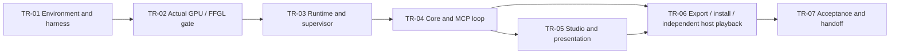

# Tracer 0.1 implementation plan

> **For agentic workers:** Use `superpowers:subagent-driven-development` or `superpowers:executing-plans` where available. Follow tasks and checks in order; equivalent explicit planning/review procedures are acceptable when skills are unavailable. Stop at failed prerequisite gates.

**Goal:** Use Lux and an external AI to create, inspect and revise visuals, then export/install them as reusable Resolume sources that cold-start and run independently without Lux Studio, AI or development tools. Save and reopen the correct versions and controls in Resolume.

**Scope authority:** [Tracer export scope](tracer-export-scope.md), approved by the user on 12 September 2026 (DEC-13), supersedes the original scratch-only/single-host and deferred-release limits. Existing implementation checkpoints may satisfy parts of this plan; verify their evidence rather than restarting them or assuming export is already complete.

**Architecture:** The application core serializes scene changes and owns accepted revisions. A detached supervisor runs isolated compiler/render processes; the studio is a presentation/control client. A native adapter publishes completed GPU frames to a small FFGL source without waiting for the renderer inside the host callback.

**Tech stack:** Windows x64, pnpm/TypeScript, Electron/React, Three.js TSL/WebGPU, C++ FFGL and proposed Spout/D3D transport. Exact package/SDK versions are selected and pinned in TR-01; actual transfer is proved in TR-02 before broader work.

**Spec:** [Architecture](../architecture.md), [requirements](../requirements.md), [decisions](../decisions.md), and the [subsystem designs](../README.md).

**Performance implementation:** [Profiling and monitoring design](../design/performance-monitoring.md) is required reading for TR-01/02/03 and TR-07, and for the status integration in TR-04/05. It defines exact metric endpoints, buffer/query/recording limits, availability/coverage, clocks, overhead methodology and validation fixtures. Numerical targets remain in [acceptance](tracer-acceptance.md).

## Global constraints

- Source plans remain preserved; this plan reconciles their outcomes through [decisions](../decisions.md).
- Actual host/GPU/AI evidence is mandatory; no video substitute, per-frame CPU transport, fixed-example-only demo or path-only image result.
- Default output is 1920×1080 at 60 Hz for reference tests. No silent quality reduction.
- Keep generated code outside UI/privileged processes/Resolume; bound queues, captures, initialization and unresponsive execution.
- One authoring instance and independent installed host instances use immutable release bytes. Prove two distinct sources together and, separately, two copies of one source. Keep one simple continuous control per source. Include basic export/install and runtime provisioning; no general graph editor, library, embedded chat, studio audio setup, polished signed installer or durable revision history in 0.1.
- The final workflow is Export for Resolume → install → close Studio → load in Resolume. Cold start must work offline with no checkout, external asset paths, developer activation command or manually started producer. Installed release identity survives service shutdown; mutable runtime IDs may change.
- UI moves do not reset producers; pane size is not output resolution. Only the selected authoring scene runs by default.
- Benchmark thresholds and raw evidence are defined once in [acceptance](tracer-acceptance.md); a failed gate requires resolution or an explicit revised decision.
- User asked the documentation coordinator to stop before implementation. This file is the assignment for the next agent, not a record of tasks already run.

## Proposed repository shape and ownership

```text
apps/studio/                 # thin preview/controls/status Electron client
apps/render-service/         # detached supervisor and authenticated rendezvous
apps/render-host/            # output-only Electron page and unprivileged worker
apps/build-worker/           # bounded compiler subprocess
packages/runtime-contracts/  # shared IDs/DTOs and schema validation
packages/visual-sdk/         # minimal discoverable visual contract
packages/runtime/            # instance/clock/capture/metrics
packages/core/               # scratch scene, revision, job and application services
packages/mcp/                # stdio protocol adapter and tool schemas
native/texture-bridge/         # owned GPU frame pool and process handle integration
native/ffgl-source/          # per-release fixed-schema sources and shared control client
tests/{runtime,core,mcp}/    # deterministic unit/contract cases
tests/e2e/tracer/            # AI, desktop and actual-host procedures
scripts/                    # preflight, build, evidence and acceptance runners
evidence/tracer-0.1/         # compact reports/manifests; binary policy in acceptance
```

These paths are proposals, not files already in the repository. Runtime and bridge documents own any more specific subpaths beneath them; the coordinator resolves path differences before delegation. Avoid speculative packages unrelated to a task. Define the minimal build workspace in TR-01 so later commands are real and discoverable.

## Task dependency and parallelism



One implementing coordinator owns integration and shared contracts. TR-01–06 run sequentially: TR-05 consumes the core operations committed in TR-04. Use parallel agents only for bounded independent subtasks or review with exclusive ownership; a mocked service cannot satisfy Studio integration. Only the coordinator changes shared contracts. Real-host/GPU acceptance runs serially on this machine. Keep each reviewed task committed before dependent work starts.

## TR-01 — Pin environment and establish executable harness

**Requirements:** T09, B04; prerequisites for T02/T07. **Read:** [environment](environment.md), bridge source notes, AI discovery/profile section.

**Create:** root `package.json`, `pnpm-workspace.yaml`, `tsconfig.base.json`, lockfile; `native/CMakeLists.txt`; `scripts/preflight.mjs`; `scripts/native-build.ps1`; `tests/mcp/profile-fixture.test.ts`; `evidence/tracer-0.1/<run-id>/environment.json` and `preflight.md`.

**Interfaces:** Produces exact version tuple, adapter/host IDs, workspace scripts and build targets. Does not produce a production visual or claim tracer success.

- [ ] Inspect current machine and code baseline; confirm the environment inventory, actual C++ workload/SDK/CMake, host plugin directory and native x64 architecture. Do not replace user host configuration silently.
- [ ] Inspect current official APIs and pin compatible Electron/Three.js/FFGL/Spout/MCP dependencies, compiler and SDK versions. Record source hashes, licenses, ABI and adapter selection. Prefer the observed host first.
- [ ] Create script entry points: `pnpm preflight`, `pnpm typecheck`, `pnpm test:unit`, `pnpm build`, `pnpm native:build`, `pnpm test:gpu`, `pnpm test:mcp`, `pnpm test:studio`, `pnpm test:host`, `pnpm test:acceptance`. Each must name its prerequisites; hardware suites fail or explicitly report unavailable, never silently pass when a host is absent. Add script bodies with the task that first exercises them; before then a command must exit nonzero with its missing task ID.
- [ ] Establish the minimal MCP profile fixture using the selected client's supported profile, a discoverable test tool and actual small PNG ImageContent. Keep this stub isolated from the real tool registry.
- [ ] Run `pnpm preflight` and `pnpm test:mcp -- --profile-fixture`; preserve protocol negotiation/version messages and evidence the model can see the image. A fixture is not the rendered AI feedback loop.
- [ ] Run `pnpm typecheck` and `pnpm native:build` on minimal harness targets; verify missing dependency/host conditions produce actionable nonzero output.
- [ ] Commit harness and environment manifest. Record an explicit pass/fail decision before TR-02.

Suggested preflight contract (implement and schema-check it, do not infer GPU support from names):

```ts
type PreflightResult = {
  schemaVersion: 1; sourceCommit: string;
  host: { executable: string; version: string; refreshHz: number };
  adapters: { rendererLuid: string; bridgeLuid: string; hostLuid: string };
  versions: Record<string, string>;
  mcp: { profile: string; client: string; imageObserved: boolean };
  checks: { name: string; outcome: "pass" | "fail" | "unavailable"; evidence: string }[];
};
```

**Gate:** Actual available host/GPU/toolchain and client image path identified. Unsupported hardware/client stops dependent integration; unit harness work may continue without claiming readiness.

## TR-02 — Prove actual completed GPU frames reach FFGL

**Requirements:** T04, T08, T09, B01/B04. **Read:** [runtime](../design/runtime.md), [bridge](../design/resolume-bridge.md).

**Create:** `apps/render-host/src/main.ts`, output-only page/worker; `native/texture-bridge/` shared-texture adapter and bounded pool; `native/ffgl-source/` fixed tracer plugin; `tests/e2e/tracer/gpu-transfer.md`, `scripts/test-gpu.ps1`.

**Interfaces:** Consumes pinned environment. Produces a documented native frame descriptor/lease contract, proven adapter/synchronization strategy and a completed-frame consumer in the actual FFGL callback. Bridge design owns the exact native structures and release transitions.

- [ ] Build the smallest animated WebGPU shader with orientation corners, RGB/alpha pattern, frame marker and one controllable numeric value. Use the intended worker/output-page topology, not an unrelated native sample as final evidence.
- [ ] Obtain Electron offscreen shared-texture output. Inspect actual format, dimensions, handle lifetime, adapter and compositor marker correspondence. If worker output fails, follow the bridge's explicitly documented topology experiment before changing the runtime contract.
- [ ] Implement import into a bounded native owned pool with producer completion and consumer ownership. Keep the Electron texture alive until the native GPU copy completes. Do not invent a keyed-mutex contract for a handle that lacks one.
- [ ] Implement the smallest fixed-schema FFGL source. Import only a completed compatible frame without a blocking wait. Keep last completed owned output for late frames and transparent black before first frame. Prove handle/process ownership, GL context assumptions and adapter compatibility.
- [ ] Run `pnpm native:build`, `pnpm build`, `pnpm test:gpu -- --run-id <id>` in actual Resolume. Record frame marker progression, orientation/color/alpha, native handle lifecycle, absence of per-frame readback and rough latency/delivery counters.
- [ ] Inject consumer delay and producer stop/restart; assert no pool overwrite while in use, bounded drops, no host callback wait and no invalid stale handle use.
- [ ] Write `gpu-feasibility.md`: exact chosen route, measured outcomes, native/compositor frame correspondence, unresolved limits and pass/fail. Commit the successful minimal path and evidence, or the failed experiment plus next decision.

Example minimum pool invariant test, translated into the selected native test framework:

```text
Given three slots and all held by consumers,
when a producer attempts publication,
then no held slot changes identity or contents,
the producer reports no-free-slot without blocking the host,
and releasing one lease permits only that slot's next generation.
```

**Gate:** Real WebGPU-produced frames in real FFGL using GPU transport. A Spout native demo alone, successful compilation, CPU screenshot stream, or unsynchronized displayed texture fails. If Electron's supported path cannot meet the contract, stop SDK/editor expansion and record the bounded fallback decision from bridge design. Do not implement a new custom Chromium backend without an explicit scope decision.

## TR-03 — Minimal runtime, compiler and detached supervisor

**Requirements:** T01/T03/T05/T06, B02/B03, U04/U07. **Read:** runtime; project-model identity; AI bounds.

**Create:** `packages/runtime-contracts/src/index.ts`, `packages/visual-sdk/src/index.ts`, `packages/runtime/src/{instance,clock,capture,metrics}.ts`, `apps/build-worker/src/main.ts`, `apps/render-service/src/supervisor.ts`; runtime tests.

**Interfaces:** Consumes proven native frame transport. Produces `VisualDefinition`, `VisualInstance`, `RuntimeSession`, `RuntimeKey`, immutable completed-frame lease and generation-aware controls/status. Shared IDs/DTOs live in runtime-contracts; core imports them. Runtime design owns exact signatures; AI metadata must be losslessly derivable from each leased frame.

- [ ] Implement shared runtime DTO schemas and a minimal SDK example with one finite continuous control. Define bundle/SDK identity, output format, clock epoch, frame/control sequence and generation before consumers use them.
- [ ] Add failing tests for source compile error, invalid import, infinite initialization/update loop, candidate replacement failure, stale generation command and same-seed reset. Tests assert observable state/errors and cleanup, not private function sequences.
- [ ] Compile submitted UTF-8 source in a bounded subprocess using pinned imports. Execute candidate code only in the sandboxed render context. Block privileged modules, network/navigation and arbitrary desktop IPC in actual process configuration.
- [ ] Implement runtime create/update/render/reset/dispose, play/pause clock behavior, compatible live controls and immutable candidate activation. Preserve the active bundle on failed compile/smoke and retain prior validated artifact for recovery. Initial API budgets are owned by AI authoring; watchdog uses runtime's stricter two-second stop gate.
- [ ] Implement detached service rendezvous/start lock, host/preview leases, independent authoring/host instances, startup/shutdown and restart generations. Verify actual PIDs and that studio shutdown does not kill host-owned processes.
- [ ] Implement bounded full-output readback with immutable frame metadata; pair image resource and provenance before asynchronous encoding. No inspection readback on the continuous host transport path.
- [ ] Implement performance-design probes and collector (`apps/render-service/src/telemetry-collector.ts`), shared telemetry DTOs, asynchronous timing-query pools and owned-resource gauges. Test missing queries, stale generation/calibration, collector overload and paused/hidden UI without blocking rendering. TR-04 provides the shared profiling/status service; TR-05 consumes snapshots with age/coverage.
- [ ] Run `pnpm test:unit -- --area runtime`, `pnpm typecheck`, `pnpm build`, then `pnpm test:gpu` against the SDK-produced reference. Add real-process hang tests verifying confirmed stop within two seconds.
- [ ] Commit contracts, implementation and tests. Freeze them before TR-04, then deliver its real core service before TR-05. Include old-ring retirement after slot reuse, duplicate/lost-reply Attach, and literal `intensity` schema tests from the contract map.

Example contract tests to translate into runnable tests using the implemented service harness:

```ts
// A harness drives actual public commands; implement fixtures with this task.
it("failed replacement preserves active revision", async () => {
  const old = await harness.activate(validSource);
  await expect(harness.activate(invalidSource)).rejects.toMatchObject({code: "COMPILE_FAILED"});
  expect((await harness.status()).revisionId).toBe(old.revisionId);
});
it("detaching a preview does not reset the producer", async () => {
  const before = await harness.completedFrame();
  await harness.detachPreview();
  await harness.attachPreview();
  const after = await harness.completedFrameAfter(before.frameId);
  expect(after.instanceId).toBe(before.instanceId);
  expect(after.clockEpoch).toBe(before.clockEpoch);
  expect(after.actualTimeSeconds).toBeGreaterThan(before.actualTimeSeconds);
});
```

The harness helper names above are test-local, not competing production APIs. It must launch or attach to the actual runtime for lifecycle tests; use deterministic clocks only for isolated clock unit tests.

## TR-04 — Application operations and actual external AI loop

**Requirements:** T01/T02/T06, B02; early A01/A02 boundaries. **Read:** [AI authoring](../design/ai-authoring.md), [project model](../design/project-model.md).

**Create:** `packages/core/src/{contracts,scene-service,job-service,capture-service,control-service,source-policy}.ts`; `packages/mcp/src/{server,tools}.ts`; `tests/core/capture-races.test.ts`; `tests/mcp/authoring-loop.test.ts`.

**Interfaces:** Core consumes runtime DTOs/sessions; MCP exposes the exact `lux.*` operation table in AI design. Canonical public types are `Submit`, `ParameterWrite`, `Playback`, `CaptureRequest`, `Job`, `Fault` and `CaptureMetadata`. Adapter results use the negotiated MCP profile, never mix profile-specific envelopes.

- [ ] Write operation/schema tests for new scratch scene, stale base, payload mismatch for repeated request ID, invalid scope/import, full queues and host authority rejection. Implement discovery and source read with actual SDK contract/examples returned to the client.
- [ ] Implement serial submit/compile/smoke/activate with default automatic apply and a concise summary. Explicit staging tools remain diagnostic options; do not add a required Keep button. Keep basic editable save/open, while durable history remains milestone 1. Installed releases are persistent retention roots independent of the authoring scratch registry. Test that exporting A, accepting B/C and collecting unrooted scratch data cannot remove A's complete installed closure. Export/install and native Attach/restart are delivered/tested in TR-06.
- [ ] Implement status/cancel/retry/idempotency behavior and bounded retention. Test cancellation before commit and late cancellation after commit; the latter must report the actual committed result.
- [ ] Implement `lux.capture` and `lux.jobs.get({includeResult:true})` returning real PNG ImageContent and metadata. Test revision change before/after frame lease, restart before lease, control sequence barrier, paused repeated frame and queue/timeout cleanup.
- [ ] Run `pnpm test:unit -- --area core`, `pnpm test:mcp`, `pnpm typecheck` and `pnpm build`. Include real source-to-render capture integration in addition to mocked protocol cases.
- [ ] Connect the actual external AI client. Ask for a visual, let it submit code, inspect the returned image, identify a visible change, revise code, and inspect again. Preserve prompt/source/image/revision evidence. Ask it to submit invalid code and verify actionable failure plus last-good availability.
- [ ] Commit code and compact AI-loop evidence. The coordinator confirms captures actually reached the model and influenced executable changes.

**Gate:** T01/T02 are proved by actual AI execution and viewed images, not by an automated test named authoring-loop that only changes fixture values.

## TR-05 — Thin studio and presentation lifetime

**Requirements:** T03/T06, U04/U07 and early U01 boundary. **Read:** [studio](../design/studio.md) and runtime presentation ownership.

**Create:** `apps/studio/src/main.ts`, `apps/studio/src/renderer.tsx`, `apps/studio/src/preview.tsx`, `apps/studio/src/service-client.ts`; `tests/e2e/tracer/studio.spec.ts`.

**Interfaces:** Uses core operations for parameters/playback/restart/status and runtime's presentation attach/detach mechanism. React holds IDs/status/control values only, not per-frame pixels. No second application operation path.

- [ ] Build one large preview, named parameter control, play/pause/reset/restart buttons, explicit output dimensions, separate visual/UI performance display and readable job/runtime errors.
- [ ] Keep 1920×1080 render size fixed for the reference; implement fit without resizing the producer. Expose output dimension changes only through explicit validated settings if included; advanced resolution/quality settings remain later.
- [ ] Add a small presentation detach/reattach test window (using the real surface mechanism), verify same instance/generation/clock and advancing frames across hide/show and tab-like container replacement. This tests architecture, not a complete dock editor.
- [ ] Show whether the preview is authoring and whether a separate host instance is pinned to another revision. Studio source changes never silently change the host artifact.
- [ ] Run `pnpm test:studio` and measure UI acknowledgment under active rendering and failed replacement; exercise close/reopen, DPI/pane resize and producer retention.
- [ ] Commit the thin studio and lifecycle results. Record full Dockview packaged popout/layout testing as milestone 4 work; don't claim a library is validated by this smoke test.

**Gate:** Visible working controls through shared operations; preview lifetime separate from simulation; output size unaffected by pane geometry.

## TR-06 — Export, install and independent Resolume playback

**Requirements:** T04/T05/T06/T08/T10; end-to-end T03; minimum P/R release outcomes promoted by DEC-13. **Read:** [export scope](tracer-export-scope.md), bridge lifecycle/control contracts and acceptance failure matrix.

**Modify:** proven native transport/source, supervisor, release service and Studio export entry; add a basic install helper and actual-host export/lifecycle tests. Reconcile concrete paths and shared release DTOs with the integrated implementation before coding.

**Interfaces:** A user-facing Export for Resolume action takes an accepted revision and creates an immutable named release, complete manifest and fixed-schema source wrapper. Installation resolves the release and its exact installed runtime without an authoring service. Native Attach identifies the installed release and the particular plugin object; each object gets an independent runtime. Developer activation may remain a diagnostic helper, but cannot be the required export/playback workflow. Use the existing host snapshots/generations/frame contracts, extended with persistent release identity.

- [ ] Connect the fixed FFGL named control to runtime values with native normalized range conversion and monotonic control sequence. Coalesce continuous snapshots off the render callback; no raw MIDI or FFT claims in 0.1.
- [ ] Build named immutable packages from validated revisions, including required code/assets, runtime dependencies and fixed control schema. Verify hashes and reject unresolved paths. Give distinct releases stable host source identities; do not retarget one global source when another visual is exported.
- [ ] Add Export for Resolume and a basic install action/helper. Install complete versioned runtime dependencies; playback needs no developer checkout, compiler, Node/pnpm setup, terminal command or manual producer. Failed export/install preserves existing releases. New releases coexist; old compositions keep their selected release until explicitly changed.
- [ ] Implement cold-start discovery and independent runtime allocation from installed releases. Recover installed release identity after service restart; reject incompatible fixed schemas. Apply the host snapshot before the first accepted frame. General dynamic control schemas remain later.
- [ ] Export A, accept B/C in Studio and collect eligible scratch revisions. With the source project and external asset paths unavailable, Attach and renderer/service restart must still load installed A with current host-owned values. Include a required asset in the release-closure test.
- [ ] Confirm an AI-produced artifact from TR-04 renders in actual Resolume and responds to the native control; capture visible markers proving selected revision.
- [ ] Close studio and AI while host runs. Change the host control; verify uninterrupted playback and no studio-dependent lifetime or data source. Reopen studio without resetting the host.
- [ ] Run two different exported sources together, then two copies of one source. Change controls independently and remove one while the other runs. Record separate IDs, state and resource use; reject capacity beyond supported limits explicitly rather than aliasing instances.
- [ ] Save the Resolume composition, close all Lux/host processes, disable network and make authoring/development paths unavailable. Open only Resolume and restore the exact release versions and saved values. Confirm the installed runtime starts automatically and can exit normally after host shutdown. Animation may restart from its defined initial state.
- [ ] Kill/restart render process, change host control during outage and verify current host values on recovery. Reject stale generations/frames; preserve last completed image during outage and transparent black before first frame.
- [ ] Run `pnpm test:host -- --run-id <id>` including producer delay, resource cleanup and callback nonblocking checks; repeat `pnpm test:unit`, `pnpm build`, `pnpm native:build` after integration.
- [ ] Commit export/install, cold-start, independent-source and lifecycle/control evidence. Wider resize, upgrade and capacity coverage remains 0.2; polished distribution and sustained workload qualification remains 5.

**Gate:** The user exports visuals from Lux and uses the installed sources in Resolume with Studio absent, including cold composition reopen and independent copies. No developer activation or producer launch is needed. Renderer restart restores current host values within five seconds without intentional host waits; normal source removal and host shutdown complete.

## TR-07 — Measured acceptance and implementation handoff

**Requirements:** all T01–T09, promoted T10/minimum P/R export outcomes and applicable B/U constraints. **Read:** [acceptance](tracer-acceptance.md) and [export scope](tracer-export-scope.md).

**Create:** `scripts/acceptance-report.mjs`, actual-host runner completion, evidence manifests/raw traces/reports; update task checkboxes only with artifact links.

- [ ] Run full build/type/unit/contract suites on the integrated commit; preserve output and test count. Missing hardware suites must be visibly unavailable rather than green.
- [ ] Execute the acceptance workload, failure matrix and actual AI/host checks under the pinned environment. Measure warmup/five-minute run, delivery/control/CPU/GPU/UI/overhead independently with calibrated clocks and declared workload conditions.
- [ ] Run `tests/performance/{accounting,clocks,quantiles,overhead}.test.ts` and the performance design's capability/overflow/lifecycle fixtures before trusting hardware reports. Measure paired baseline/routine work-duration overhead and preserve raw coverage/calibration/resource/instrumentation records. Unavailable timing or incomplete collection cannot yield a passing metric.
- [ ] Generate `acceptance.md` linking every gate to source/settings/environment and raw evidence. Compute fresh/repeated/skipped counts from actual frame IDs, not target FPS or producer submissions. Negative calculator fixtures: a perfect 30 Hz trace declared 60 Hz fails workload validity; missing/unmatched control versions fail reconciliation rather than improve latency quantiles.
- [ ] Review failures or unavailable metrics; fix bottlenecks and rerun affected gates. Record any explicit budget/design revision with its reason before claiming completion. Never silently lower quality.
- [ ] Request independent implementation review for runtime/native ownership, product loop and evidence validity. Use separate worktrees for fixes and serialize actual-host runs.
- [ ] Commit implementation and final evidence manifest; verify clean working tree and no missing referenced artifacts. Report tracer success only if all applicable gates are resolved. Hand off remaining 0.2/0.3 work through the roadmap.

## Traceability for tracer

| Requirement | Tasks | Evidence |
| --- | --- | --- |
| T01 | TR-03, TR-04 | Actual submitted source → runtime; image-informed executable revision |
| T02 | TR-01, TR-03, TR-04 | Model-visible PNG before/after with revision/time/control provenance |
| T03 | TR-03, TR-05, TR-06 | Shared control/transport/status and separate visual/UI measurements |
| T04 | TR-02, TR-06 | Actual GPU frame path and native host control of AI artifact |
| T05 | TR-03, TR-06 | Studio close, current controls, host responsive, restart |
| T06 | TR-03, TR-04, TR-06 | Error/hang/invalid candidate and queue/capture race matrix |
| T07 | TR-01, TR-07 | Environment, raw timings/counters and every provisional budget |
| T08 | TR-02, TR-06 | Color/orientation/alpha and synchronized ownership proof |
| T09 | TR-01, TR-02 | Pinned actual environment and first integration gate |
| T10 and DEC-13 | TR-03, TR-05, TR-06, TR-07 | Named installed releases, two sources/copies, Studio-free cold start, offline composition reopen and retained controls |
| B01–B04 | All tasks | Scope, real dynamic playback, shared operations and isolated execution |
| U04, U07 | TR-03, TR-05 | Presentation detach without reset; explicit output dimensions |

Full U01–U09 and other product requirements are routed in [roadmap](roadmap.md). Architecture supports them now; later milestone completion must not be inferred from the tracer's thin shell.
