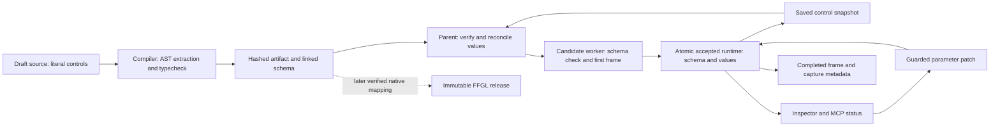

# Visual parameters implementation design

Status: proposed implementation at `ce14d1c`, 12 September 2026. This document changes no running Studio, SDK, or installed release. It supersedes the intended *future* fixed-control assumption in [tracer contracts](../design/tracer-contracts.md), not the existing v1 export format.

**Goal:** A visual declares its own controls in code; Studio and MCP expose exactly those controls. `intensity` has no special meaning in the new SDK.

**Architecture:** The compiler extracts literal declarations without executing source and seals their normalized schema into compiled and linked identities. The accepted runtime owns a schema plus complete values snapshot; UI, MCP, saved documents, and eventual native exports consume that contract.

**Implementation workflow:** Use `superpowers:subagent-driven-development` or `superpowers:executing-plans` for the file-owned slices below. This is the design and dependency handoff, not a claim that the feature or its acceptance tests are complete.

## Source-backed constraints

| Existing authority | Consequence |
| --- | --- |
| `AGENTS.md`; `packages/visual-sdk/src/index.ts` | Product intent makes controls visual-owned, but SDK 0.1 currently injects a fixed descriptor and accepts only `create`. Preserve that behavior exclusively for legacy source. |
| `packages/runtime-contracts/src/index.ts` | Descriptor IDs, values, source SDK and artifact SDK currently use fixed literals. Generalizing only the Inspector cannot work. |
| `apps/build-worker/src/worker.mjs`, `source-policy.mjs`, `artifact-identity.mjs`, `link-worker.mjs` | Compiler parses/types source without executing it; identities have exact versioned fields and existing v1/v2 asset semantics. Metadata must enter both identity validation and linking. |
| `apps/studio/src/standalone-client.ts`, `visual-worker.mjs` | Parent promotes on completed `ready`; worker receives intensity before import. Accepted restart closure currently retains code/revision and last admitted intensity separately from applied state. |
| `apps/studio/src/service-client.ts`, `runtime-operations.ts`, `renderer.tsx` | One scalar view, queue, validator and slider need a generic schema/value interface. Existing instance/generation/revision guards must survive coalescing. |
| `apps/studio/src/source/authoring-session.ts`, `packages/core/src/scene-document.ts` | Scene versions 1/2 save scalar controls. Open currently applies saved values *after* activation; generalized parameters must be supplied before the candidate's first accepted frame. Invalid draft source can coexist with a previous working preview. |
| `scripts/studio-mcp.mjs`, `packages/visual-sdk/src/discovery.mjs` | Discovery reads the adapter checkout's files, not the running application's capability. Parameters already use a `values` payload but validate only intensity. |
| `packages/export/src/package.cjs`, `apps/render-host/src/compiled-output.html`, `tools/gpu-spike/host-startup.cjs` | Release v1 validates exact fixed descriptors and values; transport startup/acknowledgement is scalar. |
| `native/ffgl-source/src/LuxSource.cpp`, `FrameReceiver.cpp`, `FrameReceiver.h` | Native exposes one index and publishes one float. Arbitrary controls cannot truthfully be advertised as exported by changing only release JSON. |

Existing broad design proposals in [project model](../design/project-model.md), [runtime](../design/runtime.md), and [AI authoring](../design/ai-authoring.md) describe eventual services/transactions, including files not yet present. Implement this slice in the actual standalone client; do not invent a second core service.

## Recommended first slice

Ship SDK **0.2.0**, live finite numeric controls, static declaration discovery, generic Studio/MCP authoring, save/open, restart, and exported/offline FFGL playback with the declared controls. These are required for tracer completion. No implicit control. Require `controls: {}` for a visual with none. Keep SDK 0.1.0 compilation/playback and v1/v2 scenes compatible through an explicit legacy adapter. Do not silently upgrade old source or installed bytes. Authoring can land first behind an explicit export capability gate, but that intermediate state is not tracer done.

Boolean, enum and color controls are intentionally excluded from this first contract. Numeric controls directly cover the motivating displacement/material brief and existing FFGL numeric foundation. Color needs a canonical representation/color-space contract; enum needs stable option IDs and host persistence semantics; Boolean needs an actual typed widget/wire mapping. Reject their declarations with a clear unsupported-type diagnostic rather than simulating them as numbers. The new design leaves room for a discriminated descriptor union in a later SDK revision.

```ts
import { defineVisual } from '@lux/visual-sdk';

export default defineVisual({
  controls: {
    spikeHeight: { type: 'number', label: 'Spike height', default: 0.8, min: 0, max: 2, step: 0.01 },
    noiseScale:  { type: 'number', label: 'Noise scale', default: 2, min: 0.1, max: 8, step: 0.1 },
    sharpness:   { type: 'number', label: 'Sharpness', default: 3, min: 0.5, max: 8, step: 0.1 },
    motionSpeed:{ type: 'number', label: 'Motion speed', default: 0.3, min: 0, max: 2, step: 0.01 },
    roughness:  { type: 'number', label: 'Roughness', default: 0.4, min: 0, max: 1, step: 0.01 },
  },
  async create(context) {
    // Create geometry/material here. `const color = '#8ceaff'` remains
    // a source setting until typed color controls are supported.
    return {
      update(frame) {
        const height: number = frame.controls.spikeHeight;
        // Update displacement, time and material using these named values.
        // frame.controls.intensity is a compile error for this declaration.
      },
      render(target) { /* render the initialized scene */ },
      reset(seed) { /* reset visual state */ },
      dispose() { /* dispose owned resources */ },
    };
  },
});
```

The example shows the declaration/type surface, not a complete sphere implementation.

### Concrete schema and typing

```ts
type NumberDeclaration = Readonly<{
  type: 'number'; label: string; default: number; min: number; max: number;
  step?: number; unit?: string;
}>;
type ControlDeclarations = Readonly<Record<string, NumberDeclaration>>;
type NumberControlDefinition = NumberDeclaration & Readonly<{ id: string; changeCost: 'live' }>;
type ControlSchema = readonly NumberControlDefinition[];
type ControlValues = Readonly<Record<string, number>>; // transport type only
type ControlsOf<C extends ControlDeclarations> = { readonly [K in keyof C]: number };
// FrameContext<C>, VisualInstance<C> and VisualDefinition<C> carry C through
// create's contextually typed return value; do not widen C to a string index.
declare function defineVisual<const C extends ControlDeclarations>(definition: {
  controls: C;
  create(context: VisualContext): Promise<VisualInstance<C>>;
}): VisualDefinition<C>;
```

`VisualDefinition<C>.controls` contains normalized descriptor rows, preserving declaration order. `FrameContext<C>.controls` is `ControlsOf<C>`. The compiler's generated `__lux_check.ts` must use a deliberate erased definition boundary compatible with the generic signature; it must not erase contextual typing in user source. Compile fixtures must prove a wrong key fails and `roughness` is inferred as `number`, not its default's numeric literal. Explicit type annotations may use `FrameContext<typeof declarations>` only when declaring corresponding typed helpers; static discovery still requires the literal entry declaration described below.

Validation policy:

- 0–32 controls, IDs matching `^[a-z][A-Za-z0-9_]{0,63}$`; camelCase supports the brief. Reject `constructor`, `prototype`, `__proto__`, duplicate keys, inherited/accessor/symbol properties. IDs are case-sensitive and stable semantic identities, not labels or UUIDs. Update the old lowercase-only design text when implementing.
- Labels are trimmed nonempty strings, at most 80 code points, without control characters; optional units at most 24. Numeric fields are finite, `min < max`, and `min <= default <= max`; normalize negative zero to zero. Optional `step` is finite, positive and no greater than `max - min`.
- `step` is a UI gesture increment, **not** a wire quantization rule. A valid finite in-range MCP/host value need not lie on a step grid. Without step, Inspector uses `(max - min) / 1000`; numeric entry permits finer values.
- All controls are live in this slice; normalization inserts `changeCost: 'live'`. Do not accept reset/rebuild controls with misleading live semantics. Expensive topology changes stay in source.
- Runtime/API input rejects unknown IDs, out-of-range values and nonfinite values atomically. It does not clamp. Validation errors identify the parameter and expected range. Bound metadata to 32 KiB of canonical UTF-8 JSON.
- Exact fields, deterministic descriptor order/field ordering and the normalized schema determine `controlSchemaHash` (SHA-256). Label/order changes change this identity even when values migrate compatibly. Declaration IDs should change when semantic meaning changes; code cannot prove semantic equivalence.

### Discovery and execution boundary

For SDK 0.2 the entry remains `export default defineVisual({...})` imported from `@lux/visual-sdk`. Extend the existing Babel walk to extract its **inline literal** `controls` object. Allow noncomputed identifier/string keys, string literals, finite numeric literals and unary negative numeric literals. Reject spreads, duplicate properties, shorthand/reference values, calls, getters, computed keys and imported metadata. Parenthesized/TypeScript `as const`/`satisfies` wrappers may be unwrapped; they never authorize evaluation. Report file/line/column and a corrective example.

Static extraction is chosen over running `defineVisual` for discovery: untrusted code already executes only in the bounded browser worker. Executing source to populate an Inspector would make metadata reading capable of hanging or throwing and move candidate work across the trust boundary. Do not import submitted modules in Node, Electron main, compiler, MCP, save/open or export validation.

Create one pure normalization/value-policy module with a browser-compatible implementation and declaration file; import it from the compiler and worker/parent validation. Include its bytes in dependency hashes. SDK runtime normalization imports this module; the build worker must copy/emit its dependency and the linker must close over it. Do not add an unresolved package import to emitted `__lux/sdk.js`. Test the emitted closure as part of slice A/B.

Use **artifactVersion 3 / linkedVersion 3** for SDK 0.2. Their exact identity bodies include `controls`, `controlSchemaHash` and existing assets plus `assetSetHash` (empty assets included). Hash the schema fields inside the artifact and linked payload; the parent verifies hashes and agreement, not just a child-reported hash string. Keep v1/v2 canonical byte order/hash algorithms untouched. Source envelope versions still mean existing no-assets/v2-assets shapes; `sdkVersion` independently chooses the SDK. This is not a reuse of artifact v2's asset meaning.

The worker receives verified schema/hash and initial full values before first draw. After importing candidate code in the worker, normalize/check `module.default.controls` against the sealed schema before `create`; reject mismatches, unsupported SDKs or values. A matching hash is an integrity/identity check, not proof that visual code is trustworthy. Existing isolation/watchdogs remain required.



## Values, persistence and concurrency

Freeze schema/values snapshots. A runtime view exposes `controlSchema`, `controlSchemaHash`, `controls`, and existing runtime identities/sequences; remove top-level `intensity` from the new view. Legacy visual adaptation produces a one-row schema and values record for this same generic internal path.

`lux.parameters.set` / `lux.studio.parameters` retain `values`, now a **nonempty partial patch**. Validate the entire patch against the accepted schema, merge with current admitted owner values, then send the worker a **complete snapshot** with a new monotonic sequence. Serial admission prevents writes to distinct keys losing one another. UI coalescing merges pending keys only for identical instance/generation/revision/schema; it never replaces one pending key with an unrelated key or retargets a queued command after a build.

Require `expectedControlSchemaHash` for SDK 0.2 writes alongside existing instance, expectedGeneration and expectedRevisionId. Preserve legacy requests without that hash only when the target is an SDK 0.1 visual. On stale guard/authority/busy errors make no change; return an actionable reread-current-status error. Validate shape before admission and range/schema at admission; recheck target just before dispatch. No command can mutate a host-owned instance through the Studio path.

Store admitted desired controls separately from completed-frame controls. A command completes only after a matching frame/status acknowledgement proves application; capture includes the producing frame's full controls and schema hash. Restart uses the last admitted values for that exact accepted revision/schema, even if its last command faulted before acknowledgement, and increments generation. It must not reuse failed runtime intent for a newly submitted visual. Reset playback preserves parameters and play/pause state, resets visual/clock/seed and increments clock epoch. Inspector parameter reset sends declared defaults through the normal guarded patch path; it does not invoke playback reset.

Reconcile values before candidate initialization:

| Case | Rule |
| --- | --- |
| First build / newly added ID | Declaration default. |
| Same ID, type and unit; value in new range | Preserve existing owner value even if default/label/order changed. |
| Removed ID | Omit; report removal. |
| Same ID with changed unit/type or value outside range | Use new default and report reset reason; do not silently clamp. |
| Open document | Reconcile the document's own saved snapshot, never the previous preview's values. |
| Failed compile/initialization | Retain prior accepted schema, values, source, revision and pixels together. Keep failed draft editable. |
| Successful build | Atomically promote new schema, reconciled values and first frame; then publish migration report. |

The existing standalone implementation derives revisionId from sourceHash. Keep this local convention for this slice and use generation plus schemaHash to guard reincarnations; do not claim it implements the UUID revision-history design. Metadata edits change source/artifact/schema hashes. Runtime values do not rewrite source or artifact identities; they advance controlSequence and mark document values dirty.

Introduce scene **version 3** for SDK 0.2, with existing `source`/`settings` plus `controls: { sourceHash, schema, schemaHash, values }`. This is a cached saved snapshot with provenance, not a second authoring schema. Validate own-record structure, bounds, schema hash and complete values; source compilation remains the authority. Save/open must not execute source.

This snapshot can refer to the last accepted source while the document contains a changed or invalid draft. Save must preserve this distinction instead of pairing draft source with an unexplained prior preview value map. On subsequent build/open, re-extract the source schema, reconcile from the cached snapshot and report changes. Before any successful build, store an empty schema/value cache whose sourceHash is the current draft hash. Never synthesize intensity for a new SDK 0.2 draft.

Read v1/v2 scenes exactly as today, normalize their fixed schema in memory and keep their serialization/hash compatibility until explicit source upgrade. Keep source/assets and existing file budgets/token-save protections intact. Modify the authoring session submit port to pass optional saved control state to candidate startup; remove the post-promotion `applyControls` window. Save uses document-owned pending controls when open/build fails. Export receives a coherent accepted schema/value snapshot or fails; it cannot take values from unrelated current UI state.

## Inspector and MCP behavior

Render accepted schema rows in declaration order with label, range slider, editable numeric value, optional unit and per-control reset. Include Reset parameters when at least one row exists; an empty schema displays “This visual has no published controls.” Keep pending local edits distinguishable from acknowledged values. Disable during candidate activation/failure when writes are unavailable. No intensity fallback/empty-state slider.

The current `renderer.tsx` effect unconditionally copies each acknowledged intensity into local slider state. Delayed frames can therefore move the thumb backward during an ongoing drag. Generic controls must track per-ID local intent plus latest submitted/acknowledged write sequence. While dragging, typing, or awaiting a newer local intent, render that local value; old acknowledgements may update the applied-value indicator but cannot replace the local value. Settle only when the latest intent is acknowledged, explicitly rejected, or canceled; a changed instance/generation/revision/schema cancels the old interaction and replaces it with new target state. Keep the existing guard on queued input. Test a delayed low-value acknowledgement during a higher-value drag and keyboard edit, then test rejection and target replacement. Runtime failure must report the unapplied intent rather than silently presenting it as a rendered value.

Move generic rows to `apps/studio/src/controls/ParameterInspector.tsx`; retain layout/status/presentation in `renderer.tsx`. Replace `StudioController.setIntensity` and scalar drain with `setParameters(values)` and merged pending patches. Dirty tracking compares acknowledged parameter snapshots/sequences rather than a single scalar.

Read/status return accepted schema/hash/full applied values, SDK version, and capability version from the **running Studio**. Distinguish draft source/version from accepted runtime revision. Adapter discovery can advertise its supported SDKs/type schemas, but also expose actual running capabilities (or explicitly report unavailable); never describe adapter metadata as a handshake. Old application plus new adapter must return an explicit unsupported-capability result for 0.2 build/writes. MCP tool schema stays a bounded number record; dynamic IDs/ranges are validated by the running target, not rebuilt as global tool definitions.

Update shipped `skills/lux-visual-creation/` instructions, noise example and references alongside implementation. Discovery's new default example declares controls; retain the legacy intensity fixture separately. Reinstall/check the skill as required by `AGENTS.md` when author-facing implementation ships, not for this design-only change.

## Resolume: truthful support and compatibility

During the intermediate authoring implementation, add an early SDK/schema capability gate in Studio export and transport/export entrypoints and report “This runtime exports legacy SDK 0.1 visuals only; code-declared parameter export is not yet supported.” This also applies to empty schemas or 0.2 schemas coincidentally named intensity. No silent baking, scalar renaming, truncating, or claiming unsupported controls are live. Legacy export/install remains usable with existing release v1 readers and runtime bytes. Remove the gate only when the complete parameter-capable native/runtime package has passed its acceptance checks.

The user explicitly requires code-defined parameters for tracer completion, including exported/offline playback. The authoring-only state is an intermediate checkpoint, never a final delivery or a follow-up backlog item. The temporary limitation must be visible before export launches expensive packaging, while lower boundaries independently reject unsupported inputs.

For the required native slices, freeze an immutable ordered mapping per release: `{ index, id, label, min, max, default }` plus schema/hash. Native FFGL values use normalized `[0,1]`; convert `x = min + u * (max - min)` at the render-host boundary, and inverse-map defaults/saved values at registration. Validate indices and finite numbers; preserve this index-to-ID mapping for the release lifetime. Reordering source creates a new release/plugin identity and never changes an existing composition. Actual FFGL default registration and saved-host restoration must be tested against the pinned SDK; current `SetParamInfof` omits an explicit default and must not be assumed sufficient.

The native implementation must replace scalar state in `LuxSource`/`FrameReceiver`, version the host-control wire payload with bounded count/schemaHash/full snapshot, update native/JS readers and startup acknowledgement, and restore the complete host snapshot **before first accepted frame** on reconnect/restart. Two instances remain independent; authored default/saved values never override an attached host's current values. Release/installed-source descriptor readers need a new version and cannot reinterpret v1 bytes. Labels may need host length/display adaptation; IDs, full labels and values remain preserved in the release manifest. Numeric live parameters are the only first native mapping; no unsupported Boolean/enum/color claim follows from it.

The current `SharedRing` version is 3, with one atomically published `controlBits` float. Introduce ring version 4 with an explicit initialized flag, count (0–32), schema hash, monotonic snapshot sequence and bounded normalized float array. Zero controls is an initialized empty snapshot, not “waiting for host.” Publish/read the entire tuple atomically using a bounded try-lock with Windows interlocked operations and memory barriers; never tear a multi-value snapshot, block the FFGL render callback waiting on another process, or read ordinary shared fields while a writer owns the lock. Lock acquisition failure means retry/drop, not an empty/default snapshot. A writer crash poisons that ring until supervisor replacement; retain existing liveness/restart behavior. Keep old runtime DLL/addon/header closure packaged for old releases; unsupported ring versions fail explicitly.

Release manifest v2 includes verified schema/hash, complete saved controls and immutable index mapping; package inventory pins all validators/runtime bytes. Installed sidecar v2 must carry the bounded mapping needed when the FFGL constructor registers parameters before GL initialization. Specify a deterministic length-bounded encoding with IDs, adapted labels and normalized initial values, cross-check against the release manifest at activation, and fail closed on malformed/oversized records. Preserve v1's five-line descriptor parser and 512-byte limit exclusively for v1; do not append fields to v1. Host registration uses the release's saved snapshot as initial plugin defaults, while subsequent composition-restored host values win. Sidecar and release hash validation must agree before frames are accepted. Native host labels follow the pinned FFGL SDK's actual supported bound, tested during implementation; never silently truncate distinct labels to identical host labels.

## Implementation slices and ownership

Do not merge a temporarily misleading generic UI without working compiler/runtime validation. Slices A and B establish shared interfaces, then C and D can run independently with disjoint files; E integrates authoring. F and G implement the required native/export track, and H closes tracer acceptance. No task changes the user's active Studio during implementation. CPU checks run in the isolated checkout; graphics/host acceptance is separately scheduled in an isolated fixture session.

| Slice / dependency | Owned files | Deliverable and required checks |
| --- | --- | --- |
| **A. Policy and SDK**, first | `packages/runtime-contracts/src/index.ts`; new `parameters.mjs` / `parameters.d.mts` beside it; `packages/visual-sdk/src/index.ts`, `metadata.mjs`; new `packages/visual-sdk/src/legacy.ts`; `tests/compiler/sdk.test.mjs`; new `tests/unit/parameters.test.mjs` | Pure `normalizeControlDeclarations(input): ControlSchema`, `validateControlPatch(schema,input): ControlValues`, `validateControlSnapshot(schema,input): ControlValues`, `reconcileControlValues(previousSchema,previousValues,nextSchema): { values, changes }`; generic SDK inference and explicit 0.1 adapter. Test empty/multiple controls, invalid descriptors, own-property attacks, units/range reconciliation, wrong-key TypeScript failure. |
| **B. Static compile and identities**, after A | `apps/build-worker/src/worker.mjs`, `source-policy.mjs`, `artifact-identity.mjs` / `.d.mts`, `compile.mjs`, `link-worker.mjs`, `link-runtime.mjs`, `result-budget.mjs`; new `parameter-declarations.mjs`; `tests/compiler/compiler.test.mjs`, `asset-identity.test.mjs`, `link-runtime.test.mjs`; new `parameter-declarations.test.mjs` | SDK-version selection, literal extraction, v3 sealed controls and linker closure. Add extractor and pure policy module to dependency hash closure. Test alias imports, wrappers/negative literals, executable/spread/duplicate metadata rejection, tampered schema/hash/link mismatch, v1/v2 unchanged identity fixtures, v3 with empty/assets schema. Compiler success returns verified schema/hash alongside existing linked result. |
| **C. Runtime and operations**, after B | `apps/studio/src/standalone-client.ts`, `visual-worker.mjs`, `runtime-operations.ts`, `service-client.ts`; new `apps/studio/src/controls/control-state.ts`; `tests/studio/runtime-commands.test.ts`, `runtime-lifecycle.test.ts`, `client.test.ts`; new `control-state.test.ts` | `RuntimeView` generic shape; `submit(source, { savedControls? }?)`; runtime validates sealed schema, atomic promotion/restart and patch admission. Tests multi-key coalescing, wrong guards/keys/ranges, no partial writes, schema mismatch before create, failed candidate retention, admitted-versus-applied restart, capture snapshot, reset distinction. Keep optional submit argument backward-compatible for fixture ports. |
| **D. Scene persistence**, after B, parallel with C | `packages/core/src/scene-document.ts`, `scene-file.ts`; `apps/studio/src/source/authoring-session.ts`; `tests/core/scene-file.test.ts`, `tests/studio/authoring-session.test.ts` | Scene v3 snapshot/provenance and generic submit port. Tests legacy roundtrip, v3 empty/multi-control roundtrip, malformed cache, invalid draft save, opened values at first candidate frame, schema migration report and failed-open ownership. Implement against C's declared optional `savedControls` contract without editing C files. |
| **E. Inspector, MCP, capability gates, integration**, after C+D | `apps/studio/src/renderer.tsx`, `authoring.tsx`, `main.ts`; new `controls/ParameterInspector.tsx`; `scripts/studio-mcp.mjs`, `studio-export.mjs`, `export-resolume.mjs`, `transport-prepare.mjs`; `packages/visual-sdk/src/discovery.mjs`, examples; `packages/export/src/runtime-capability.cjs`; `skills/lux-visual-creation/**`; affected design docs; UI/MCP/export tests | Render schema; map full applied views/patches; dirty tracking; report running capability; reject 0.2 export early. Test five controls with no Intensity, typed numeric entry/default resets, empty schema, stale inspector writes, old-app adapter mismatch, legacy exports still pass, new unsupported exports fail without installation. Update native/transport contract docs without mutating legacy wrappers. |
| **F. Native parameter snapshots and registration**, after B; coordinate v2 mapping interface with G | `native/texture-bridge/include/shared_ring.h`, `native/texture-bridge/src/electron_texture.cc`; `native/ffgl-source/src/LuxSource.cpp`, `FrameReceiver.cpp`, `FrameReceiver.h`, `InstalledSource.h`, `InstalledActivation.h`; `tests/native/host_control_test.cc`, `shared_ring_test.cc`, `installed_source_test.cc` | Ring v4 full snapshot API, addon `control()` returns normalized record plus schema/sequence, v2 descriptor parsing and dynamic 0–32 parameter registration. Tests atomic multi-value coherence, no stale/default startup, empty initialized snapshot, invalid index/count/hash/float, lock-contention nonblocking behavior, v1 parsing unchanged. Native plugin constructor uses immutable descriptor mapping; callback writes preserve other parameter values. |
| **G. Release and installed render-host integration**, after B and agreed F protocol; E's export-file edits must land first | `packages/export/src/package.cjs`, `register.cjs`, `runtime-capability.cjs`; `scripts/studio-export.mjs`, `export-resolume.mjs`, `transport-prepare.mjs`; `tools/gpu-spike/transport-release.cjs`, `host-startup.cjs`, `build.mjs`; `apps/render-host/src/main.ts`, `compiled-output.html`; affected installed runtime files only if protocol validation requires changes; export/host-startup/transport fixtures | Release v2 and sidecar v2 mapping/identity, v3 artifact transport reader, complete normalized host values mapped to SDK values, worker/capture handshake, runtime closure inventory and feature gate enabling only complete compatible packages. Preserve v1 readers and cold installed-release closure. Tests export/load/tamper, defaults mapping, restart first-frame values, normalized endpoints/intermediate values, two isolated host snapshots, empty controls and old package validation. |
| **H. Required completion evidence**, after E+F+G | `scripts/test-studio-ui.mjs`, `test-studio-mcp.mjs`, installed/native acceptance harnesses and fixtures; `docs/implementation/tracer-acceptance.md`, `tracer-export-scope.md`; shipped visual skill/docs | Regression for dragged thumb versus delayed acknowledgements; capture named parameter effects; export/install/cold reopen a new multi-control visual with Studio closed and source unavailable; saved host values survive restart; two instances independent; old release still opens. Only after these checks report code-defined parameters complete for tracer. |

For each slice: write focused failing cases, run them, implement its contract, rerun the affected checks, inspect its diff and commit. Shared contract changes after A require coordinator review before parallel consumers proceed. No dependency install or graphics run is required to write this design.

CPU integration entrypoints already present: `node --test tests/compiler/*.test.mjs`, `node apps/studio/test-cpu.mjs`, `pnpm typecheck`, and `pnpm test:export`. Select targeted tests while iterating; run all affected suites at integration. Review existing glob/runner inventories so new tests are actually included. Do not claim typechecking or mocked UI proves live rendering.

Final isolated acceptance: compile a sphere with the five named numeric controls; change spikeHeight and noiseScale independently through UI/MCP; inspect actual frame captures and metadata; save/reopen values; remove/change-range/add a control and check migration; force failure/restart and check desired/applied semantics; verify empty controls; confirm legacy source still shows its one control. Then export the new visual, change named controls independently in Resolume, save/reopen the composition with Studio closed and source unavailable, and verify host-save/reopen, renderer/service cold restart and independent instances. An intermediate export refusal is honest behavior but fails tracer completion.

## Decisions and remaining product scope

No clarification is needed to implement this numeric parameter slice through authoring and exported/offline playback. Static literals, SDK version separation, camelCase IDs, no implicit controls, explicit migration reports, and a temporary export gate are routine design choices grounded in current boundaries. Numeric-only scope should be communicated clearly: color remains a source setting in the motivating visual. If the user requires typed live color/Boolean/enum controls in this delivery, those types expand the required schema/widget/native mapping work; do not present numeric controls as satisfying that additional outcome.
